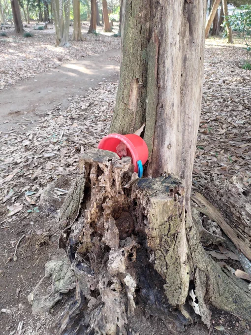

# 2023-04-01

[1 Apr, 2023 10:00 PM](https://twitter.com/hirasawa/status/1642149815084630018#m)

さて、世界の二相下は喧しく、煌びやかにキナクサイ。私もすっかり準備は出来ている。

そんな日にKENNJUの新作にお呼ばれした。明日レポートする。

またこんど！！

---

[1 Apr, 2023 09:55 PM](https://twitter.com/hirasawa/status/1642148556617428992#m)

音楽制作ソフトの参考例の無いトラブルが解消されてからというもの絶好調で挙動も早くなったのは何故？

何故だか分からず治ってしまう数で決まるステルス品質。

---

[1 Apr, 2023 09:50 PM](https://twitter.com/hirasawa/status/1642147298368184327#m)

オマエタチにも「おかげ様動画」が用意されている。

---

[1 Apr, 2023 09:45 PM](https://twitter.com/hirasawa/status/1642146040496156672#m)

初心者は次を履修してください。

私は誕生日に贈り物をもらうのではなく贈るタイプのヒト化なのだ。それが理にかなっていると信じている。

明日は、訪問者に贈り物が用意されている。

---

[1 Apr, 2023 09:40 PM](https://twitter.com/hirasawa/status/1642144781722882049#m)

明日はシトリン、1号、中井画伯が来る。

生け花は更新され庭の草木は手入れされるのだろうか。

私は密かに「庭師キン子」と呼んでいる。

あくまで密かに。軽やかに。

---

[1 Apr, 2023 09:35 PM](https://twitter.com/hirasawa/status/1642143524270342144#m)

末広がりの幸運を車のナンバーに託すケースの多さは、停滞、衰退を憂慮する人生が多いことの証。

車のナンバーで分かる地球人類の奴隷度。

と描かれたTシャツを着て歩くのが憧れ。

---

[1 Apr, 2023 09:30 PM](https://twitter.com/hirasawa/status/1642142269674520577#m)

日本の民は8を好むから出会う確率も高いという考察はごもっとも。それにしても多い。

マジるんそすぎ。

---

[1 Apr, 2023 09:25 PM](https://twitter.com/hirasawa/status/1642141006979031041#m)

フィリピーナで思い出した。

近頃私が8のゾロ目について語っていないので8嵐は収まったと思っている人は居まいか？

ぜんぜん収まっておらず、毎日のように8が大群で飛来する。

2や7のゾロ目もつれて。

---

[1 Apr, 2023 09:20 PM](https://twitter.com/hirasawa/status/1642139748704583680#m)

今日別の場所の桜の木の下に別のフィリピーナが居た。

桜の下に居るのは美空ひばり先生かお侍さんの切腹ばかりと言う先入観を払拭した。

桜の下には、美空ひばり先生とお侍さんの切腹とフィリピン人が居る。

---

[1 Apr, 2023 09:15 PM](https://twitter.com/hirasawa/status/1642138490283638785#m)

それなら私にできることは何もないので足早に通り過ぎた。

この行動は冷徹に見える。

そう、私は冷徹なのでこれからも多くを見捨てて行く快感に打ち震える。

---

[1 Apr, 2023 09:10 PM](https://twitter.com/hirasawa/status/1642137232021803013#m)

もしオバチャン達が森になってしまったのなら、森に以前とは違う様子が有るはずだと周囲を見渡せば、ああ、可愛そう。。。

自然との一体化が足りず、変わり果てた姿に。しかも赤。

---

[1 Apr, 2023 09:05 PM](https://twitter.com/hirasawa/status/1642135974288171008#m)

毎日気功をたゆまずやったおかげで自然と一体化しすぎてしまい、森になってしまったのか。

この森の木は全て元ヒトだったのか？という連鎖妄想。

---

[1 Apr, 2023 09:00 PM](https://twitter.com/hirasawa/status/1642134723601522691#m)

この季節のUターン通勤路SU-38Bには小さな森があり、毎朝オバチャンたちが集って気功をやっている。

ところが先週あたりからいない。

誰もいない。

---

