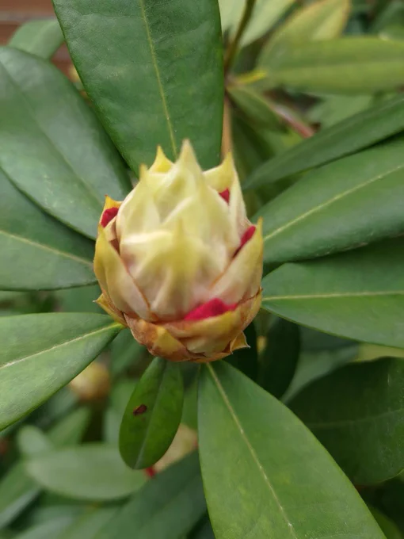

[6 Apr, 2023 10:00 PM](https://twitter.com/hirasawa/status/1643961759433125894#m)

明日にも咲くシャクナゲの個体があろるの庭に有る。

人類のシャクに触った終わり行くこの世を投げ捨てるように。

ダジャレで世が変わるなら。。

またこんど！！

---

[6 Apr, 2023 09:55 PM](https://twitter.com/hirasawa/status/1643960496138391553#m)

Q：学校の先生方からの圧がすごくて苦しいです。どう考えれば楽になりますでしょうか。

A：よくわかります。もしその境遇を自らきれいさっぱり捨て去ることができないならこう唱えてください。

「平沢はこれを知っている」

---

[6 Apr, 2023 09:50 PM](https://twitter.com/hirasawa/status/1643959238195068929#m)

Q：今ちょいと嘔吐しそうです。

A：吐きだせ吐きだせ。

By 田中靖美<a href="/p" title="paolo i.">@P</a>-MODEL。

---

[6 Apr, 2023 09:45 PM](https://twitter.com/hirasawa/status/1643957979476049922#m)

Q：ヒラサワさんはじゃんけんした事ありますか？

A：あります。ほとんどが後出しじゃんけんですが。相手はそれに気づきません。

---

[6 Apr, 2023 09:40 PM](https://twitter.com/hirasawa/status/1643956721654833157#m)

Q：自分はやるべきことがあっても、自分の弱さをひけらかして、それから逃れようとしてしまいます。

A：内発的な衝動が足りません。やらざるを得ない程己を突き動かす衝動に蓋をしていなか自問しましょう。

---

[6 Apr, 2023 09:35 PM](https://twitter.com/hirasawa/status/1643955462944206848#m)

直立歩行の生物は既に全てを学んでおり、それを思い出す困難な過程で砂金を見つけるような「成長」を夢想すのはその生物が賢いと困るので余計なゴミを頭に詰め込んで記憶を封じる教育が発明されたためだ。

Tシャツにするにはちょっと長い。

---

[6 Apr, 2023 09:30 PM](https://twitter.com/hirasawa/status/1643954207962320897#m)

Q：なりたかった職業に進む学びの為、新しい生活を始めます。
好きな事をする道ではありますが、もし挫折しそうになった時どういう風に考えると良いか、

A：挫折は好きな事をするための必要条件ではありません。それは単なる課題です。その不吉な回路をOFFった時ONになる回路に進路を委ねてください。

---

[6 Apr, 2023 09:25 PM](https://twitter.com/hirasawa/status/1643952946315669505#m)

Q：鏡の世界の左右は反対になるのに何故上下は反対にならないのでしょう。
花屋敷のびっくりハウスに行ってからこの世がびっくりハウスになってしまったのですがこの世界酔いに生姜チューブは効きますか？

A：貴方の方が鏡像だと早く気づいてください。貴方は上下も逆さまです。生姜は実体に与えて。

---

[6 Apr, 2023 09:20 PM](https://twitter.com/hirasawa/status/1643951688146120705#m)

Q：玄関のセンサーライトが誰もいないのに点灯したのを見て、怖くて固まっています。

A：自分が居るかどうかの確信を得てから抱いても遅くない恐怖です。

---

[6 Apr, 2023 09:15 PM](https://twitter.com/hirasawa/status/1643950430261747714#m)

シャクナゲが終わる世の蕾から始まる世の始まりをはみ出させているつくば降ろしの春。

のどかでうららかは暴風の中。

---

[6 Apr, 2023 09:10 PM](https://twitter.com/hirasawa/status/1643949171786018816#m)

終了を嗅ぎつける男。

皆様のうちほんの少数が待ち望むタイプのこの世の終了も「間もなく臭」を放っております。

と描かれたTシャツを着るのが好きです。

---

[6 Apr, 2023 09:05 PM](https://twitter.com/hirasawa/status/1643947914287259648#m)

Twilogが終了するのは知っていたけど、いつ終了なのかは知らなかった。

たまたまある目的で全TWをDLした日は終了の前日だった。

---

[6 Apr, 2023 09:00 PM](https://twitter.com/hirasawa/status/1643946663545847808#m)

７曲目が出来上がり。

微調整後数日以内に世話役公開される。

---

[6 Apr, 2023 04:02 PM](https://twitter.com/Hirasawa_Info/status/1643871758771171328#m)

Retweet from [平沢進・公式サイト @Hirasawa_Info](https://twitter.com/Hirasawa_Info)

"Ash Crow - Susumu Hirasawa Berserk Soundtrack Collection," a collection of soundtracks supporting Berserk's unique view of the world, will be available digitally on Bandcamp.
Distribution is scheduled to begin at 5:00pm (Japan time) on April 7!
<a href="https://susumuhirasawa.bandcamp.com/">susumuhirasawa.bandcamp.com/</a>

---

[6 Apr, 2023 04:02 PM](https://twitter.com/Hirasawa_Info/status/1643871757525487616#m)

Retweet from [平沢進・公式サイト @Hirasawa_Info](https://twitter.com/Hirasawa_Info)

ベルセルク唯一無二の世界観を支えるサントラ集『Ash Crow - 平沢進ベルセルクサウンドトラック集』をBandcampにてデジタル配信開始します。
4月7日17時（日本時間）配信開始予定！
<a href="https://susumuhirasawa.bandcamp.com/">susumuhirasawa.bandcamp.com/</a>

---

