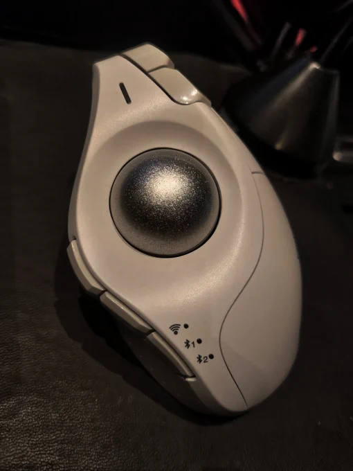

[10 Apr, 2023 10:00 PM](https://twitter.com/hirasawa/status/1645411317975511043#m)

このTWがトラックボールの初仕事だ。

オマエタチはここまでまるで恐竜が生息する川沿いをカヌーで下るアトラクションのように共に帰還した。

この先は滝つぼだが、勿論共に落ちてもらう。

またこん、あーーーーーー！！

---

[10 Apr, 2023 09:55 PM](https://twitter.com/hirasawa/status/1645410047391043585#m)

ところでこのての話を成功物語と取ってもらっては困る。

これは帰還物語だ。

物語りはようやくトラックボールへ帰還した。

ゴールまでは何百年、いや何千年も遡る骨折れる作業だが、案外それは一瞬で終わりそうな気がする。

「一瞬」よノックせず入ってよし。

---

[10 Apr, 2023 09:50 PM](https://twitter.com/hirasawa/status/1645408789154369539#m)

その後は点検隊で国境をまたぎ、音楽業界をまたぎ、苗場を往復またぎする又裂け男として顔面は左右対称に含み笑いで微振動している。

---

[10 Apr, 2023 09:45 PM](https://twitter.com/hirasawa/status/1645407530917724161#m)

主導権は自分にあり、境遇は自分で作ると決意した男は「またがれて行く変わり者」を経て気が付けばまことに無礼ながら観客をまたいでいる自分を見た。

そこちょっとスイマセン、またぎますよ。

---

[10 Apr, 2023 09:40 PM](https://twitter.com/hirasawa/status/1645406272551022593#m)

主導権がうまく機能せず、他者のせいで自分の境遇が荒れていくと感じている間は自己評価が著しく低くなるもんだ。

そんなもん持ってる必要ないと捨ててしまったのがソロである。

---

[10 Apr, 2023 09:35 PM](https://twitter.com/hirasawa/status/1645405014498873346#m)

ツアー中は深夜か明け方になるまでホテルの部屋には帰らない。帰ってもスタッフの轟くイビキと体臭が襲い掛かる。

さりとて独りで泊まる金もなく、「明日の舞台のためにフロントマンには休息を」という配慮も受けたことがない。

だからゲームだ。場末の小汚い茶店で繰り広げるサイバーパンクだ。

---

[10 Apr, 2023 09:30 PM](https://twitter.com/hirasawa/status/1645403757931560960#m)

居留地からこんなに遠く離れた土地でどこにも収まらない男を金を払って見に来る人々の存在が奇妙でありました。

P-MODELになるまでは、変わり者というだけで、人は私をまたいで行くだけだと思っていた。

（猫マタギに次ぐ人マタギの夜です、こんばんは）

---

[10 Apr, 2023 09:25 PM](https://twitter.com/hirasawa/status/1645402497807269888#m)

生産性のないことに金をつぎ込む己の虚無を自嘲しながら深夜泥酔者で溢れる歓楽街をうろつくだけの消耗よりマシだと、顔の半分だけ冷笑し、もう片方の半分は不機嫌だった。

---

[10 Apr, 2023 09:20 PM](https://twitter.com/hirasawa/status/1645401239759343616#m)

私は元来ゲームはやらない類の人間でありますが、コンピューターゲームの黎明期であった時代にP-MODELはツアー真っ盛りの季節であったため土地土地の茶店やゲームセンターでしばしばゲームをやった。

ディスプレーの青白い光に下から照らされる人るの顔はなかなか浮世離れしていて好ましかった。

---

[10 Apr, 2023 09:15 PM](https://twitter.com/hirasawa/status/1645399981417693185#m)

これからの作品はこの機械と生き物の中間のようなトラックボールと共に作って行く所存。

---

[10 Apr, 2023 09:10 PM](https://twitter.com/hirasawa/status/1645398722841329665#m)

その後AMIGA絶滅に伴い止む無くPCに移行するまで私はずっとトラックボール派だった。美しいトラックボールだった。

何故PCでトラックボールを使わなくなったかというと美しい製品が無かったから。

---

[10 Apr, 2023 09:05 PM](https://twitter.com/hirasawa/status/1645397465087242242#m)

トラックボールを初めて知ったのはツアー先の何処かの土地で深夜一人茶店でやったゲームだ。

ミサイルの弾道を調整するゲームだったと思う。

ハイテクでSF的な雰囲気と深夜秘密めいた単独行動の怪しさが相まって未来的な雰囲気に浸りその後AMIGA用のトラックボールを購入した。

---

[10 Apr, 2023 09:00 PM](https://twitter.com/hirasawa/status/1645396220431699968#m)

数十年の時を経て再びトラックボールに回帰しました。

美しい。

---

