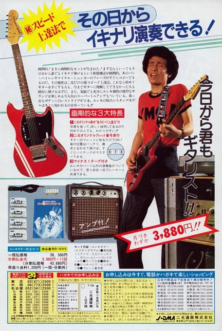

[14 Apr, 2023 10:00 PM](https://twitter.com/hirasawa/status/1646860862060392448#m)

意を決して高い敷居をまたぎ、二人は出て来るときには１万円台のエレキとアコギを抱えていた。

二人ともしばらくMANDRAKEのステージで使っていた。

なーに、遠目で見ればGibsonに見えるさ。

内緒。

またこんど！！

---

[14 Apr, 2023 09:55 PM](https://twitter.com/hirasawa/status/1646859599113273345#m)

住所に間違いはない。しかし、目の前にあるのは巨大配送センターではなく、個人経営の小さなクリーニング店といった風情の店舗だ。

ちゃんと二光商会という看板も出ている。

ここは、こんな広告を少年雑誌に掲載するあの憧れの店なのか？

---

[14 Apr, 2023 09:50 PM](https://twitter.com/hirasawa/status/1646858340780089346#m)

亀有から小岩へはエヅレ巡査の交差点を通ってずーーーっと行けばそれほど遠くはない。車でなら。

我々二人は巨大な配送センターのような倉庫兼店舗を想像しながら小岩へと向かった。

---

[14 Apr, 2023 09:45 PM](https://twitter.com/hirasawa/status/1646857083189379072#m)

私はアコギ、ベーシストはエレキを買う決意を固めた。

生意気にも半分プロのつもりでいるふたりは偉そうにこう言った。

「しかし、実物を見ないで買うのもなんだなあ」

「ああ、なんだなあ。行くか」

「小岩だし」

---

[14 Apr, 2023 09:40 PM](https://twitter.com/hirasawa/status/1646855823933702144#m)

少年ステルスと言ってももう18だ。来年にはMANDRAKEを始めようとする半分プロみたいなもんだ。

だが二光商会に魅かれた。
後にMANDRAKEのベーシストになる男も二光商会に魅かれた。

二人に共通する最大の理由は

貧乏。

---

[14 Apr, 2023 09:35 PM](https://twitter.com/hirasawa/status/1646854565877420032#m)

しかも通販、と念を押したのは、当時インターネットなどなく、通販は主流ではなかった。

頼りになるのは雑誌広告の粒子の荒い商品写真だけで、現物を見ずに買うのは危険だと考えられていた。

少年ステルスも二光商会の広告見たさに少年雑誌を買ったことがあった。

---

[14 Apr, 2023 09:30 PM](https://twitter.com/hirasawa/status/1646853308118597637#m)

二光商会は巷で憧れの高価な商品に似せた廉価商品を自社ブランドで制作して販売し、若者たちの夢をかなえていた。

特に有名なのはエレキギターやアコースティックギターで、見た目本物のような楽器を驚きの廉価で販売していた。

しかも通販。

---

[14 Apr, 2023 09:25 PM](https://twitter.com/hirasawa/status/1646852049349296130#m)

敷居が高いといえば小岩の二光商会だ。

（現存したらお許しを）

70年代に少年雑誌の広告で名を馳せた通販の店だ。

当時の通販はアヤシイものの宝庫だ。

---

[14 Apr, 2023 09:20 PM](https://twitter.com/hirasawa/status/1646850791305793538#m)

8曲目をボツにした。

この度はボツの確立が高い。

シンプルは敷居が高い。

---

[14 Apr, 2023 09:15 PM](https://twitter.com/hirasawa/status/1646849533068943360#m)

郵便配達員がバイクを止めて水を飲んでいた。ほっとするひと時かも。

私が水を飲んだ後ほっとしていてはライブが止まってしまう。

---

[14 Apr, 2023 09:10 PM](https://twitter.com/hirasawa/status/1646848274731606018#m)

カビより嫌われる配線。

これで本日の名言は出尽くしたのでこの後は期待しないで欲しい。

---

[14 Apr, 2023 09:05 PM](https://twitter.com/hirasawa/status/1646847016822091777#m)

どこかでやめなければ再び配線に浸食されてしまう。

当家においては

カビより嫌われる配線。

---

[14 Apr, 2023 09:00 PM](https://twitter.com/hirasawa/status/1646845764533092352#m)

つくば山頂１配線の嫌いな男は90%の機材を仮想物にして配線もろともサイバー空間に幽閉してきた。

ところが数年前配線の権化であるモジュラーシンセを購入したのをきっかけに？物理機材系を増やし始めている。

どういうこと？

---

