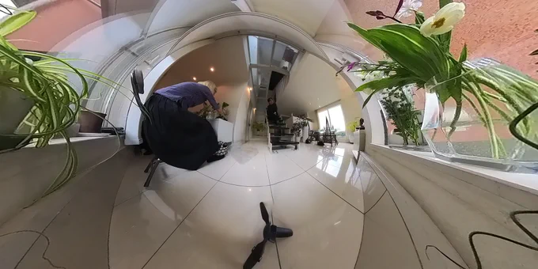
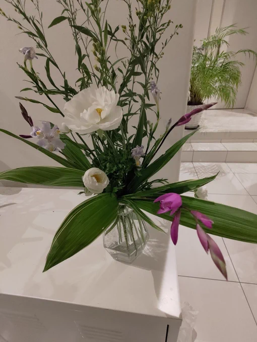
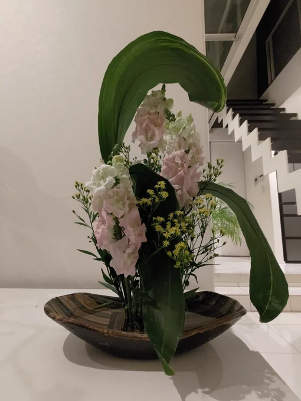

[16 Apr, 2023 10:00 PM](https://twitter.com/hirasawa/status/1647585642531147777#m)

Q：私は他人からの影響を受けやすく独自の世界観で創作する事がなかなか出来ません。何故ヒラサワさんは独自の世界観を維持し続ける事ができるのでしょうか？

A：創作に向かう「動機」は何ですか？揺らがない人の創作は「結果論」であり、揺らぐ人は創作を「目的」にしています。

またこんど！！

---

[16 Apr, 2023 09:55 PM](https://twitter.com/hirasawa/status/1647584374811156480#m)

Q：歌う時声が揺れて聞く人を不安にさせるような歌声になってしまいます。

A：そのように歌う魅力的な歌い手が少なからず存在するので探してみましょう。

あるいは90%の人々からは不安定と悪評を受け、10%の人から天才と称賛されるケースもあります。

---

[16 Apr, 2023 09:50 PM](https://twitter.com/hirasawa/status/1647583116431888384#m)

Q：師匠は香水とかお使いになります？平沢さんは良い匂いしそうですよね。

A：使いません。私は無臭です。病める時も健やかなる時も無臭です。

---

[16 Apr, 2023 09:45 PM](https://twitter.com/hirasawa/status/1647581858585096194#m)

あと２曲が終われば170Kも終了です。

長かった～。

---

[16 Apr, 2023 09:40 PM](https://twitter.com/hirasawa/status/1647580599811731456#m)

長く瞑想的な曲と短く「亀裂から覗く的」な曲が交互に配置されるでしょう。

---

[16 Apr, 2023 09:35 PM](https://twitter.com/hirasawa/status/1647579341621170177#m)

今回のアルバムはICE-9とはだいぶ趣が変わっている。

構造がシンプルであり
透明感のあるクリーントーンが目立つ。

ICE-9のように重い曲調はなく、瞑想的、せん妄的、夢の文脈的な質感を持っている。

---

[16 Apr, 2023 09:30 PM](https://twitter.com/hirasawa/status/1647578084529324033#m)

盤となればパッケージデザインや撮影も必要となるでしょう。

タイトルはもう決まっている。

前回のギターアルバムが「ICE-9」なら、今回のタイトルは自ずとそうなる。

---

[16 Apr, 2023 09:25 PM](https://twitter.com/hirasawa/status/1647576825046892544#m)

残すところあと2曲になったギターアルバム。当初はDL販売を想定していたものの、8曲目の出来によって全体のバランスが見え、盤が相応しいとの判断に至る。

それは、まず盤になるでしょう。

---

[16 Apr, 2023 09:20 PM](https://twitter.com/hirasawa/status/1647575566982459393#m)

キジバトやヒヨドリが再びやってくる頻度が増えた。今年も巣を作るだろうか。

すの住かに巣作りを勧める素顔の素直さ。

---

[16 Apr, 2023 09:15 PM](https://twitter.com/hirasawa/status/1647574308317962241#m)

シトリンが冬に剪定を始めた成果が見え始めている。

植物たちはバランスよく、しかも生き生きと咲き新芽を見せ始めた。

こんなところにこんな花が有ったのか！と驚かされる表情を持った空間に変貌し始めている。

未来を見据える庭師キン子。
正に植物とのセッションと呼ぶにふさわしい。

---

[16 Apr, 2023 09:10 PM](https://twitter.com/hirasawa/status/1647573050001616902#m)

ライブ生け花プレイ中のシトリン。

---

[16 Apr, 2023 09:05 PM](https://twitter.com/hirasawa/status/1647571792100478981#m)

そしてシトリンの庭から
あろるの館へ運ばれて来た花々。

---

[16 Apr, 2023 09:00 PM](https://twitter.com/hirasawa/status/1647570534820102144#m)

本日の生け花。by シトリン。

良いタメで（生け花の誉め言葉）

---

