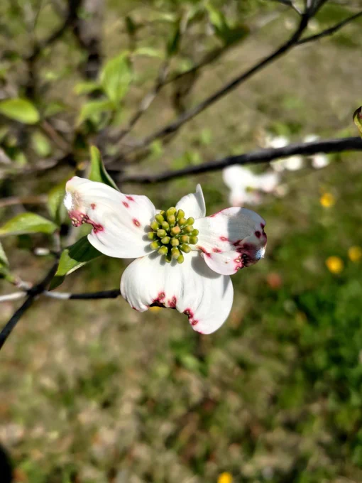
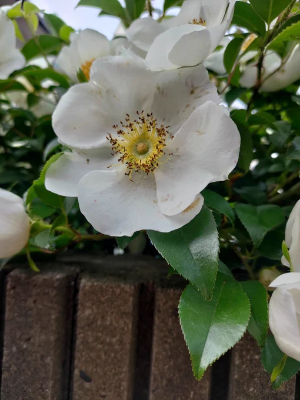
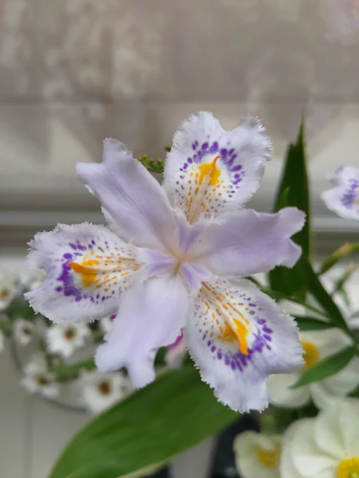
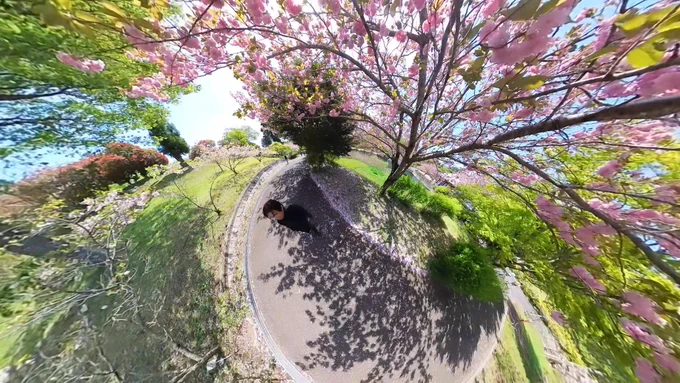
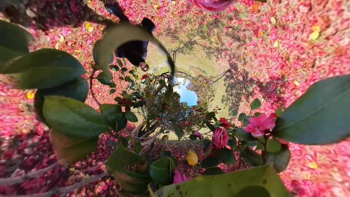
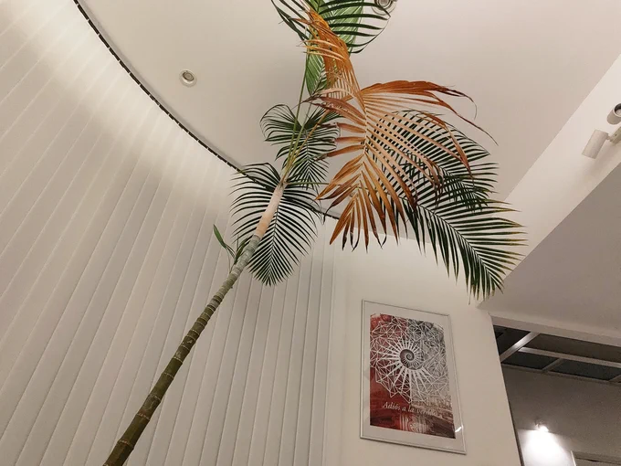

# 2023-04-20

[20 Apr, 2023 10:00 PM](https://twitter.com/hirasawa/status/1649035194568163328#m)

近所のスーパーの脇にもやや紫なピンクのはなみずきが咲いているのを発見した。それは丁度換気扇の前で唐揚げの匂いを浴びて咲いていた。

私もそうやって咲く方法を学んで来た。

花よ。

またこんど！！

---

[20 Apr, 2023 09:55 PM](https://twitter.com/hirasawa/status/1649033926395170816#m)

こんなやつ

！

---

[20 Apr, 2023 09:50 PM](https://twitter.com/hirasawa/status/1649032667948625920#m)

近所の病院に咲く花々を見に行き、この花は何だ？！と思って画像検索をした結果それははなみずきでありました。私が「なんだ！これはやや紫なピンクのはなみずきなのか！」というと後ろを通りかかった顔に包帯グルグル巻きの人が頭上に感嘆符を出現させた！

---

[20 Apr, 2023 09:45 PM](https://twitter.com/hirasawa/status/1649031410303348736#m)

数週間前に、この世にはやや紫なピンクのハナミズキがあることを知った。

やや紫なピンクのハナミズキが無かった人生を返して欲しい。

---

[20 Apr, 2023 09:40 PM](https://twitter.com/hirasawa/status/1649030151282237441#m)

先日脱兎に乗り高速を１時間走って撮影して来た映像は立派に使えました。

---

[20 Apr, 2023 09:35 PM](https://twitter.com/hirasawa/status/1649028893263659009#m)

しかし納車後は赤信号で前倒し発進するような乗り物ではないようにお願いします。

---

[20 Apr, 2023 09:30 PM](https://twitter.com/hirasawa/status/1649027637409447937#m)

５つ戻る双六TW。

私が前倒ししているんだから納車も前倒しして欲しい。

---

[20 Apr, 2023 09:25 PM](https://twitter.com/hirasawa/status/1649026376463179776#m)

野戦病院のナースに束の間の休息をと木々は枝の毛細管に時空を吸い上げ終戦の野辺に彼女をうたた寝させる。

---

[20 Apr, 2023 09:20 PM](https://twitter.com/hirasawa/status/1649025118549442560#m)

巨大船舶を推進させるスクリューが骨休みする方法は花のフリをして人様の庭で厳然することである。

---

[20 Apr, 2023 09:15 PM](https://twitter.com/hirasawa/status/1649023860191404032#m)

東南アジアの女児が着るちょうちん袖のブラウスに現れる神の紋章。

---

[20 Apr, 2023 09:10 PM](https://twitter.com/hirasawa/status/1649022601845690374#m)

月締メより抜粋。

デトックス祈願の二連発。

---

[20 Apr, 2023 09:05 PM](https://twitter.com/hirasawa/status/1649021344191848449#m)

一足早く月締メ・フォルマントが納品された。

いろいろと前倒しで攻めている。

---

[20 Apr, 2023 09:00 PM](https://twitter.com/hirasawa/status/1649020097275760641#m)

枯れヤシと中井デザイン

---

