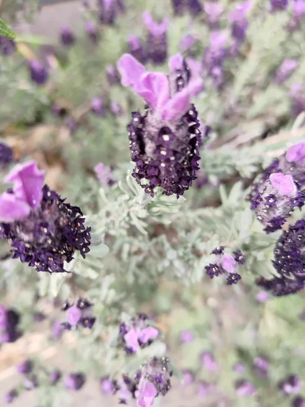
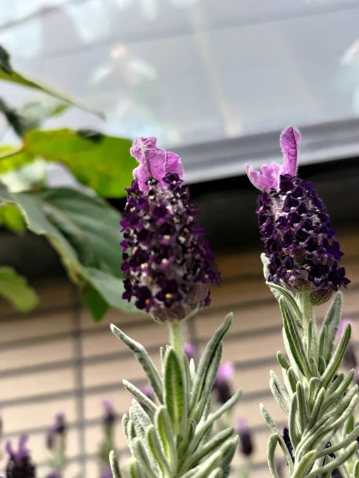

# 2023-04-24

[24 Apr, 2023 10:00 PM](https://twitter.com/hirasawa/status/1650484747800563713#m)

帰り道、１万歩を達成してブルブルと震えた歩数計からふと顔を上げると頭上に見事は藤棚があり、思わずこう言った。

「なんだ！この長尺逆さフレンチラベンダーは！」

なたこんど！！！

---

[24 Apr, 2023 09:55 PM](https://twitter.com/hirasawa/status/1650483477652062209#m)

魔の９：５５

---

[24 Apr, 2023 09:50 PM](https://twitter.com/hirasawa/status/1650482219545407490#m)

あまりに納車が遅いので、キャンセルして同車種の中古車を探そうとしたくらいだ。

まだ売られていない車の中古車が納車より先に見つかると思っている混乱した脳。

---

[24 Apr, 2023 09:45 PM](https://twitter.com/hirasawa/status/1650480961757360131#m)

来なければならないと思い。
来ると確信したものを待って２０年が経ったがどうやら納車は本当に来るらしい。

---

[24 Apr, 2023 09:40 PM](https://twitter.com/hirasawa/status/1650479702828810240#m)

「貴方のため」と頭上で鐘が鳴る新興宗教の館の前で腕時計がブルブルと震えた。電話だ。タイヤチューブの鞄から携帯を出すとそれは印鑑証明を持って近々来て欲しいというディーラーからのお願い電話だった。

---

[24 Apr, 2023 09:35 PM](https://twitter.com/hirasawa/status/1650478444847988738#m)

だがお嬢さんは館のドアをくぐった。お嬢さんであるところの神を根こそぎ殺されるために。

フレンチラベンダーは言った。

「我々が紫になり、あんたが灰色になってもあのスイッチは切れないな」

---

[24 Apr, 2023 09:30 PM](https://twitter.com/hirasawa/status/1650477187873767426#m)

彼女が驚いたのは、私の目が彼女の人生の色をそのまま映し出している鏡の目の男に見えたからだと思う。その非日常的驚きにつけこんで本当の事を教えてあげればよかったと思うがそれは営業妨害だと思う。

お嬢さん、早く思い出して。神は貴方です。

---

[24 Apr, 2023 09:25 PM](https://twitter.com/hirasawa/status/1650475927850340352#m)

そんな事を考えながらまりに長い間凝視していたため、にべもなく巡る歌曲のような日々に溺死せんとする信者たちの道を塞いでることに気が付かなかった。

溺死せんとする信者は私の顔を見てギョっとしたが正体がバレたわけではない。

---

[24 Apr, 2023 09:20 PM](https://twitter.com/hirasawa/status/1650474669693370369#m)

以上はフレンチラベンダーの花言葉（どっからどこまで？）となります。

ウソだけど。

---

[24 Apr, 2023 09:15 PM](https://twitter.com/hirasawa/status/1650473411393585152#m)

その短小逆さ藤は土の上なら「花咲く道理」さえ歪める屁理屈の殿堂の庭にも咲く。

にべもなく巡る歌曲のような日々に溺死せんと集う民の目を遊ばすためかと問うても答えなく。

谷底の庶民よ、共に聞くべきは「貴方のため」と頭上で鳴る鐘ではなく、背後で止まずに引き留めるミゼラブル嬢の鐘だ。

---

[24 Apr, 2023 09:10 PM](https://twitter.com/hirasawa/status/1650472153597480961#m)

初めてそれを見た瞬間

「なんだ！この短小逆さ藤は！」

と驚き

「ここは新興宗教の館の入り口なので手短に写真を撮って調べてやれ」

と無言でつぶやき撮影した後、プラズマ放電する灰色の目でスルドク凝視した。

---

[24 Apr, 2023 09:05 PM](https://twitter.com/hirasawa/status/1650470895297900547#m)

私は赤レンガの倉庫で逆子として誕生して以来数ある花壇や通勤路の植え込みや、花咲く野辺や、人様の庭を凝視するに留まらず、立ち止まってスルドク凝視して来たが、今日初めてフレンチラベンダーを知った。

---

[24 Apr, 2023 09:00 PM](https://twitter.com/hirasawa/status/1650469643042148353#m)

フレンチラベンダーを知ってるか？

---

