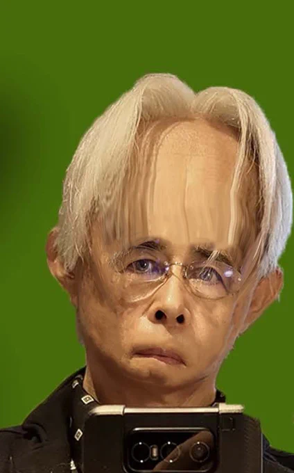

# 2023-04-25

[25 Apr, 2023 10:00 PM](https://twitter.com/hirasawa/status/1650847136005906432#m)

手っ取り早く目に飛び込んできたものの話題から始めると終わり方が見つからなくなる典型的な例が今日。

何処かへ辿り着こうとしてもハズレが出るばかり。

そんな日はサッと店じまいしよう。

またこんど！！

---

[25 Apr, 2023 09:55 PM](https://twitter.com/hirasawa/status/1650845865437810688#m)

そこで私は究極の平沢二重スリット実験について語ったわけです。

これで青いチェックマークは戻って来るでしょう。

---

[25 Apr, 2023 09:50 PM](https://twitter.com/hirasawa/status/1650844607243247617#m)

私のtwitterからブルーのチェックマークが消えたのでTwitter Blueに混ぜてくださいと申請した結果、Twitterの人は私が本物かどうか審査中なのです。

私が本物であるかどうかは万物平沢説を説けるかどうかにかかっているのです。

---

[25 Apr, 2023 09:45 PM](https://twitter.com/hirasawa/status/1650843349249556484#m)

問題なのはこんな事を45分もいかけて話している平沢が居るということだ。

しかし、これは大事な事である。

何が大事なのかは次のTWに書かれている。

---

[25 Apr, 2023 09:40 PM](https://twitter.com/hirasawa/status/1650842090664755205#m)

この世は計り知れないほど小さな平沢で出来ており、それが二重スリットを通る時、観察者が居なければ平沢になり、観察者が居れば平沢になることが知られている。

この世は平沢から出来ているのだから観察者も平沢である。

だから何も問題無いのである。

---

[25 Apr, 2023 09:35 PM](https://twitter.com/hirasawa/status/1650840832424165379#m)

それは、全ての現象が股下で起こるほど長い脚の貴方が、顎にベルトをするほど短い胴の貴方に出会っても問題ないのと同じである。

万物平沢の法則では対比するものが存在せず、概念と概念の境界もない。

貴方は顎にあるベルトに向かって「おい、平沢」と呼びかけても心は乱れないのである。

---

[25 Apr, 2023 09:30 PM](https://twitter.com/hirasawa/status/1650839574187507714#m)

例えば貴方の額が身震いするほど長く、街中で恐怖するほど顔のパーツが下のほうに付いている自分に出会ったとしても問題ない。

どちらの貴方も平沢なのだから。

---

[25 Apr, 2023 09:25 PM](https://twitter.com/hirasawa/status/1650838316055404545#m)

この世には相対値によって上になったり下になったり、長くなったり短くなったりするものがあるが、それはガワの問題であって中身には関係ない。

それが分からないと万物平沢の法則も分からない。

---

[25 Apr, 2023 09:20 PM](https://twitter.com/hirasawa/status/1650837057634283522#m)

今気が付いても教えてやれる相手が居ないのでオマエタチに教えておく。

街で元木君の脚が長いと信じている人がいたら教えてやってくれ。

---

[25 Apr, 2023 09:15 PM](https://twitter.com/hirasawa/status/1650835800165163011#m)

同じクラスの元木君は長い脚を自慢にしていたし、皆も同意していたと思う。

最近道を歩いていてふと気が付いたんだが、元木君は足が長いのではなく、胴が短いのだ。

---

[25 Apr, 2023 09:10 PM](https://twitter.com/hirasawa/status/1650834541181804548#m)

額が広いと表現できる造作の顔はよく見る。

トロピカル国では顔のパーツが下のほうに配置されているタイプの人を見かけるが、額が広いという印象はないのは何故だろう？

---

[25 Apr, 2023 09:05 PM](https://twitter.com/hirasawa/status/1650833283104505857#m)

まだそれほど下がっていないし、オマエタチが見たって気付かない程度だから、今のうちにやめておけば取返しの付かないことにはならないと思う。

---

[25 Apr, 2023 09:00 PM](https://twitter.com/hirasawa/status/1650832033860517888#m)

アイマッサージャーが重くて顔面下垂になってしまう。

---

