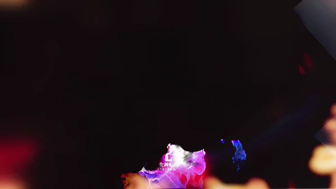

# 2023-04-27

[27 Apr, 2023 10:00 PM](https://twitter.com/hirasawa/status/1651571913179926528#m)

そういえば昔ヨッツというバンドが居た。彼らの帆に

「もう虫も食わない。
哀れな二足歩行はまだ食っている」

と書かせてもらえないか頼んでみる。ニューウエーブのよしみで。

今夜はヨッツでお別れ。またこんど！！

<a href="https://youtube.com/watch?v=Aj203ln8nwc">youtube.com/watch?v=Aj203ln8…</a>

---

[27 Apr, 2023 09:55 PM](https://twitter.com/hirasawa/status/1651570641261465603#m)

私は小西健司より

「ド」

が一つ多い。

だが「ド」一つで行く勇気はない。

---

[27 Apr, 2023 09:50 PM](https://twitter.com/hirasawa/status/1651569383205134338#m)

小西健司はドイツ派と言えなくもないが、私は都都逸派と言えなくもない。

だから言う。

私は都都逸派です。

---

[27 Apr, 2023 09:45 PM](https://twitter.com/hirasawa/status/1651568125219950593#m)

「期待する虫を腹に持つ者にこの世は時として恐ろしいほどよく練られたタイミングを放ってくる。

私はそれを何度も経験し、ゆえにここに居る」

この都都逸もTシャツにしたい。

---

[27 Apr, 2023 09:40 PM](https://twitter.com/hirasawa/status/1651566866316378113#m)

タイミングよく脱兎のオーナーは帰国する。

これは断固ダジャレではなく、絶妙なるタイミングを堪能するタイミング浴。決然と巡る血行に浴する。

---

[27 Apr, 2023 09:35 PM](https://twitter.com/hirasawa/status/1651565608515805185#m)

「もう虫も食わない。
哀れな二足歩行はまだ食っている」

と帆に描かれたヨットに乗りたい。

---

[27 Apr, 2023 09:30 PM](https://twitter.com/hirasawa/status/1651564350585356288#m)

「私はそれゆえに、来ることが不可能だった未来がやってくると囁く腹の虫に毎日耳を傾けることができます」

と描かれたTシャツを着るのが好きです。

---

[27 Apr, 2023 09:25 PM](https://twitter.com/hirasawa/status/1651563091468103682#m)

期待する虫は近未来を先回りして私によこす。MIRAIは「先回りする近未来」として遅れてやってくるインフラを夢見て寝たきりだ。

MIRAI、身重く横たわる。

床ずれしない程度に動かしてやる。返却まであと１年。

---

[27 Apr, 2023 09:20 PM](https://twitter.com/hirasawa/status/1651561833608691714#m)

腹の虫は憤慨することを止め、期待する虫へと変異した。

山ほどの憤慨物は史実として暗い汚物入れへと排泄され暗黒の陳列棚で晒される。

もう虫も食わない。
哀れな二足歩行はまだ食っている。

---

[27 Apr, 2023 09:15 PM](https://twitter.com/hirasawa/status/1651560575879479300#m)

もう何年も前から私は伏線回収のタイムラインに突入したと感じている。

それゆえに、来ることが不可能だった未来がやってくると囁く腹の虫に毎日耳を傾けることができる。

---

[27 Apr, 2023 09:10 PM](https://twitter.com/hirasawa/status/1651559316971978752#m)

「来なかった近未来」とは私がAMIGAコンピューターを修飾した表現。

それ以来私の身の周りは来なかった近未来と言い得るものだらけだが何か違う。

そもそも私に予定されていた近未来はホームレスか行倒れだと考えていた自分はバラバラに解体され、再構築された。

---

[27 Apr, 2023 09:05 PM](https://twitter.com/hirasawa/status/1651558059167318017#m)

平沢に好まれた物質はこの世から消えて行くの法則に従い、私が発注したある種のパッケージ構成は既に生産されなくなったと知らされた。

私の分はセーフ。

ディーラーは、その構成は私を含めて計２台しか販売しなかったそうだ。

来なくなりかけた近未来

---

[27 Apr, 2023 09:00 PM](https://twitter.com/hirasawa/status/1651556810447548418#m)

もしかして私は納車の無い世界線に移動してしまったかと考えた自分には罰を与えた。

納車は真実であった。しかも少し早まっている。

納車が霞むほどヒト科に良い事が早まる余震です。

と描かれたTシャツを着て納車式に臨みます。

---

[27 Apr, 2023 04:00 PM](https://twitter.com/d2megaten/status/1651481302837891072#m)

Retweet from [【公式】Ｄ×２ 真･女神転生 リベレーション @d2megaten](https://twitter.com/d2megaten)

／
TVアニメ「<a href="https://twitter.com/search?q=%23ベルセルク">#ベルセルク</a>」イベント復刻！
RT数に応じて全員最大500ジェムもらえる💎
＼

さらに！
RTした人の中から
ベルセルクグッズが当たる！

⚔ 参加方法
①<a href="/d2megaten" title="【公式】Ｄ×２ 真･女神転生 リベレーション">@d2megaten</a>をフォロー
②このツイートをRT
5/3(水)23:59まで

⚔ 詳細
<a href="https://d2-megaten-l.sega.jp/news/detail/095573.html">d2-megaten-l.sega.jp/news/de…</a>

<a href="https://twitter.com/search?q=%23D2メガテン">#D2メガテン</a> <a href="https://twitter.com/search?q=%23ベルセルク復刻中">#ベルセルク復刻中</a>

---

[27 Apr, 2023 06:39 PM](https://twitter.com/Hirasawa_Info/status/1651521397565554688#m)

Retweet from [平沢進・公式サイト @Hirasawa_Info](https://twitter.com/Hirasawa_Info)

遂に4度目の開催！
大好評のコラボゲームにて、 平沢進「灰よ」「Ash Crow」が再びBGMとして登場です。
様々なイベントも企画されている模様。

また、上記楽曲収録のベルセルク関連曲集結アルバム「Ash Crow」がBandcampでも好評配信中！
是非チェックして下さい！
<a href="https://susumuhirasawa.bandcamp.com/">susumuhirasawa.bandcamp.com/</a>
> [27 Apr, 2023 12:00 PM](https://twitter.com/d2megaten/status/1651420906185691136#m)
> 
> [【公式】Ｄ×２ 真･女神転生 リベレーション @d2megaten](https://twitter.com/d2megaten)
> 
> ⚔ コラボPV公開中 ⚔
>
>本日4/27(木)データ更新後よりイベント開始！
>ログインボーナスで全員グリフィス貰える！ 
>
><a href="https://twitter.com/search?q=%23ベルセルク">#ベルセルク</a> <a href="https://twitter.com/search?q=%23D2メガテン">#D2メガテン</a>
> 

---

