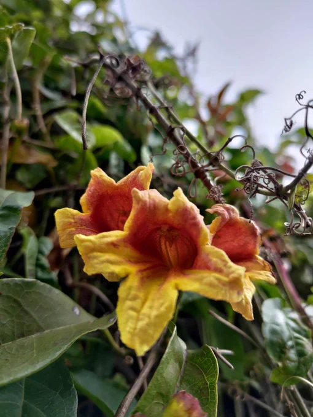
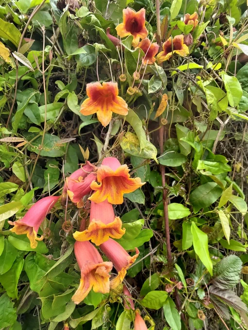

# 2023-05-01

[1 May, 2023 10:00 PM](https://twitter.com/hirasawa/status/1653021456081604609#m)

Q：ご自身の作られた曲や詩、アイデアなどで、良い意味で「誰が作った(考えた)んだろう？」と思われることがありますか？

A：しばしばあります。

しかし、これは明らかに私の考えから出る言葉です。

またこんど！！

---

[1 May, 2023 09:55 PM](https://twitter.com/hirasawa/status/1653020192799338497#m)

Q：月締メの新しいbgmが何なのか、気になって四半世紀眠れません。

A：ドビュッシーの逆再生です。

---

[1 May, 2023 09:50 PM](https://twitter.com/hirasawa/status/1653018934621405187#m)

Q：言葉を要しない存在に感謝の意を伝えたい時、
平沢さんでしたらどのような行動をされますか？

A：

---

[1 May, 2023 09:45 PM](https://twitter.com/hirasawa/status/1653017676111912964#m)

Q：なんかもう自分はなんで生きてるんだろうって気持ちでいっぱいです。中略～自己肯定感を上げる方法などありませんか？

A：そう思いながら死なずに「自己肯定感を上げる方法などありませんか？」と質問しているのは誰ですか？一人のシケた人間を脱出させようとしている偉大な人は誰ですか？

---

[1 May, 2023 09:40 PM](https://twitter.com/hirasawa/status/1653016417799634944#m)

Q：尊敬している方のアドバイスを参考にした結果、自分が最初作りたかったものとは程遠い物になってしまいました。

A：アドバイスは命令ではありません。結果は貴方が招いたものであり、招いた結果の責任は貴方にあります。そう認識した時アドバイスは機能しはじめます。

---

[1 May, 2023 09:35 PM](https://twitter.com/hirasawa/status/1653015159831658496#m)

表舞台では科学を敵視する「噂話」を巡って互いを有害物扱いする根源的ディスコミュニケーションの儀式であるアクリル板の向こう側からやって来る「敬語」が二足歩行の著しい劣化を思わせた一幕に潜伏する憤怒はより軽微な憤怒によって浄化された朝。

これ、要約しかねる。

---

[1 May, 2023 09:30 PM](https://twitter.com/hirasawa/status/1653013901531836417#m)

要約すると：銀行に行って踏切を迂回して帰ってきたら8,498歩だった。

質問ある人。

---

[1 May, 2023 09:25 PM](https://twitter.com/hirasawa/status/1653012643026804739#m)

軽微な憤怒のおかげで千金に値するツリガネカヅラの歓楽を得た事を祝う、ピアノブラックの深い艶を湛えたPEVO1号佃煮とコッパーゴールドの酵素玄米の質素な宴を想いながら帰宅した。

都合8,498歩の夢遊。

---

[1 May, 2023 09:20 PM](https://twitter.com/hirasawa/status/1653011384622534656#m)

それは瞬間に生じる驚きの引き延ばされた情緒のようであり、注意力の喚起と血行の促進と生活の持続する感嘆符であり、植物で言うならツリガネカヅラである。

---

[1 May, 2023 09:15 PM](https://twitter.com/hirasawa/status/1653010126360682497#m)

ヒドイ肩こりが潜伏するように存在するのに似て、半世紀をまたいで存在するアヨカヨへの憤怒はもはや感情からほぼ切断されている。

そうでなければまず自分の身が亡びてしまう。

軽微な憤怒はツリガネカヅラが体現するように「咲く」「小道」などの概念を超えない感情の微振動に留まる。

---

[1 May, 2023 09:10 PM](https://twitter.com/hirasawa/status/1653008868232904707#m)

軽微な憤怒はある種難しいチューニングの範疇にある。

怒りすぎてはいけないし、平穏でもいけない。

まして、無意識に議論放棄へと向かう者が見識者風に言う「中庸」でもいけない。

---

[1 May, 2023 09:05 PM](https://twitter.com/hirasawa/status/1653007610323386369#m)

つくばツインピークスに疎開して以来何度かあの小道を通ったことがあるが、そこがツリガネカヅラの小道だとは知らなかった。

ツリガネのヤツの表情を見るからに、それは軽微な憤怒に呼応して現れる小道だと確信する。

たまには軽微な憤怒も良いものだ。

---

[1 May, 2023 09:00 PM](https://twitter.com/hirasawa/status/1653006364665597953#m)

開かずの踏切が私の行く手を阻んだために軽微な憤怒の迂回路はツリガネカヅラの小道だったことを知った。

---

