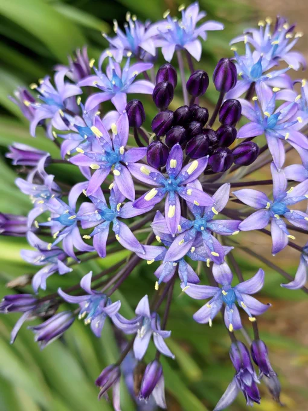

# 2023-05-02

[2 May, 2023 10:00 PM](https://twitter.com/hirasawa/status/1653383852986081281#m)

Q：では平沢進を誤用するとどうなりますか？

A：フォロワーが30万人を超えしまいます。

平沢は正しく使って健全な暮らしを。

またこんど！！

---

[2 May, 2023 09:55 PM](https://twitter.com/hirasawa/status/1653382580664782852#m)

Q：9月のライブには当然もうすぐ納車される新しい車で大阪へ移動なさると思いますが、そのまま舞台に登場してお披露目する計画はないでしょうか？🤗　♪🚙〜

A：ない。

---

[2 May, 2023 09:50 PM](https://twitter.com/hirasawa/status/1653381322457612289#m)

Q：では人生を誤用するとどうなりますか？

A：平沢進になります。

---

[2 May, 2023 09:45 PM](https://twitter.com/hirasawa/status/1653380064640217089#m)

Q：ライブや逃亡などで家を長期間空けるとき、植物の管理はどうされていますか？

A：親戚縁者に託します。知っていますか？私には血縁と祖先が存在します。

---

[2 May, 2023 09:40 PM](https://twitter.com/hirasawa/status/1653378806068150272#m)

Q：旬IVのPV群はどのような手法を用いて制作されてるんですか

A：ビデオ編集機材の民生機など存在しない時代の作品でTVモニターにカメラを向けたフィードバックやテロッパーと呼ばれる機械の誤用などで作られています。全ては人の兄YOU1の仕事です。

---

[2 May, 2023 09:35 PM](https://twitter.com/hirasawa/status/1653377547495940097#m)

Q：それヤバくね？

A：はい、ヤバいです。保険屋さんには親友から受け継がれた値段が付けられない程の勝のある楽器だと申告しました。もう手に入らないということでAMIGA2500に成りました。

---

[2 May, 2023 09:30 PM](https://twitter.com/hirasawa/status/1653376290697928704#m)

Q：そのアコギは今も所有していますか？

A：いいえ。GOK SOUNDの前に駐車してあった楽器車にノーブレーキの乗用車が突っ込み大破しました。

---

[2 May, 2023 09:25 PM](https://twitter.com/hirasawa/status/1653375030863237121#m)

もう追いつかれた。。。

---

[2 May, 2023 09:25 PM](https://twitter.com/hirasawa/status/1653375030817087488#m)

Q：「金星」は伴奏がアコースティックギターのみで平沢さんの曲のなかでは珍しいと思いますが、そう至った経緯などあればお聞かせ下さい。

A：中野テルヲがゴミ捨て場で拾ったアコースティックギターをもらったので、ようし、これで一発作ってみよう。

という経緯です。

---

[2 May, 2023 09:20 PM](https://twitter.com/hirasawa/status/1653373772500701185#m)

それから

「あちきがひやしんす」

とか言わないように。
暑い日に飲むシソジュースが花魁だとしても。

---

[2 May, 2023 09:15 PM](https://twitter.com/hirasawa/status/1653372514268233731#m)

花魁の５状態については調べる価値があり、それ自体心身浄化の効果がありそうです。

しかし、ウツボカヅラの５状態については熟練を積むまで調べないほうが良いでしょう。初心者は寝込んでしまうでしょう。

---

[2 May, 2023 09:10 PM](https://twitter.com/hirasawa/status/1653371256383627266#m)

また、プラズマ時代の花魁はオーロラであり、気体期は酢酸リナリルの霧であり、液体時代はシソジュースとなります。

---

[2 May, 2023 09:05 PM](https://twitter.com/hirasawa/status/1653369998130434053#m)

花状態にあるものは、その履歴を遡ることで個体時代に何であったかがわかります。

例えばこのワイルドヒヤシンスの個体時代は「花魁」です。

---

[2 May, 2023 09:00 PM](https://twitter.com/hirasawa/status/1653368744285192194#m)

物質には４つの状態がある。

例：氷（個体）→水（液体）→蒸気（気体）

これにイオン化が加わってプラズマの４態になりましょうが、本日私は第五番目の状態を提唱します。

１：個体
２：液体
３：気体
４：プラズマ
５：花

---

