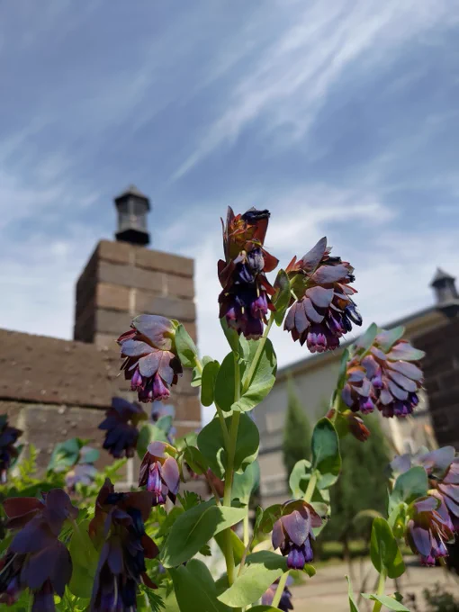

# 2023-05-04

[4 May, 2023 10:00 PM](https://twitter.com/hirasawa/status/1654108628641804289#m)

そこには澱まない不協和音があると思われます。

それは強要不気味な整合性に開いた開口部のようかもしれません。音楽のセリンセ・マヨール

では、向こう側で。

またこんど！！

---

[4 May, 2023 09:55 PM](https://twitter.com/hirasawa/status/1654107356433719296#m)

それは、運指練習に似ても似つかないフレーズの羅列で、私にギターを持たせるとこのようなデタラメを弾き続けるわけですが、そのようなものの寄せ集めのようです。

---

[4 May, 2023 09:52 PM](https://twitter.com/hirasawa/status/1654106648129204224#m)

この「亀裂から覗く」的小曲というのが作っていて楽しいのです。

作るというより「出来てしまう」というのが正確です。

これはかつてあるレコード会社のディレクターが私に

「平沢さん、あれやって」

と言ったスタイルです。

端的にいうと「デタラメ」です。

---

[4 May, 2023 09:45 PM](https://twitter.com/hirasawa/status/1654104839897460737#m)

「亀裂から覗く」小曲たちは、かつてこんなジャンルがあっただろうか？という怪しさと着地点の無さを標榜しています。

とてもシンプルな構造を心がけて。

---

[4 May, 2023 09:40 PM](https://twitter.com/hirasawa/status/1654103581472210944#m)

以前にも申し上げましたように、この度のギターアルバムは瞑想的な曲の間に「亀裂から覗く」的小曲が挟まるような形になるでしょう。

残る最後の１曲は「亀裂から覗く」タイプとなります。

---

[4 May, 2023 09:35 PM](https://twitter.com/hirasawa/status/1654102323168448512#m)

当事者を置き去りにした意味不明の施設を作りたいなら、

偉大な現象が目録外である文脈の世界で熱狂していた狂喜の無感動が何だったのか思い出せない。もうどうでもよい。ただその「OFF」を祝うトイレ

を作ってくれ。

---

[4 May, 2023 09:30 PM](https://twitter.com/hirasawa/status/1654101064709476354#m)

今年になって知った花が沢山ある。

それらは初めて認知した花。

それらの花が認知されない世界では、私はどんな命令に従っていたのだろうか。

偉大な現象が目録外である文脈の世界で熱狂していた狂喜の無感動が何だったのか思い出せない。もうどうでもよい。ただその「OFF」を祝いたい。

---

[4 May, 2023 09:25 PM](https://twitter.com/hirasawa/status/1654099806753632256#m)

バラの写真に

「神々が入眠時の電撃で咲かせたミオクローヌスの結晶」

と描かれたTシャツを着て10曲目に挑みたい。

---

[4 May, 2023 09:20 PM](https://twitter.com/hirasawa/status/1654098548328214534#m)

着火を急がなければ。

そして残るはあと１曲。

---

[4 May, 2023 09:15 PM](https://twitter.com/hirasawa/status/1654097290745839616#m)

二つの花咲く開口部から流入する何等かのもの、しいて言うならペニシリン色のエーテルが短時間で9曲目を完成させた。

まだ7曲目と8曲目を世話役公開していないのに。

---

[4 May, 2023 09:10 PM](https://twitter.com/hirasawa/status/1654096031821250565#m)

帰宅すると窓辺では

「神々が入眠時の電撃で咲かせたミオクローヌスの結晶」

が炸裂していた。

超高電圧の安寧と睡魔。

---

[4 May, 2023 09:05 PM](https://twitter.com/hirasawa/status/1654094774150782976#m)

その安寧は、一つの号令で巨大な集合を成す狂喜の無感動に波打つ群衆の目前で命令の目録外として一瞥されることもなく退けられた静寂の中に有った。

号令で波打つ人々の前にはなく
隠れる者の前にあるセリンセ・マヨールという開口部。

---

[4 May, 2023 09:00 PM](https://twitter.com/hirasawa/status/1654093518548217856#m)

私はここに居るから大丈夫なのだ。

---

[4 May, 2023 04:43 PM](https://twitter.com/Hirasawa_Info/status/1654028915776851968#m)

Retweet from [平沢進・公式サイト @Hirasawa_Info](https://twitter.com/Hirasawa_Info)

平沢進が三浦建太郎氏に捧げ、新たに書き下ろした『ベルセルク 黄金時代篇 MEMORIAL EDITION』の劇中歌「遠征」を三浦建太郎氏の命日である5月6日より、Bandcampにてデジタル配信します。皆さまのアクセスをお待ちしております。
5月6日午前0時（日本時間）配信開始予定
<a href="https://susumuhirasawa.bandcamp.com/">susumuhirasawa.bandcamp.com/</a>

---

[4 May, 2023 04:43 PM](https://twitter.com/Hirasawa_Info/status/1654028917215461376#m)

Retweet from [平沢進・公式サイト @Hirasawa_Info](https://twitter.com/Hirasawa_Info)

The song "The Expedition" from Berserk Golden Age Arc MEMORIAL EDITION, written by Susumu Hirasawa, dedicated to Kentaro Miura, will be available digitally on Bandcamp. 
Distribution is scheduled to begin at midnight (Japan time) on 6 May.
<a href="https://susumuhirasawa.bandcamp.com/">susumuhirasawa.bandcamp.com/</a>

---

