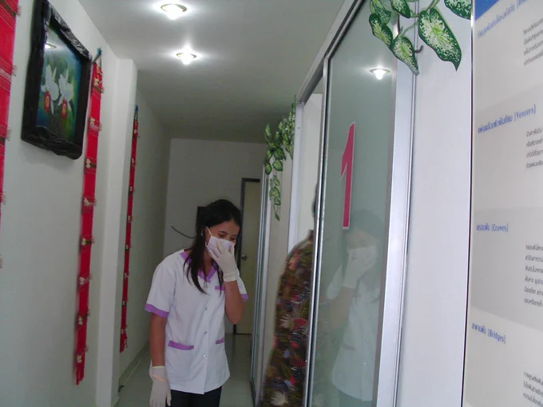

# 2023-05-08

[8 May, 2023 10:00 PM](https://twitter.com/hirasawa/status/1655558173401686017#m)

「知らず」と言っていたのに「忘れられない」というパラドックスはさすがヒラサワの口腔内と、喝采を浴びながら

またこんど！！

---

[8 May, 2023 09:55 PM](https://twitter.com/hirasawa/status/1655556907954843648#m)

ところで「ばっしらいん」というのは宮古島の方言で「忘れられない」という意味だそうです。

私の口腔内には今「忘れられない」があります。

---

[8 May, 2023 09:50 PM](https://twitter.com/hirasawa/status/1655555649504440320#m)

抜歯が終わり（へへへ）支払い待ちしていると電話だ。

「もいもい」「あ、あい、おーえすえ、あい、えーえー」「え！！もうえすか！？あやい！」

納車の日程が決まったそうです。

---

[8 May, 2023 09:45 PM](https://twitter.com/hirasawa/status/1655554391062228992#m)

それ以来もう痛みは無いのですが、口の中にずっとスライムが有ります。

---

[8 May, 2023 09:40 PM](https://twitter.com/hirasawa/status/1655553132858859523#m)

気のせいでしょうか。

さっき納豆を食べたら血液が口腔内で凝固し始めました。

まるでレバ刺しを食べている途中の人のようです。

---

[8 May, 2023 09:35 PM](https://twitter.com/hirasawa/status/1655551874974531584#m)

私だけではありません。
口腔外科の待合室はこんなです。

---

[8 May, 2023 09:30 PM](https://twitter.com/hirasawa/status/1655550620399726593#m)

---

[8 May, 2023 09:25 PM](https://twitter.com/hirasawa/status/1655549358128136198#m)

現在もやや出血が続いているため唇の周囲や両端にうっすらと赤い血潮がにじんでおります。

次のTWで自撮りをお見せしましょう。

---

[8 May, 2023 09:20 PM](https://twitter.com/hirasawa/status/1655548099656568833#m)

トロピカルな赤い看板でおなじみの「ばっしらいん」は宮古島のファミレスですが、ピタゴリアンは無理です。どんな店でも逃げ道はありますが「ばっしらいん」では「お冷や」くらいです。

一方、動物食愛好家は今すぐGo!たとえ現在新橋の飲み屋に向かう山手線のつり革につかまっていようとも。

---

[8 May, 2023 09:15 PM](https://twitter.com/hirasawa/status/1655546841667338243#m)

今は抜糸を待つ抜歯後のラインからまだ出血しています。

赤いバッシライン。 

（左から、第二大臼歯さん、第一大臼歯さん、第二小臼歯さん）

---

[8 May, 2023 09:10 PM](https://twitter.com/hirasawa/status/1655545583170625536#m)

14年の歳月を経て件の親知らずは本日抜歯されました。

歯茎を切開されました。

へへへ。

---

[8 May, 2023 09:05 PM](https://twitter.com/hirasawa/status/1655544325189582848#m)

治療室に入る男の背中を見守る女医さんはこれから男の身に起こる惨事を思い泣いている。

ヨヨヨと（タイ語で）

---

[8 May, 2023 09:00 PM](https://twitter.com/hirasawa/status/1655543080479596548#m)

2009年？
HKTの歯医者さんで応急処置をしてもらい、先生に「日本に帰ったらすぐにちゃんと治療してください」と言われた親知らず。

---

