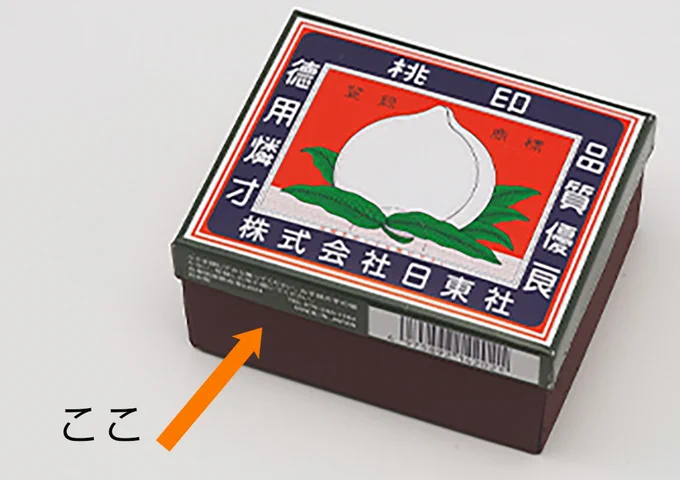

# 2023-05-09

[9 May, 2023 10:00 PM](https://twitter.com/hirasawa/status/1655920554950402049#m)

Q：幼少期の写真は残ってないのでしょうか？見せてもらえないでしょうか?  
  
A：いやです。そもそも私は自分の写真をほとんど持っていません。  
  
あ！またこんど！！

---

[9 May, 2023 09:55 PM](https://twitter.com/hirasawa/status/1655919295606702086#m)

Q：「遠征」dlさせていただきました。あと千年生きてください。  
  
A：かしこまりました。

---

[9 May, 2023 09:50 PM](https://twitter.com/hirasawa/status/1655918037478809601#m)

言う相手が間違っています。  
私にはカメラアングルがあるだけで実体は不細工です。

---

[9 May, 2023 09:45 PM](https://twitter.com/hirasawa/status/1655916779544223748#m)

Q：あなたの花の撮影技術を知りたいです。私も花の撮影が大好きですが、自分の技術にあまり満足していません...  
  
A：質問する相手が間違っています。私には「カメラアングル」があるだけで技術はありません。

---

[9 May, 2023 09:40 PM](https://twitter.com/hirasawa/status/1655915520854749185#m)

ですから、何かの目的で使い分けるために曲の構造に差異があるわけではありません。  
  
Q：街中でのステルス方法を教えていただきたいです。  
  
A：大衆は、小さな嘘よりも大きな嘘の犠牲になりやすいに倣い、「私は聖徳太子だ」と言いながら変装もせずに歩く。

---

[9 May, 2023 09:35 PM](https://twitter.com/hirasawa/status/1655914262668226560#m)

Q：師匠の曲には一番からサビがある曲と一番はサビがなくて二番からある曲がありますが、この二種はどうやって使い分けているのですか？  
  
A：よく「何故そうするのか？」と聞く人が居ます。あなたはどう感じましたか？  
  
私の曲の構造は結果論であって目的ではありません。ですから  
  
つづく

---

[9 May, 2023 09:35 PM](https://twitter.com/hirasawa/status/1655914262538371076#m)

Q：憧れる国は何処ですか?  
  
A：現在、憧れる国はありませんが、近い将来とても多くの国が憧れの国になるかもしれない、と書かれたTシャツを着て無銭旅行をしたい。

---

[9 May, 2023 09:30 PM](https://twitter.com/hirasawa/status/1655913008780963840#m)

Q：その後Strayは進みましたか？  
  
A：私はMYSTのような世界を俳諧するのが好きなのです。あの静寂館、孤独感、機械音、音楽、装置のデザイン等が好きでStrayにも同様の感触も求めましたが、途中にシューティングのような忙しないシーンがあるため望んだものと違うという結論に至り中止しました。

---

[9 May, 2023 09:30 PM](https://twitter.com/hirasawa/status/1655913004775673859#m)

私が好きなミニマルな歯科医は「今日は安静にしてください」  
と言ったので「答える安静」Q&amp;Aへとシケ込みます。

---

[9 May, 2023 09:25 PM](https://twitter.com/hirasawa/status/1655911746077425664#m)

次の議題です。

---

[9 May, 2023 09:20 PM](https://twitter.com/hirasawa/status/1655910489199898624#m)

こうして懐かしの桃印マッチを見ていると色白き桃が赤き血潮に浮かぶ親知らずに見えてくる。

---

[9 May, 2023 09:15 PM](https://twitter.com/hirasawa/status/1655909229830586369#m)

止血と言えば幼年ステルスが少年雑誌で得た知識としてマッチの擦り紙を傷口に当てると血が止まるというものがあり、外で怪我をした時に試してみたら確かに止まる。  
  
しかし、あの時代はマッチを外に持ち出すとお母さんは晩御飯の支度ができない。

---

[9 May, 2023 09:10 PM](https://twitter.com/hirasawa/status/1655907970985910274#m)

今日はこの話で通すかどうか苦渋の判断を迫っている。自分に。  
  
止血的倒置法。

---

[9 May, 2023 09:05 PM](https://twitter.com/hirasawa/status/1655906713365798912#m)

何よりも口腔内から海洋の味が消えたこと、自分より小さな口腔内でジワジワとカサを増すスライムの、無いようで有る圧のプールで溺れそうになるあの助けの来なさから解放されたことが副である。

---

[9 May, 2023 09:00 PM](https://twitter.com/hirasawa/status/1655905461776818178#m)

と言いつつも起床時にはシーツが薔薇園になっていたので近所のミニマル先生に処置して頂き、完全に抜歯後のシソジュースは止まった。  
  
アントシアニンで薔薇を描く睡眠画家が私です。

---

