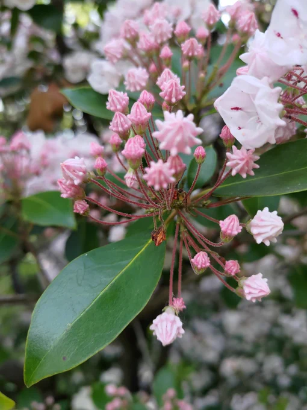

# 2023-05-11

[11 May, 2023 10:00 PM](https://twitter.com/hirasawa/status/1656645339716173825#m)

スタジオの作業デスク上の模様替えは終了した。何十年もそうであったが、今は目の前に楽器の鍵盤が置かれていない。快適だ。  
  
明日は7曲目を世話役公開しよう。  
  
またこんど！！

---

[11 May, 2023 09:55 PM](https://twitter.com/hirasawa/status/1656644071392260100#m)

昨日接続師に  
  
「一週間はダラシナク過ごしてください」  
  
と言われたもので。

---

[11 May, 2023 09:50 PM](https://twitter.com/hirasawa/status/1656642813193224193#m)

何だ！今日のTwは！ダラシナイ！

---

[11 May, 2023 09:45 PM](https://twitter.com/hirasawa/status/1656641555061526529#m)

「どうせ分からないので先生の歯でやったらどうでしょう？秘密は守ります」  
  
オマエタチも口外しないように。

---

[11 May, 2023 09:40 PM](https://twitter.com/hirasawa/status/1656640296787283968#m)

「勿論捨てました」  
  
「そうか…売れるのに…型を取って量産すればもっと富めるのに」  
  
冗談とはいえ接続師はすっかり馬骨脳的発想をするようになってしまった。

---

[11 May, 2023 09:35 PM](https://twitter.com/hirasawa/status/1656639038277955585#m)

昨日、接続院の接続師に抜歯、出血の件を話したところ抜歯の前後に鍼を施すとよかったそうだ。残念。  
  
「ところで抜いた親知らずはどうしました？」

---

[11 May, 2023 09:30 PM](https://twitter.com/hirasawa/status/1656637781719023616#m)

ご贔屓様のご指導により、ただいま、ゲーム「Firmament」を概観してまいりました。  
  
目を見張る美しさ。  
  
「Firmament」とか、「レルム」間を移動するとか、これヤバくね？  
  
私は必ずやPlayするでしょう。

---

[11 May, 2023 09:25 PM](https://twitter.com/hirasawa/status/1656636521934385152#m)

今年はいったい幾つの知らない植物と遭遇しただろうか。  
  
知らないのじゃなく、気づかなかっただけだと思う。  
  
そうだ、8のゾロ目を目撃し始めてからだ。  
  
そしていまだに目撃する。

---

[11 May, 2023 09:20 PM](https://twitter.com/hirasawa/status/1656635263483871235#m)

二足歩行が20万種類の花や21種類のオウムのようにヴィヴィッドで弾ける遊び道具とされなかったのはきっとこういうことだ。  
  
自分で遊べ、こら。

---

[11 May, 2023 09:15 PM](https://twitter.com/hirasawa/status/1656634005997985793#m)

ところで人間は何種類居るんだろう？  
  
単純に見た目の色分けなら3～４種類しかいない。  
  
創造主は人間で遊ぶのが面白くないのだろうか？

---

[11 May, 2023 09:10 PM](https://twitter.com/hirasawa/status/1656632747144740864#m)

ついでに、遭遇すれば格別にウキウキするカラフルなオウムは何種類いるのか調べた。  
  
21種類もいる！  
  
我々のイメージの中には何種類居る？それよりはるかに多い！  
  
人類は生まれただけでオウムリッチ！！

---

[11 May, 2023 09:05 PM](https://twitter.com/hirasawa/status/1656631488916619264#m)

我々二足歩行の拙い観測からしても、花には人知れぬ役割や見る者の目を楽しませる役割があるとして、それでも概ね50種類もあれば事足りるのではないかと思う。  
  
ところが花の咲く植物は20万種類あるという。  
  
有り余るほどの福。大福！  
  
二足歩行は生まれただけで  
超花リッチ！

---

[11 May, 2023 09:00 PM](https://twitter.com/hirasawa/status/1656630232349298688#m)

森を歩いていて不意にこういうものを見つけたら  
  
「あー、はいはい」  
  
と言って対応するのがよろしかろう。  
  
創造主は遊び過ぎ。

---

