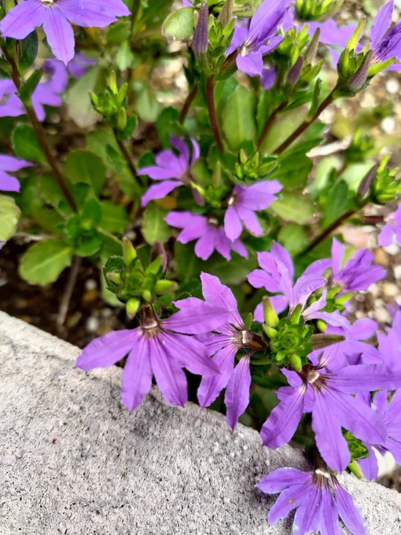
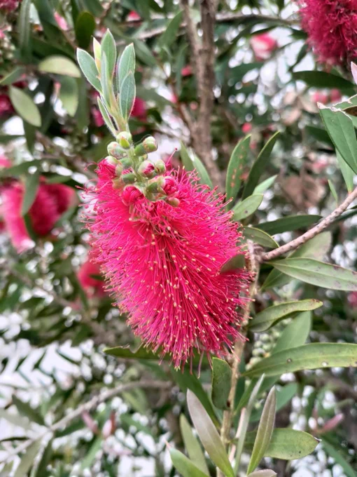

# 2023-05-14

[14 May, 2023 10:00 PM](https://twitter.com/hirasawa/status/1657732506513453056#m)

だが、いくら血行不良でも飛行中に窓を開けてはいけない。  
  
血流が流血になる。  
  
音楽を作るのも命がけ。  
  
またこんど！！

---

[14 May, 2023 09:55 PM](https://twitter.com/hirasawa/status/1657731235110879236#m)

二足歩行は空を飛ぶ技術まで獲得していながら譜割のエコノミー症候群なのだ。

---

[14 May, 2023 09:50 PM](https://twitter.com/hirasawa/status/1657729976815480834#m)

そんな時、例えばメロディーの音階はそのままで譜割の一部を変えてみる。  
  
最初は物理的にフレーズ内での「入れ替え」をやってみる。  
  
うまくツボに刺されば窓は自ずと開き血流は全身へと巡る。

---

[14 May, 2023 09:45 PM](https://twitter.com/hirasawa/status/1657728718620487684#m)

特にシンコペーションの使い方などは「いい加減窓開けろよ」と言いたいくらい聞き飽きている。酸欠の１酸化炭素中毒の血行不良の動脈瘤だ。

---

[14 May, 2023 09:40 PM](https://twitter.com/hirasawa/status/1657727460157390849#m)

そもそも二足歩行は何万回も聞かされてきた似通った音楽の要素で脳ががんじがらめになっている。  
  
いくらメロディーを工夫してもコード進行にアイデアを注ごうとも代わり映えしないのは、あらゆる音楽で使われている譜割から脱出できないからだ。

---

[14 May, 2023 09:35 PM](https://twitter.com/hirasawa/status/1657726202109628418#m)

あまりに突然に曲を個性的に仕上げる秘密の1つを教えよう。  
  
それは、メロディーやリズムやコード進行ではなく、譜割だ。

---

[14 May, 2023 09:30 PM](https://twitter.com/hirasawa/status/1657724944531292161#m)

結論は出たが、間引いても間引かなくても私しか分からないので公表しない。間引くけど。

---

[14 May, 2023 09:25 PM](https://twitter.com/hirasawa/status/1657723685313343489#m)

ところが「つくば駅」周辺に来ると電柱が無くなってしまう。  
  
電線は地下に潜っているのだ。  
  
そのエリアを通過する間は二者択一から離れてこう唱える。  
  
間引くとき  
  
間引けば  
  
間引かれざる日に  
  
間引くがごとく  
  
間引き過ぎても  
  
間引けなさそうで  
  
間引けそうでも  
  
間引こうとせず  
  
間引くのは誰？

---

[14 May, 2023 09:20 PM](https://twitter.com/hirasawa/status/1657722426912899073#m)

珍しくUターン通勤時にこれまでに出来ている9曲を聞きながら歩いた。  
  
思ったように出来ているという感触を得た。  
  
無駄に長い曲を間引くかどうか試案の歩み。  
  
電柱毎に  
  
間引く  
  
間引かない  
  
間引く  
  
間引かない  
  
…。

---

[14 May, 2023 09:15 PM](https://twitter.com/hirasawa/status/1657721168798048257#m)

とは言え10曲目は快調に進んでいる。  
  
世話役から7曲目への感想も続々届いている。  
  
着火に追い越されないよう走る走るピタゴリアン。

---

[14 May, 2023 09:10 PM](https://twitter.com/hirasawa/status/1657719910733168640#m)

以上  
カリステモンとスカエボラを見て  
思うこと：  
  
自然はヒラサワに似ている…。

---

[14 May, 2023 09:05 PM](https://twitter.com/hirasawa/status/1657718652391571458#m)

そのわりには飽きっぽい。  
  
半分まで作って放置された花。  
スカエボラ！！

---

[14 May, 2023 09:00 PM](https://twitter.com/hirasawa/status/1657717405253242880#m)

創造主の悪ふざけ  
  
ブラシノキ、フトモモ科、ブラシノキ属、カリステモン！！

---

[14 May, 2023 07:00 AM](https://twitter.com/hirasawa/status/1657506002923831296#m)

着火された  
  
<a href="http://susumuhirasawa.online/170k2022">susumuhirasawa.online/170k20…</a>  
  
<a href="https://twitter.com/search?q=%23170奇炉の1分間">#170奇炉の1分間</a>

---

