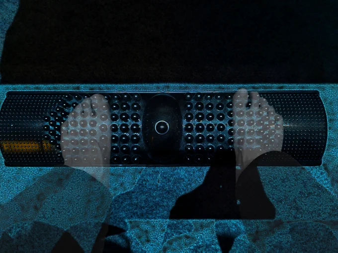

# 2023-05-20

[20 May, 2023 10:00 PM](https://twitter.com/hirasawa/status/1659906824139845634#m)

「おもてなし」なら私には飲み食いは無効。飲み食いより手品が見たい！  
  
CAのオバチャン！イリュージョンやって！飛行機が消えるやつ！  
  
「またこんどね」By　CAのオバチャン。  
  
またこんど❕！

---

[20 May, 2023 09:55 PM](https://twitter.com/hirasawa/status/1659905562061021189#m)

ファーストクラスにするとキャビンクルーのオバチャンがやれコレ飲むか？とかアレ食うか？とかうるさい。名前を呼ばれるのも不気味だ。  
  
御親切に私にカタツムリを食わしたりもする。

---

[20 May, 2023 09:50 PM](https://twitter.com/hirasawa/status/1659904303786754048#m)

自分のスタジオなんだからエコノミーとかシケたこと言わないでいっそファーストくらいの空間を確保できるだろう？と言いたい気持ちはわかる。  
  
でもそれはしない。

---

[20 May, 2023 09:45 PM](https://twitter.com/hirasawa/status/1659903045482807298#m)

もっとも仕事が終わって外に出たらクアラルンプールだったというのも困るけど。  
  
もしもし、今KLなんだけど迎えに来てくれる？  
  
かっこよくね？

---

[20 May, 2023 09:40 PM](https://twitter.com/hirasawa/status/1659901787305017345#m)

足がダルいのは座りすぎたためだ。  
  
スタジオ内エコノミー症候群はいくら血行を犠牲にしても何処にも辿り着かないので損した気分だ。

---

[20 May, 2023 09:35 PM](https://twitter.com/hirasawa/status/1659900529290678272#m)

まったく、足がダルかっただけなのにとんだTWをする男が居る。

---

[20 May, 2023 09:30 PM](https://twitter.com/hirasawa/status/1659899271360000000#m)

「幻視人」は幻視的存在という意味ではなく貴方に幻視を作り出す者という意味で「幻視人」と書いてアヨカヨと読む。

---

[20 May, 2023 09:25 PM](https://twitter.com/hirasawa/status/1659898012305625088#m)

見えない、感じない、をいいことに存在しないものを山ほど作り出した幻視人たちが去った後、世界はほぼ空っぽに近く、しかしそこで黄金の貴方を隠していた霧も晴れる。

---

[20 May, 2023 09:20 PM](https://twitter.com/hirasawa/status/1659896754031185921#m)

存在しない男の存在しない音楽によって何等かの実体験をするという意味では私の音楽は幻肢痛の類だが痛くないし、ほぼ害が無い。  
  
存在しないものの実体験によって散々な目に合わせるアレ等は有害でありジワジワと痛くなるかもしれない。  
  
アレ等を大量に作り出している生き物を「幻視人」と言う。

---

[20 May, 2023 09:15 PM](https://twitter.com/hirasawa/status/1659895495781756928#m)

それはヒラサワという名称に導かれた幻影の最下端である足部であるはず。  
  
私の足部が青竹踏みをする幻影が見られるほどに幻肢痛に似たメカニズムにより私は健康になる。

---

[20 May, 2023 09:10 PM](https://twitter.com/hirasawa/status/1659894237608001536#m)

もしそこに身体の部位が見えるなら「踏み」という言葉に導かれた幻影である。

---

[20 May, 2023 09:05 PM](https://twitter.com/hirasawa/status/1659892979702669314#m)

答え  
  
青くもなく、竹でもないのに  
青竹踏み

---

[20 May, 2023 09:00 PM](https://twitter.com/hirasawa/status/1659891724037115905#m)

これは「ながら」Twです。  
  
さて、何んの「ながら」でしょう？  
  
という独り言から始まる今宵。

---

