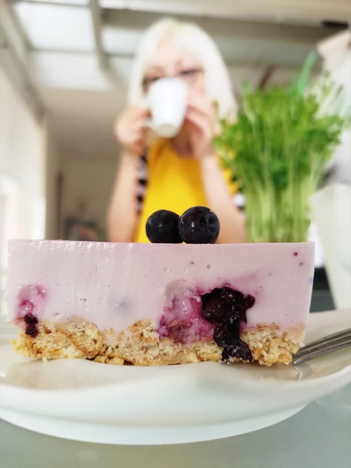
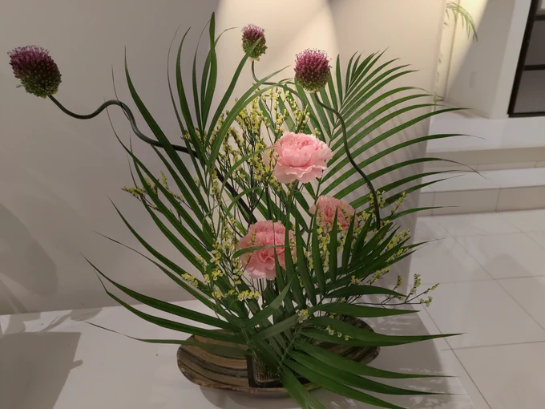

# 2023-05-21

[21 May, 2023 10:00 PM](https://twitter.com/hirasawa/status/1660269214878539777#m)

というような言い回しをすると、昨今の貧しい反応として  
  
「師匠は一神教信者なんですか」  
  
とか言われる。  
  
遊びが足りない。感受性を磨いて出直すように。  
  
またこんど！！

---

[21 May, 2023 09:55 PM](https://twitter.com/hirasawa/status/1660267950098595843#m)

太陽が創造主の産物なら弾んでも不思議はない。  
  
この世は創造主の悪ふざけで出来ている。  
  
主は「さあ、遊べ」と言って二足歩行を放たれた。  
  
苦渋の発明者を白日の下に晒せ。

---

[21 May, 2023 09:50 PM](https://twitter.com/hirasawa/status/1660266691673088001#m)

曲がり植物（丹頂アリウム）の首が曲がっているのは成長過程で太陽を追いかけたからだろうか？  
  
それなら動かぬ証拠を押さえた。  
  
太陽は弾んでいる。

---

[21 May, 2023 09:45 PM](https://twitter.com/hirasawa/status/1660265433348575233#m)

9個戻る双六TW。  
  
清流に生じた左回転と右回転の交叉に身を預ける生命の寡黙なる躍動と、揺蕩うことを不動と定義する菩薩の黙想。  
  
恐れながら、そのように吟じさせていただきます。  
  
まじ？  
まし。

---

[21 May, 2023 09:40 PM](https://twitter.com/hirasawa/status/1660264175048830980#m)

この度はリサイクル品が1曲あります。  
  
私は作曲も好みですが、スクラッチで新な曲をでっちあげるのも好みです。  
  
また、人様の曲の素材を生かし、細部や接合部を研磨して光らせるのも好みです。  
  
プロデューサーではなく、研磨師と呼ばれたい。磨き屋ならなお好ましい。

---

[21 May, 2023 09:35 PM](https://twitter.com/hirasawa/status/1660262917210775552#m)

煮詰まる前に乗り換えられたボツ曲は焼却処分されるものも有ればリサイクルされるものも有る。  
  
音楽はゴミと同じ過程をたどります。  
  
音楽産業廃棄物。  
  
呼んだ？

---

[21 May, 2023 09:30 PM](https://twitter.com/hirasawa/status/1660261660706177025#m)

私のような、ギタリストの風上にもおけない風下ギタリスト？がギターだけで10曲のアルバムを作れたのは、静、動、の二面性を設定したことが功を奏したと思われます。  
  
煮詰まる前に乗り換えがやってくる。

---

[21 May, 2023 09:25 PM](https://twitter.com/hirasawa/status/1660260400494157825#m)

ギターの練習方法を教えてという質問を見かけた。  
  
それは貴方がどんなギタリストになりたいかによります。私のようなのになりたければどんなに難しくても、何日かかっても、最も弾きたいフレーズをコピーして弾く努力をし、基礎練習はしません。  
  
ただし普通のギタリストにはなれないので要注意。

---

[21 May, 2023 09:20 PM](https://twitter.com/hirasawa/status/1660259141972299777#m)

ここだけの話、私高校生の頃ほとんど指紋無いです。  
  
将来弾かなくても済むように？  
  
無駄な努力。  
  
大人になっても弾かなければならない時がある。  
  
大人には弾かねばならない時がもある。

---

[21 May, 2023 09:15 PM](https://twitter.com/hirasawa/status/1660257884033171458#m)

「まさかギターだけで10曲のアルバムになるとは思わなかった」  
  
とのお言葉を頂きましたが私も同感です。  
  
指は痛いし、皮は厚くなるし、捜査現場で「仏さんはギタリストだな」と言われてもしょうがない。  
  
すいません、まだ仏じゃないけど。

---

[21 May, 2023 09:10 PM](https://twitter.com/hirasawa/status/1660256625628958720#m)

本日はデザイナーの中井くんもご来館。私はギターアルバムデザインのイメージを提示いたしました。  
  
近い将来、そのための撮影が行われるでしょう。

---

[21 May, 2023 09:05 PM](https://twitter.com/hirasawa/status/1660255367597797379#m)

そして今日のシトリンケーキ。

---

[21 May, 2023 09:00 PM](https://twitter.com/hirasawa/status/1660254117628104706#m)

今日のライブ生け花。  
  
曲がり植物のおかげで見る角度によって表情が変わる玉虫生け花。  
  
素晴らしい構図。

---

