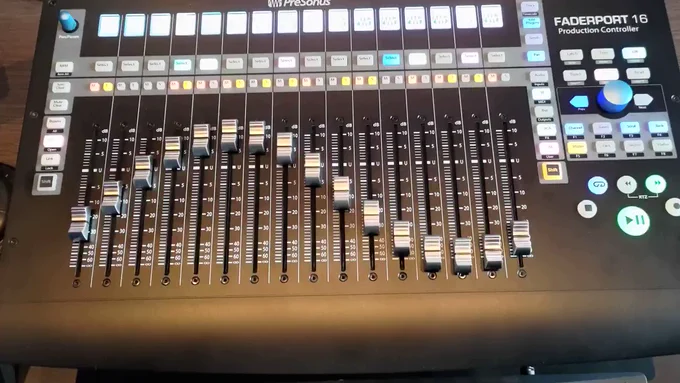
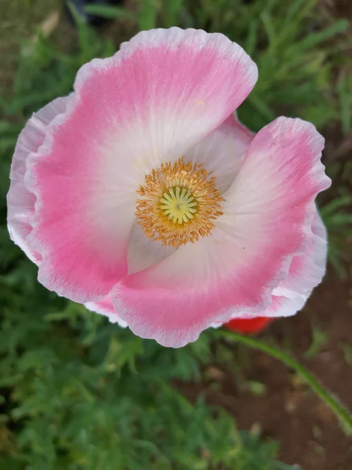

# 2023-05-25

[25 May, 2023 10:00 PM](https://twitter.com/hirasawa/status/1661718768261922817#m)

成果が花咲く今日この頃  
  
おーい！おばちゃーん、おじちゃーん！  
  
観音様なんかいないよー！  
  
反観音警察が来る…。  
  
またこんど！！

---

[25 May, 2023 09:55 PM](https://twitter.com/hirasawa/status/1661717501468868614#m)

明らかに広告代理店のようなものが何かのモニタリングのために公開しているコンテンツのようなものを動画サイトなどでも見かける。  
  
どれだけ迅速に同調され拡散されるかを見ているとしか思えないいかがわしいコンテンツ。  
  
あの観音様もまだ信頼を得ていた頃の新聞を使った何かのモニタチングかも。

---

[25 May, 2023 09:50 PM](https://twitter.com/hirasawa/status/1661716243294871552#m)

「おばちゃん！それただの木でしょう、観音様なんかいないでしょう」  
  
「やだこの子なに？バチ当たるよ」  
  
「何のバチ？当たらないから大丈夫」  
  
昔も今も同じことをしている私。  
  
民も変わらず。

---

[25 May, 2023 09:45 PM](https://twitter.com/hirasawa/status/1661714985318514688#m)

ところで何年か前にも話題にしたあの桜の木。  
  
どう見ても観音様には見えないのに新聞に写真入りで掲載された理由が分からない。  
  
その写真ですら全く観音様には見えない。  
  
それなのに人々は手を合わせ、何の勘違いか硬貨を置いてゆく。

---

[25 May, 2023 09:40 PM](https://twitter.com/hirasawa/status/1661713726591111176#m)

港くんのギターはメタリックピンクだ。  
  
それは彼のバンドが練習している神社の前で、伐採されたら観音像が現れたと新聞にも掲載された桜の木の横、毎朝散歩の犬が用を足すあたりに咲く朝顔の色と同じだ。  
  
昔、男性の公衆便器が「あさがお」と呼ばれていたことを思い出す。  
  
観音様も洒落が効く。

---

[25 May, 2023 09:35 PM](https://twitter.com/hirasawa/status/1661712468425449473#m)

港くんはどうしているだろうか？  
  
8０年代にジョーストラマーの歯が欠けているのを見て港くんは歯医者になったと確信した。  
  
根拠なんか無い。  
そもそも港くんが港くんである根拠が無い。

---

[25 May, 2023 09:30 PM](https://twitter.com/hirasawa/status/1661711211602296841#m)

港くんは高価なエレキギターを持っており、艶々でピカピカであるに留まらず、メッキ部分が私のギターより多かったため、華やかに見えた。  
  
そのうえ小臼歯が欠けているのだから非の打ち所がない。

---

[25 May, 2023 09:25 PM](https://twitter.com/hirasawa/status/1661709951729844228#m)

小４ステルスは彼を「港くん」と呼んでいたが話したこともなく、本当の名前も知らない。  
  
港くんは小臼歯が欠けていた。  
  
コウスケは顔半分を包帯で覆っており、小４ステルスには身体的特徴が何もなく、両者を羨望の眼差しで見ていた。

---

[25 May, 2023 09:20 PM](https://twitter.com/hirasawa/status/1661708693832970240#m)

小４ステルスが自分のギターを取りに帰っている頃、エレキギターを弾く小６がTVで話題になっていた。  
  
小４ステルスが加入したバンドは足立12中のグラウンドと団地の間の隙間で練習していた。  
  
同じ頃、おそらく同年代と思われる少年は神社の境内で練習するバンドのリードギターだった。

---

[25 May, 2023 09:15 PM](https://twitter.com/hirasawa/status/1661707435382566915#m)

小４の時、原っぱで大人のバンドにスカウトされ、「待ってください、自分のギター持ってきます」と言って戻ってくるまでの間にMANDRAKEを結成し、P-MODELを経てソロになり、核PをやってZCONを終わらせた。  
  
戻って来たのに誰も居ない。  
大人たちは何処に？

---

[25 May, 2023 09:10 PM](https://twitter.com/hirasawa/status/1661706177213001728#m)

目覚ましが鳴り、ストップボタンを押すまでの間に一か月が過ぎている。  
  
ノビをして、あくびをしている間に月締メ・フォルマントを撮影した。  
  
時間の経過が限りなく速い。  
  
時間の経過と私の脳の間で摩擦熱が発生している。

---

[25 May, 2023 09:05 PM](https://twitter.com/hirasawa/status/1661704919278321664#m)

たゆたう心を隠せぬ機械

---

[25 May, 2023 09:00 PM](https://twitter.com/hirasawa/status/1661703661461082112#m)

花は見ている

---

[25 May, 2023 06:54 AM](https://twitter.com/Hirasawa_Info/status/1661490856707366913#m)

Retweet from [平沢進・公式サイト @Hirasawa_Info](https://twitter.com/Hirasawa_Info)

TESLAKITEレーベルの傘下KITE IN CLOUD(カイトインクラウド)から、  
ナカムラルビイ ソロプロジェクト1st EP『サナトリウムハウスで / at the Sanatorium House』  
のダウンロード販売が開始されました。  
詳しくはこちら <a href="https://susumuhirasawa.online/kite-in-cloud">susumuhirasawa.online/kite-i…</a> をご覧ください。

---

