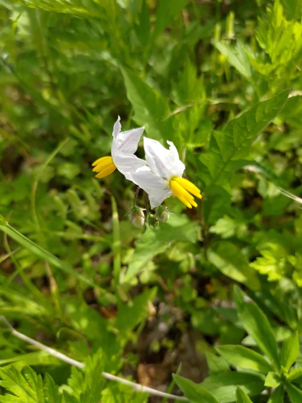

# 2023-05-28

[28 May, 2023 10:00 PM](https://twitter.com/hirasawa/status/1662805933087690752#m)

地方で実際に有った話。  
  
ファミレス仕様のライブハウス。  
観客は本番間際にオーナーが電話で呼び集めた家族連れ。誰もP-MODELなんか知らない。  
  
知らないし、もう来ないけど、またこんど！！

---

[28 May, 2023 09:55 PM](https://twitter.com/hirasawa/status/1662804665094774786#m)

舞台に立っているのに見られていない時代もある。  
  
みんな唐揚げに夢中。

---

[28 May, 2023 09:50 PM](https://twitter.com/hirasawa/status/1662803406904254465#m)

そんなことだから、同ブランドの左右対称車でさえ走っているのを4回くらいしか見たことない。  
  
4回というのは１０年でだ。  
  
私ですらもっと多く見られている。

---

[28 May, 2023 09:45 PM](https://twitter.com/hirasawa/status/1662802148806254592#m)

まるでケイオスユニオンの社長だ。  
  
え？  
  
吟じる下足番

---

[28 May, 2023 09:40 PM](https://twitter.com/hirasawa/status/1662800890162446338#m)

ところで左右非対称の車。  
歩行者から見たら行きと帰りでは違う車に見えるはず。  
  
社名を背負って「スピリット・オブ・アヴァンギャルド」という啖呵を切り、「詩的創造性に富んだ車を作る」と、営業さんや株主に叱られそうなことばかり言うブランドだ。

---

[28 May, 2023 09:35 PM](https://twitter.com/hirasawa/status/1662799632303284229#m)

脱兎から降りる時、ちらりとドアミラーに映った己の顔は、厳密にいえば左右非対称だった。  
  
どうりで天邪鬼だ。  
  
どうせなら左右別人になりたい。人前に出る時は片側しか見せない。

---

[28 May, 2023 09:30 PM](https://twitter.com/hirasawa/status/1662798375337754624#m)

無事納品された手ごたえを得て、ホッとして買い物に出た。  
  
脱兎を停めた駐車場に見知らぬ花を発見し、悪茄子と知った。  
  
左右非対称の葉。  
  
勿論周りを見渡しても左右非対称の車で買い物に来ている人などいない。  
  
来ればいいのに。とか言ってそもそも誰も持っていない。はず。

---

[28 May, 2023 09:28 PM](https://twitter.com/hirasawa/status/1662798010261331970#m)

届いたはず  
  
と言ったのは  
  
最近、私のメールは社員にブロックされている。

---

[28 May, 2023 09:25 PM](https://twitter.com/hirasawa/status/1662797115209445379#m)

ネット不通の原因は光回線終端装置の故障と断定。  
  
着火動画は健康な終端装置をスルスルと通り抜け、ケイオスユニオン社コンテンツアップロードセンターにズラリと並んだ9頭身のオペレーターの誰かに届いたはず。

---

[28 May, 2023 09:20 PM](https://twitter.com/hirasawa/status/1662795856939220994#m)

到着した機材を開梱すると中の書類に記されていた壊れた機材の返送方法によれば、私の取った行動は全てルール違反だ。  
  
でもお姉さんの指導に忠実に行ったんだ。苦情はお姉さんに言ってくれ。  
  
ルール違反とネット再開通の爽快な朝。

---

[28 May, 2023 09:15 PM](https://twitter.com/hirasawa/status/1662794598735921153#m)

ネット接続不能事件を解決するために早起きし、機材の到着を待ちながら着火作業をした。  
  
機材は到着し、運搬人に壊れた機材を手渡した。100%サポートのオネエサンの指導通りに行った。  
  
寸分の狂いもなく。

---

[28 May, 2023 09:10 PM](https://twitter.com/hirasawa/status/1662793340415541248#m)

葉が非対称であることを悪と言うべきかどうかは諸先生方にお任せするとして、確かに天邪鬼だとは言えそうだ。コレみたいに。このへそ曲がりブランドめ、もっとやれ。  
  
<a href="https://youtube.com/watch?v=7tN1EoUumHU&amp;t=24s">youtube.com/watch?v=7tN1EoUu…</a>

---

[28 May, 2023 09:05 PM](https://twitter.com/hirasawa/status/1662792082606505986#m)

ワルナスビ（悪茄子）は本当に悪いんだと力説する人が居る。  
  
不安を煽るまことしやかな作り話のような繁殖力。  
  
様々な場所に棘を隠し  
  
葉が左右非対称

---

[28 May, 2023 09:00 PM](https://twitter.com/hirasawa/status/1662790828371181569#m)

８の連番を今も見続ける私は以前のTLでは見かけなかった花の咲くTLに移動してしまったと思いたくなる。  
  
創造主の悪ふざけその３？  
  
ワルナスビ

---

