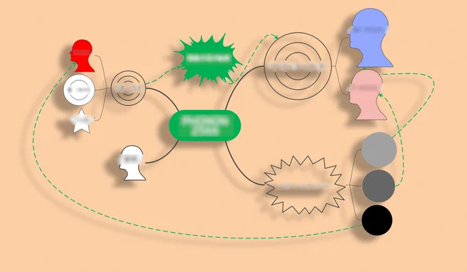
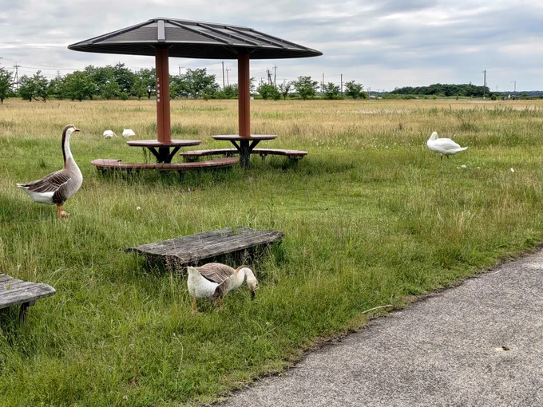
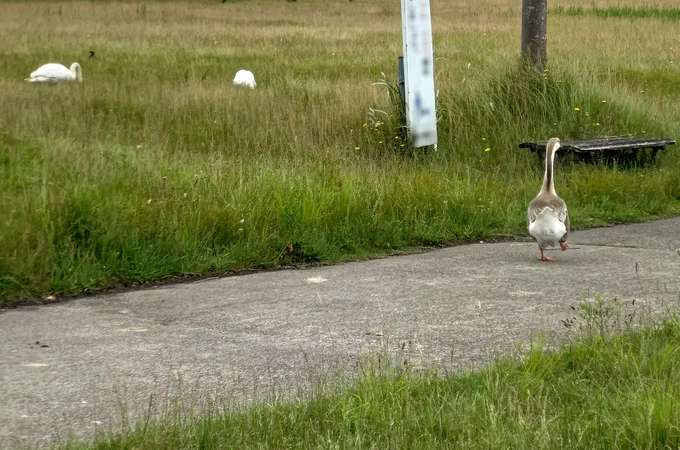
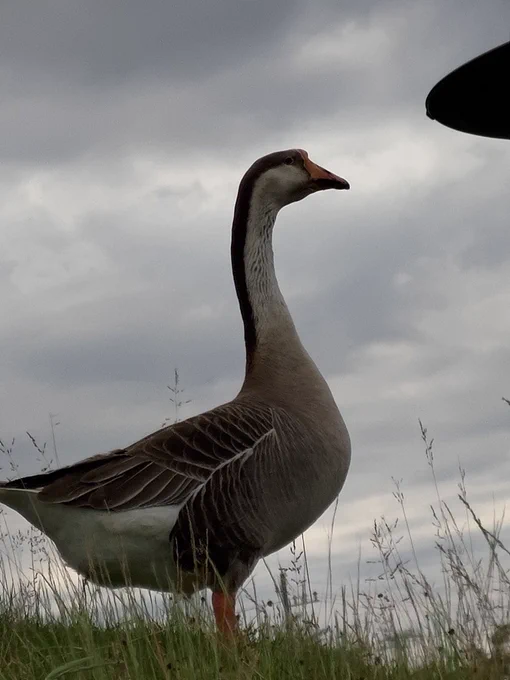
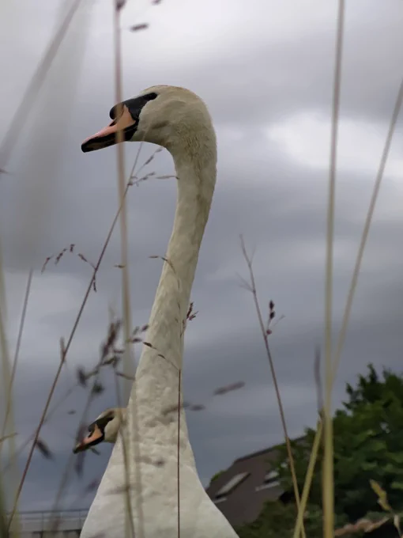

# 2023-06-01

[1 Jun, 2023 10:00 PM](https://twitter.com/hirasawa/status/1664255477780480001#m)

私は見たから知っているが、私のい前に撮影していた人が水たまりに膝をついてしまい、そのまま水に飲みこまれ反対側のベンチの下からガチョウになって出て来た。  
  
逃げないはずだよ、村人だから。  
  
またこんど！！  
15点。

---

[1 Jun, 2023 09:55 PM](https://twitter.com/hirasawa/status/1664254216485974022#m)

水たまりの周囲に10羽ほどの白鳥がおり、季節を超越してあまりに寛いでいるため、危うく私も水たまりに膝をついて撮影しそうになった。

---

[1 Jun, 2023 09:50 PM](https://twitter.com/hirasawa/status/1664252958354337792#m)

ところで先ほどの鳥類は野生であり、この季節にも渡らず悠々としている。  
  
飛び、飛びきって時間を超えてしまった鳥類。

---

[1 Jun, 2023 09:45 PM](https://twitter.com/hirasawa/status/1664251700654358528#m)

税務署から自宅への動線上に天国を挟める男はリハーサルスタジオと住居の間にどんな異境を通り抜けるのか、今から楽しみにしている。  
  
（これは居眠り運転のことを言っているのではありません。新車による移動の詩的せん妄への期待です）

---

[1 Jun, 2023 09:40 PM](https://twitter.com/hirasawa/status/1664250441583173634#m)

インタラクティブ・ライブでもないライブにマインドマップはまだ複雑すぎる。  
  
点が３つと棒一本みたいなライブが懐かしい。

---

[1 Jun, 2023 09:35 PM](https://twitter.com/hirasawa/status/1664249183564357633#m)

段取り説明のための3D CG制作を開始する。  
  
3D CGといってもどうってことない。  
  
どうってことないのに時間がかかる。  
  
天地開闢に備えて、神たる神はこんなことをしてたんだろうか？  
  
どうりで大和久電子彫刻師は神の威厳をもってスタジオに現れる。  
  
そしてちょっと踊る。

---

[1 Jun, 2023 09:30 PM](https://twitter.com/hirasawa/status/1664247928683212801#m)

本日は舞台監督に照明についての質問を投げかけるなどして、いよいよライブの準備に突入せりと我が心身、俄かに強ばれり。  
  
緩めり。

---

[1 Jun, 2023 09:25 PM](https://twitter.com/hirasawa/status/1664246666981982217#m)

聴いたも同然。

---

[1 Jun, 2023 09:20 PM](https://twitter.com/hirasawa/status/1664245408816590850#m)

帰宅して描き上げたマインドマップがこれ。  
  
実にシンプル。  
  
これで貴方はHYBRID PHONON 2566を観たも同然。

---

[1 Jun, 2023 09:15 PM](https://twitter.com/hirasawa/status/1664244150617927680#m)

迷子になる才能を磨くなら天国をも見せようぞと税務署帰りの男に背中で語る鳥類。（一部、背中以外で語る個体）

---

[1 Jun, 2023 09:10 PM](https://twitter.com/hirasawa/status/1664242891848310787#m)

善行を積んだ記憶もないのに  
近寄っても逃げないご褒美を賜る匍匐前進の男。  
  
曇天がまた吉の予兆を思わす思慮の空。

---

[1 Jun, 2023 09:05 PM](https://twitter.com/hirasawa/status/1664241634396246017#m)

果敢にも砂利をぬって生えるドクダミの小道を抜けると異世界が有った。

---

[1 Jun, 2023 09:00 PM](https://twitter.com/hirasawa/status/1664240389073563648#m)

毒とダミは歓迎されざるものと知らされようと二者合体すれば人に優しく可憐なるもののこととはまるで創造主のひっかけ問題。  
  
どこの試験にも出ないことが真実の証。

---

