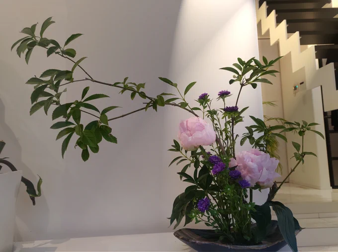

# 2023-06-04

[4 Jun, 2023 10:00 PM](https://twitter.com/hirasawa/status/1665342642408894465#m)

Q：CARAVAN（会然TREK 2K20 ver.）のボーカルチョップの素材は新録ですか？  
  
A：自分の声を素材として使う場合は99%過去録です。ギターアルバムの声も過去録のスクラッチです。ところでギターアルバムの声は全て私です。あれ？答になってる？  
  
またこんど！！

---

[4 Jun, 2023 09:55 PM](https://twitter.com/hirasawa/status/1665341380162453506#m)

Q：鏡に映る自分を見たり、自分の名前を口にしたりすると、自分の肉体が別人のもののように感じられ、とても恐ろしいです。  
  
A：いわゆる「お姉ちゃん私が居るになっちゃった」現象ですね。よく分かります。自己対象化による全体性の消失と分離感は錯覚です。残念ながら貴方は単独では存在しません。

---

[4 Jun, 2023 09:50 PM](https://twitter.com/hirasawa/status/1665340121745592321#m)

Q：音楽家の作曲能力と楽器演奏技術は、どの部分がどのように関連している、あるいはしていないのでしょうか？  
  
A：私のことでしかお答えできませんが、ほとんど関連していません。楽器が演奏できなくても作曲は出来ます。  
  
個性的な演奏技術はスパイスですが料理ではありません。

---

[4 Jun, 2023 09:45 PM](https://twitter.com/hirasawa/status/1665338863894638592#m)

Q：師匠は自分の意のままにできる夢、いわゆる明晰夢を見ることはありますか?  
また、どんな明晰夢を見たいですか?  
  
A：この夢から覚めたらお答えしに戻ってきます。

---

[4 Jun, 2023 09:35 PM](https://twitter.com/hirasawa/status/1665336347249319938#m)

さあ！書く陶板浴、「<a href="https://twitter.com/search?q=%23この件よろしくステルス">#この件よろしくステルス</a>」の時間。

---

[4 Jun, 2023 09:30 PM](https://twitter.com/hirasawa/status/1665335090506010626#m)

黒猫は私を見もせずにツーカし、母親の棟を通って外に出る。  
  
私の棟は母親の東側にあるため先に日が昇る。  
  
棟と棟の間には日付変更線ならぬ世界変更線がある。  
  
どうりでアチラにはいまだにテレビがある。

---

[4 Jun, 2023 09:25 PM](https://twitter.com/hirasawa/status/1665333830431981573#m)

切られた大量の蘇鉄の葉を束ねる度に棘が刺さり「いたっ！いたっ！」と顔をしかめている私の前方を黒猫が素通りして行く。  
  
私の家は知らない猫の通り道であることを自慢して止まない。

---

[4 Jun, 2023 09:20 PM](https://twitter.com/hirasawa/status/1665332572274958341#m)

同じノリでこれ切ったらダメだからねと、師匠は石南花（シャクナゲ）をちょっと摘まんだ。  
  
なるほど、花なのに石、追い打ちをかけて南、結局花、と落ち着いてしまうので崩壊は起こらない。  
  
諦めて正しい剪定方法を学んだ。

---

[4 Jun, 2023 09:15 PM](https://twitter.com/hirasawa/status/1665331314340372484#m)

自力で剪定した鼠糯については及第点を頂いた。  
  
木なのに鼠、追い打ちをかけて糯。  
  
そう語りかけ、アイデンティティクライシスを起こしている間に刈ってしまえばいい。

---

[4 Jun, 2023 09:10 PM](https://twitter.com/hirasawa/status/1665330055524802562#m)

昨年サボったために、爆発的に成長した蘇鉄の子株を庭師のご指導の下に剪定をした。  
  
蜘蛛の子を散らすように逃げ出すダンゴムシ。  
  
可愛そう、ダンゴムシなのに蜘蛛の子と比喩られ

---

[4 Jun, 2023 09:05 PM](https://twitter.com/hirasawa/status/1665328797556834304#m)

本当は左方にあるのは母親の棟。  
  
しゃあしゃあと、今日もテレビが余生を汚し。

---

[4 Jun, 2023 09:00 PM](https://twitter.com/hirasawa/status/1665327540683124737#m)

本日のライブ生け花  
  
左方に夏ありき

---

