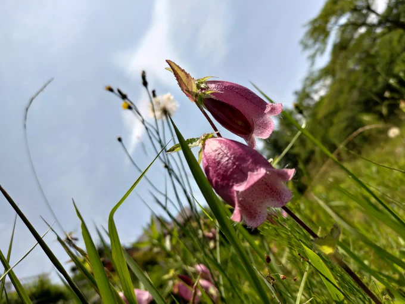
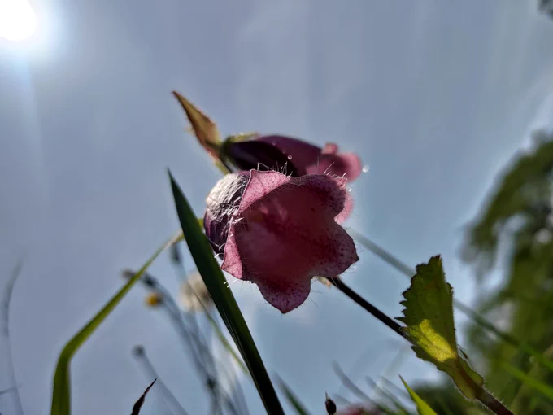
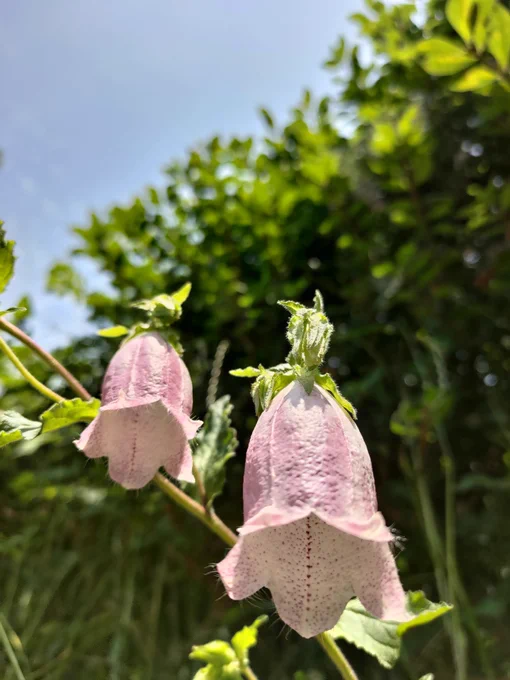

# 2023-06-08

[8 Jun, 2023 10:00 PM](https://twitter.com/hirasawa/status/1666792201186336768#m)

幼年期の妄想に「見ていない所は存在しない」というのがあり、振り向くのが怖かった。角を曲がると突然エジプトとかだったりで帰れなくなると思った。  
  
ところで私、帰って来てる？  
  
またこんど！

---

[8 Jun, 2023 09:55 PM](https://twitter.com/hirasawa/status/1666790931503382528#m)

出会い頭に知らない池を見つけるほど近所にはまだ未踏の地が残っている。  
  
貴方は町の角という角をシラミツブシに曲がったか？

---

[8 Jun, 2023 09:50 PM](https://twitter.com/hirasawa/status/1666789673232916481#m)

信心が足りないのに沼を脱出したマー君の武勇伝はご飯時を険悪なムードで包んだかもしれない。  
ぬかるみで泥だらけになったついでに、かーちゃんの顔に泥を塗った。  
  
やめてマー君、かーちゃんがご近所様を不幸にしに来るから！！どうかマー君、不幸になって。そうすればかーちゃんは幸せ。

---

[8 Jun, 2023 09:45 PM](https://twitter.com/hirasawa/status/1666788415290118144#m)

結局マー君は、かーちゃんの忌々しさから逃げるために必死の踏ん張りで華麗に沼から抜け出した。  
  
フラミンゴみたいだ！！

---

[8 Jun, 2023 09:40 PM](https://twitter.com/hirasawa/status/1666787156659154948#m)

かーちゃんはマー君を見るなり助けもせず「信心が足りない」とかなんとか説教を始め、マー君は「うるせークソバアバー」と応戦しながら益々沈んでゆく。  
  
ヒキョキョ　ヒキョキョヒー  
ヒキョキョ　ヒキョキョヒー  
  
と中川のフラミンゴが鳴いた。

---

[8 Jun, 2023 09:35 PM](https://twitter.com/hirasawa/status/1666785898653003779#m)

「ススムちゃん、動けないなった！かーちゃん呼んできて！」  
  
幼年ステルスは走り近寄りたくない家のドアを叩き、沼のマー君の難儀を告げた。  
  
マー君まってろ、今かーちゃんが行く。

---

[8 Jun, 2023 09:30 PM](https://twitter.com/hirasawa/status/1666784643767566337#m)

中川のフラミンゴはご近所様をかたっぱしから不幸にして回る新興宗教の家族に育ったマー君が河川敷の沼地に足を取られて動けなくなった時も鳴いていた。  
  
ヒキョキョ　ヒキョキョ　ヒー  
  
マー君もヒーヒー言っていた。

---

[8 Jun, 2023 09:25 PM](https://twitter.com/hirasawa/status/1666783382036963334#m)

幼年ステルスは明け方になると中川の朝霧の河川敷にでかけてヨシキリの声を聞いた。  
  
幼年ステルスはその鳴き声からヨシキリは大型の鳥だと思っていた。  
  
それは葦の間をぬって歩くフラミンゴのような姿をしていると思っていた。  
  
中川にフラミンゴ！

---

[8 Jun, 2023 09:20 PM](https://twitter.com/hirasawa/status/1666782123716493312#m)

出会い頭に遭遇した葦の茂る池の奥からは当然のごとくヨシキリの鳴き声がする。  
  
私がヨシキリを知ったのは幼年期のステルス時代で、その特徴的な声は知っていても姿は見たことがない。  
  
きっと向こうも私を見たことがない。

---

[8 Jun, 2023 09:15 PM](https://twitter.com/hirasawa/status/1666780866255675395#m)

出合い頭にホタルブクロを見つけたのは、出会い頭に遭遇した葦が密集する池のほとりだった。  
  
「近所」は奥深い。  
まるでドクター・フーのターディスのようだ。

---

[8 Jun, 2023 09:10 PM](https://twitter.com/hirasawa/status/1666779606895009793#m)

今日も今日とて知らなかった花と出合い頭に遭遇。  
  
件の花はホタルブクロというらしい。  
  
なるほど、貴婦人を捕らえて無数のホタルに変換してしまうのだと。

---

[8 Jun, 2023 09:05 PM](https://twitter.com/hirasawa/status/1666778349056950281#m)

夏のトイレは長蛇の列

---

[8 Jun, 2023 09:00 PM](https://twitter.com/hirasawa/status/1666777104158011392#m)

中の貴婦人は何処ですか？  
  
江戸にはトイレがあると知って駆け込んだのでしょう。わかります。

---

