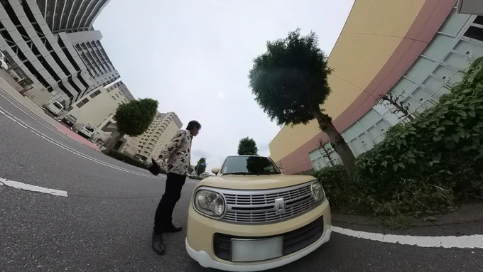

# 2023-06-10

[10 Jun, 2023 10:00 PM](https://twitter.com/hirasawa/status/1667516970915475457#m)

動物がステルスに対して警戒レベルを下げるのと同様、不良も私の血の匂いを嗅ぎ分けるのでしょうか？コイツには食われない、と。  
  
温泉シャークに気を付けて！！  
  
無理のあるまたこんど！！

---

[10 Jun, 2023 09:55 PM](https://twitter.com/hirasawa/status/1667515707524022272#m)

カツアゲといえば登校途中でカツアゲしている数人の不良に囲まれた時、一人の不良が言った。  
  
「コイツはだめだ」  
  
何故か不良に好かれる少年ステルス。

---

[10 Jun, 2023 09:50 PM](https://twitter.com/hirasawa/status/1667514449119395841#m)

正気は攻撃対象です。

---

[10 Jun, 2023 09:45 PM](https://twitter.com/hirasawa/status/1667513191444762625#m)

脊髄反射は日本の公用語です。

---

[10 Jun, 2023 09:40 PM](https://twitter.com/hirasawa/status/1667511932365213696#m)

あろるの庭園に来る鳥：  
  
スズメ、キジバト、ムクドリ、ヒヨドリ。  
  
こういう話をすると昭和のお父さんは脊髄反射のようにこう言う。  
  
「ウチに来るのは借金取りだな、くーーー」  
  
皆さんは昭和のオジサンにならないように。  
  
なるのは不可能だけど。

---

[10 Jun, 2023 09:35 PM](https://twitter.com/hirasawa/status/1667510674673528834#m)

蘇鉄は年に１センチ程度しか伸びないと聞いたので植えたけど、あろるの庭園で倍の速さで伸びていると思う。  
  
やがて100メートルに伸びたらモーターグライダーのエンジンを背負った私をてっぺんに縛り付けてくれ。地球を逆回転させようじゃないか。  
  
回転していればの話だが。

---

[10 Jun, 2023 09:30 PM](https://twitter.com/hirasawa/status/1667509417204674560#m)

双子を互いに逆相にして生活させると無限遠から来る電磁波を消去できる。  
  
このような双子をハムバッカーと言う。  
  
言わないし、そもそも逆相って何の逆相だか分からないこの話は作り話は程度の低いウソだし。

---

[10 Jun, 2023 09:25 PM](https://twitter.com/hirasawa/status/1667508157613232128#m)

明日からは天気の良いブランチタイムには偶然テスターをもって蘇鉄の前でその日初めて口にするスムージーをいただこう。  
  
実が生り始めたブルーベリーに馬乗りになるヒヨドリも至近距離で見える。  
  
「やあ、鳥なのに馬乗りかい？」  
  
と声をかけよう。

---

[10 Jun, 2023 09:20 PM](https://twitter.com/hirasawa/status/1667506899208531968#m)

体表電圧というのは、周囲の電磁波によって体表に生じる電圧のことで、テスターで計測できる。  
  
蘇鉄の前にに座る時、偶然テスターをもっている男。

---

[10 Jun, 2023 09:15 PM](https://twitter.com/hirasawa/status/1667505641114484738#m)

蘇鉄の前に鉄製のガーデンチェアを置いてその上に座る。靴は履いたまま、服も着たまま。  
  
するとどうだい、体表電圧がゼロになる！  
  
蘇鉄の前で己の体表電圧を計る男。名前、平沢です。

---

[10 Jun, 2023 09:10 PM](https://twitter.com/hirasawa/status/1667504382793994242#m)

あろるの庭のシンボルとなっている蘇鉄の子株が親を取り囲んでカツアゲしているように繁殖していたため、先週シトリンが剪定してくれた。するとどうだい、奇妙なことが起きたじゃないか。

---

[10 Jun, 2023 09:05 PM](https://twitter.com/hirasawa/status/1667503124922372096#m)

脱兎は飼い主の元へ。  
  
改めて車高の低さを激写の復路で。  
  
揺ぎ無き納車日への途上。

---

[10 Jun, 2023 09:00 PM](https://twitter.com/hirasawa/status/1667501872955924480#m)

脱兎、ラストスパート

---

[10 Jun, 2023 02:00 PM](https://twitter.com/hirasawa/status/1667396169893580800#m)

着火された  
  
<a href="http://susumuhirasawa.online/170k2022">susumuhirasawa.online/170k20…</a>  
  
<a href="https://twitter.com/search?q=%23170奇炉の1分間">#170奇炉の1分間</a>

---

