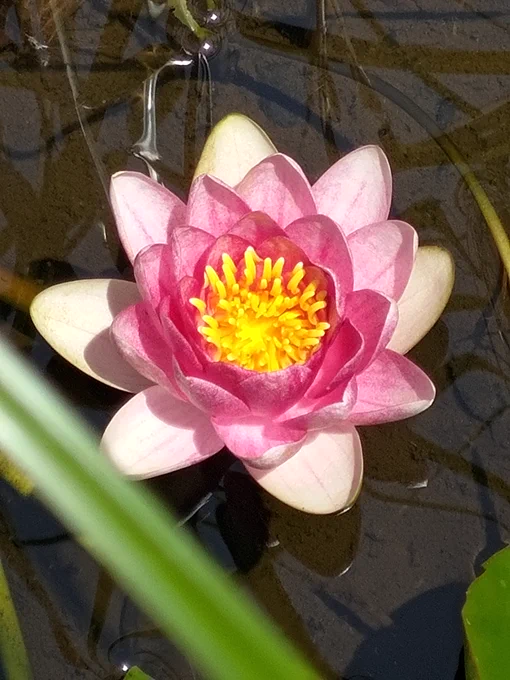
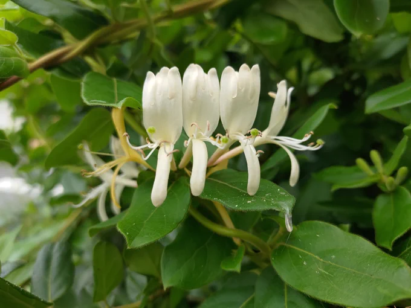

# 2023-06-16

[16 Jun, 2023 10:00 PM](https://twitter.com/hirasawa/status/1669691296292950017#m)

Q：会社でチームのリーダーをやらないかと言われて考えているのですが、ステルスがあらゆるプロジェクトの親分として心がけていることはなんですか？  
  
A：「問題」を「悪者」由来としないこと。問題が起きたらまず物理的配置を見ること。  
  
突然またこんど！！

---

[16 Jun, 2023 09:55 PM](https://twitter.com/hirasawa/status/1669690034755190785#m)

Q：ブロッコリーが以前から苦手で（特に茎の部分）克服できるように平沢さんに美味しい食べ方を教えて欲しいです…(&gt;&lt;)  
  
A：ブロッコリへと踏み出すのですね。茎はきんぴらにしましょう。それはきんぴら的になりブロッコリー的ではなくなります。

---

[16 Jun, 2023 09:50 PM](https://twitter.com/hirasawa/status/1669688776422043648#m)

Q：不自然な"自然の摂理"についてはどうお考えでしょうか。抽象的な解答お待ちしております。  
  
A：『真実』とは特定の何かに奉仕する「合意」のことです。アディオス・アルベルダオド。  
  
ハルディンドームより。

---

[16 Jun, 2023 09:45 PM](https://twitter.com/hirasawa/status/1669687518265245699#m)

Q：たまたま道でヒラサワさんにお会いした場合声をかけサインを貰うことは可能でしょうか？  
  
A：それ私じゃありません。知らないオジサンです。

---

[16 Jun, 2023 09:40 PM](https://twitter.com/hirasawa/status/1669686259671879681#m)

灼熱のフルーツ王国では、交通機関も商業施設も無い場所にいきなり住宅地を作ります。人々がそれを買ってしまうもんだから通勤途中の川を舟で渡るはめになり、いきなり住人が増えるもんだから舟と船頭さんが足りなくて毎朝喧嘩です。  
  
水素は分け合いができるだけマシ。え？

---

[16 Jun, 2023 09:35 PM](https://twitter.com/hirasawa/status/1669685001657647104#m)

MIRAIは４年後に返却の条件と補助金を活用して軽自動車より安く購入したのでした。この方法で品川区の住人は区の補助金も合わせるとMIRAIはタダになりました。  
  
オリムピックの時、日本中を燃料電池車が走っている光景を作りたかったようです。  
  
それならまず日本中に水素ステーションが必要ですね

---

[16 Jun, 2023 09:30 PM](https://twitter.com/hirasawa/status/1669683745169854465#m)

MIRAIの未来を案ずる人々にお伝えしておきます。  
  
MIRAIは今後バッテリーが上がらない程度に動かし、可能な限り水素を消費せず、来年３月には返却されます。

---

[16 Jun, 2023 09:25 PM](https://twitter.com/hirasawa/status/1669682485087666180#m)

幾つかの角の曲がり方の組み合わせによって、金庫の鍵が開くように空間が生まれる「近所」。  
  
貴方も「近所」を解いてみよう！  
  
ただし、５回曲がったところがエジプトなら戻って来れなくなる。

---

[16 Jun, 2023 09:20 PM](https://twitter.com/hirasawa/status/1669681226725179395#m)

そしてまた、睡蓮？の咲く池を見つけた。  
  
いったい「近所」とはどれだけ  
深淵なのか。  
  
行けども行けども秘境が現れる。

---

[16 Jun, 2023 09:15 PM](https://twitter.com/hirasawa/status/1669679969016881152#m)

スイカズラのお方とお見受けします。  
  
何にでも巻き付いて離れないのだそうです。  
  
どうか私の呪われた履歴に巻き付いて私について来ないようにしてください。  
  
スイカズラのお方。

---

[16 Jun, 2023 09:10 PM](https://twitter.com/hirasawa/status/1669678710029705221#m)

いくらでも与えてくれるクチナシのご褒美をもらいに通りに出ると、また知らない植物に鉢合わせした。  
  
この方々もまた甘い香りがする。

---

[16 Jun, 2023 09:05 PM](https://twitter.com/hirasawa/status/1669677452187123713#m)

流れとバランスのために、もう１曲再アレンジものが必要になった。  
  
様子を見るためにはすぐに作業に入らなければならなかった。  
  
良好と出た。  
  
まあ、過去のどんな曲でも現在のご時世にマッチするから大丈夫。  
  
予言者ヒラサワ。  
  
違います。ただの観察者です。

---

[16 Jun, 2023 09:00 PM](https://twitter.com/hirasawa/status/1669676203010301952#m)

トレンド後に増えるフォロワー数はすぐに減ります。  
  
「パパー」と言って後ろから抱きついたらよそのオジサンだった、みたいに。

---

