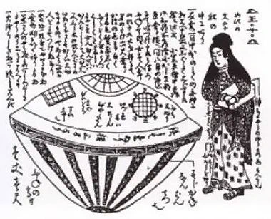
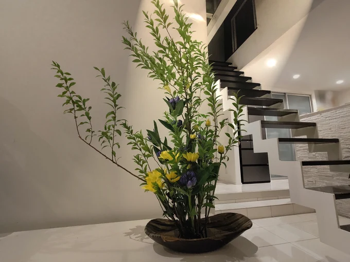
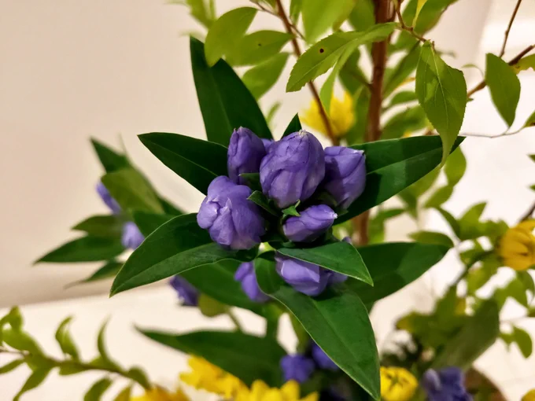

# 2023-06-18

[18 Jun, 2023 10:00 PM](https://twitter.com/hirasawa/status/1670416076637716480#m)

終わってもまだアーティスト名が分からないライブ。  
  
これもよくね？  
  
またこんど！！

---

[18 Jun, 2023 09:55 PM](https://twitter.com/hirasawa/status/1670414810440421377#m)

「より上手な歌唱への変換も必要となる」  
  
この言い方では昔はワザと下手に歌っていたかのように聞こえる。  
  
聞こえるだけ。昔は下手。  
  
現在は下手とは言わないまでも上手いとは言えない。いいかげん、これ認めなさい。

---

[18 Jun, 2023 09:50 PM](https://twitter.com/hirasawa/status/1670413552060866560#m)

終わってもまだ曲名が分からない  
最悪のリアレンジ曲集。  
  
よくね？

---

[18 Jun, 2023 09:45 PM](https://twitter.com/hirasawa/status/1670412294071676930#m)

バランスのためにはシンプルな過去曲に厚塗りが時として必要となり、より上手な歌唱への変換も必要となる。  
  
オタクの貴方でさえイントロが鳴ってもまだ曲名が分からない。  
  
終わっても分からなければ最悪のアレンジ。

---

[18 Jun, 2023 09:40 PM](https://twitter.com/hirasawa/status/1670411035382018050#m)

あろるの駐車場で記念撮影をするなどはMIRAIやラパンの時代には無かったこと。  
  
車に関心の無い人が見てさえ、なにかが溢れ出ている物体。

---

[18 Jun, 2023 09:35 PM](https://twitter.com/hirasawa/status/1670409777329864704#m)

寒い季節の終りに伴い現れる紫を嗅ぎながら一日が三週間の島へ行き三週間が一日でもまだ生きて娑婆に出られない人達の終焉の色を想いながら平常心で仕事をしたい。

---

[18 Jun, 2023 09:25 PM](https://twitter.com/hirasawa/status/1670407260785496065#m)

昔話をしたがために、2566の候補曲が増えてしまった。  
  
一日が三週間の島に行きたい。

---

[18 Jun, 2023 09:20 PM](https://twitter.com/hirasawa/status/1670406002640863232#m)

お前たちがまだ可能性の霧として全ての空間に偏在していた頃にP-MODELは生まれ、  
  
「美術館で会った人だろ？」  
  
と言った。  
  
どこの美術館だって？

---

[18 Jun, 2023 09:15 PM](https://twitter.com/hirasawa/status/1670404743842385923#m)

本日はまた、取材も兼ねていた。  
  
シトリン先生に庭の木が剪定されるのを窓越しに見ながら昔昔の話をした。  
  
いくらでも言うが、私はオマエタチがまだ螺旋のうちから生きている。

---

[18 Jun, 2023 09:10 PM](https://twitter.com/hirasawa/status/1670403485685391360#m)

ピンポーンと鳴ってご一行様は訪れた。  
  
訪れたはいいけどなかなか館内に入ってこない。  
  
御一行様は新車を交えて記念写真を撮っていた。

---

[18 Jun, 2023 09:05 PM](https://twitter.com/hirasawa/status/1670402227633266689#m)

寒い季節の終焉と共に現れ始める花の紫は気温の上昇に伴い科を超えてリレーされていく。  
  
芳香にあやかろうと、うかつに顔を近づければ蜂に刺された唇が紫に腫れ上がる。  
  
異種間リレーされる紫。

---

[18 Jun, 2023 09:00 PM](https://twitter.com/hirasawa/status/1670400974857588736#m)

本日のライブ生け花。  
  
紫不滅の法則。

---

[18 Jun, 2023 02:11 PM](https://twitter.com/Hirasawa_Info/status/1670298087414452224#m)

Retweet from [平沢進・公式サイト @Hirasawa_Info](https://twitter.com/Hirasawa_Info)

またオフィシャルサイト内  
グリーンナーブ会員限定ページ内に  
チケット譲渡掲示板を  
近日中に設置予定です。  
現在休止しているGN新規ご入会等も  
まもなく再開致します。  
どうぞ宜しくお願い致します。

---

[18 Jun, 2023 02:11 PM](https://twitter.com/Hirasawa_Info/status/1670298085246005249#m)

Retweet from [平沢進・公式サイト @Hirasawa_Info](https://twitter.com/Hirasawa_Info)

この度はHYBRID PHONON 2566  
ライブチケットをお求め頂いた皆様、  
誠に有難うございました。  
  
現在 ライブ配信について検討しております。  
詳細決定次第、改めてお知らせ致します。

---

[18 Jun, 2023 04:00 PM](https://twitter.com/hirasawa/status/1670325476559142913#m)

着火された  
  
<a href="http://susumuhirasawa.online/170k2022">susumuhirasawa.online/170k20…</a>  
  
<a href="https://twitter.com/search?q=%23170奇炉の1分間">#170奇炉の1分間</a>

---

