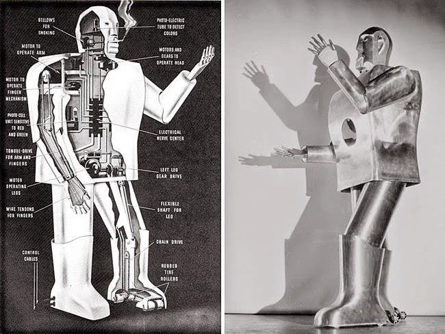
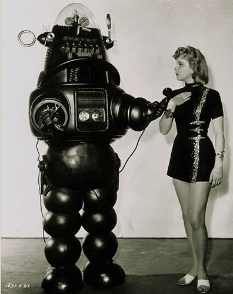
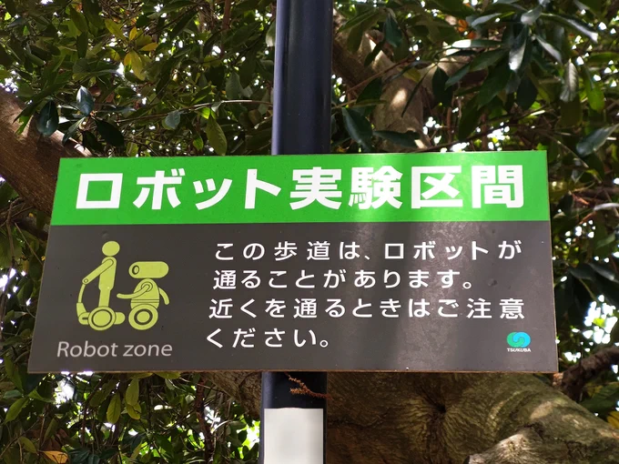

# 2023-06-19

[19 Jun, 2023 10:00 PM](https://twitter.com/hirasawa/status/1670778460460183554#m)

ところがMANDRAKEの会場は覚えている。  
  
忘れる技術の無いひよっこの脳が時に私を邪魔する。  
  
またこんど！！

---

[19 Jun, 2023 09:55 PM](https://twitter.com/hirasawa/status/1670777198171811842#m)

何時からか、自分が使った会場の名前も構造もイメージも忘れてしまうようになった。  
  
今やそれは才能と思える。  
  
その才能が明日の正気を支える。

---

[19 Jun, 2023 09:50 PM](https://twitter.com/hirasawa/status/1670775939939332096#m)

追いつかれてしまった。  
  
逃げるステルス。

---

[19 Jun, 2023 09:45 PM](https://twitter.com/hirasawa/status/1670774681840889856#m)

しかし、終わったものは忘れる能力が明日のヒラサワを支えている。  
  
えーと、今、何て書いたっけ？

---

[19 Jun, 2023 09:40 PM](https://twitter.com/hirasawa/status/1670773423381815297#m)

そういえばHYBRID PHONONというものはこういうものだったと思い出す。  
  
遅い。  
  
神よ、私にアレンジ力より多くの記憶力をください。

---

[19 Jun, 2023 09:35 PM](https://twitter.com/hirasawa/status/1670772165292199940#m)

時間切れで数曲断念する準備も同時に行う。  
  
転ばぬ先の断念。  
  
断念あれば憂いなし。

---

[19 Jun, 2023 09:30 PM](https://twitter.com/hirasawa/status/1670770907667746818#m)

照明、映像、音響スタッフに提出する演奏曲のサンプル収集が遅れている。  
  
というのは、オリジナルのままでは出せないほど他の曲と違和感のあるものが数曲あり、それを暫定アレンジしているところなのだ。

---

[19 Jun, 2023 09:25 PM](https://twitter.com/hirasawa/status/1670769648382652416#m)

昔、身近で見るロボットはブリキで出来ていた。  
  
今、身近で見るロボットは人間でできている。  
  
もう大変。

---

[19 Jun, 2023 09:20 PM](https://twitter.com/hirasawa/status/1670768390577823745#m)

その後、ロビイ以外のロボットを知るようになるが、このロボットも何かの映画に出て来たヤツだと思う。  
  
思ったより中身が少ないくせにタバコを吸う。

---

[19 Jun, 2023 09:15 PM](https://twitter.com/hirasawa/status/1670767132886421505#m)

負傷せず赤い血も出ない半人前の存在、ロボットと、負傷し、赤い血と共に身体の部位を失った一人前の退役軍人のコラボ。  
  
その壮絶なるシンフォニーに推されてロビーを買ってもらった。

---

[19 Jun, 2023 09:10 PM](https://twitter.com/hirasawa/status/1670765874347757568#m)

正しくはロビー・ザ・ロボットという。1956年の映画「禁断の惑星」に登場して瞬く間にブリキのおもちゃが世界中に出回った。  
  
それは上野の赤札堂でも売られ向かいの上野公園の露天商の台の上にさえ並び、隣で歌う傷痍軍人の軍歌にジーコジーコというゼンマイの音を乗せて不思議な悲哀を発生させていた

---

[19 Jun, 2023 09:05 PM](https://twitter.com/hirasawa/status/1670764615670824960#m)

初めて知ったロボットと言えば  
ロビーロボットで、ロボットといえばこれ以外になかった。  
（向かって左がロビーロボット）  
  
写真のロビーは女人を好むようだが、多くの子供たちはロビーを好んだ。

---

[19 Jun, 2023 09:00 PM](https://twitter.com/hirasawa/status/1670763363008225281#m)

私も通ります  
ご注意ください

---

