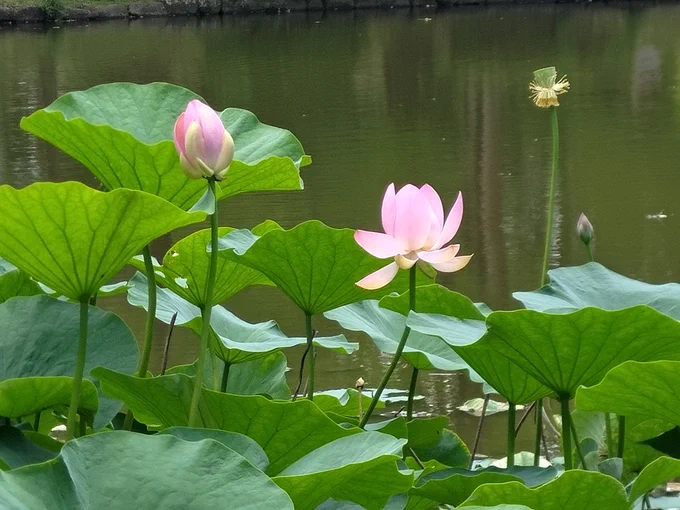
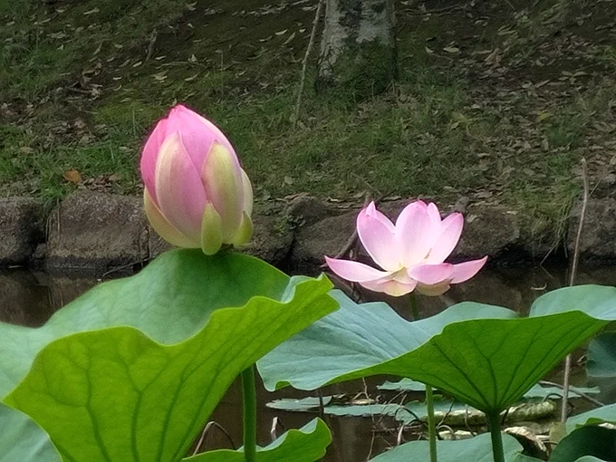
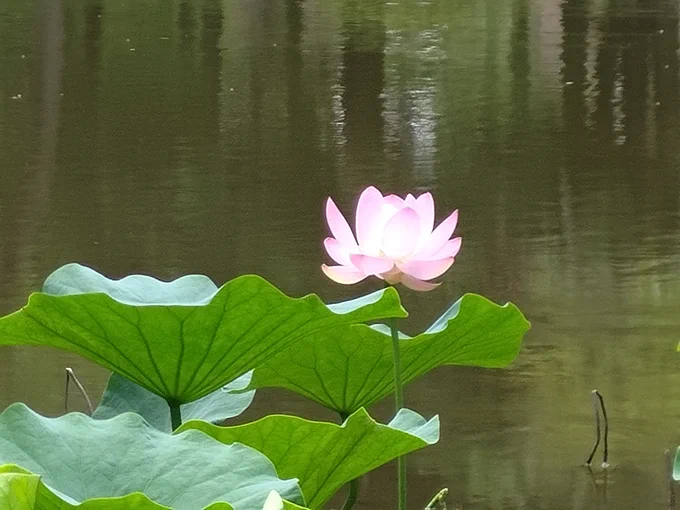

# 2023-06-25

[25 Jun, 2023 10:00 PM](https://twitter.com/hirasawa/status/1672952790992420864#m)

「お客様、アボカドのバーコードをレジに通してください」  
  
「あ、すみません、ぼーっとしてました」  
  
「レジ袋はいかがいたしますか？」  
  
と訊かれた私は教授が木に括り付けた袋を持つ己の手を掲げ「これがあるから大丈夫です」  
  
と言った。  
  
またこんど！！

---

[25 Jun, 2023 09:55 PM](https://twitter.com/hirasawa/status/1672951525201567744#m)

勿論二歳児の肩車で木の頂上に届くはずもない。私は肩車をされているものの足は地面についている。  
  
地面？  
  
足元には微生物の広大な都市が広がっており絶妙なバランスを保つ二つの集落が重なり合うモアレに転落してしまいそうになる。

---

[25 Jun, 2023 09:50 PM](https://twitter.com/hirasawa/status/1672950267325689856#m)

紅色の世界で、最も高い木の遥か上のほうで先ほどの教授が手招きをしている。その背後には数人のニューギニア高地人が穏やかな笑顔で私を見降ろしている。  
  
無理だと思って見上げていると、二歳児のご主人が来て肩車をしてくれた。

---

[25 Jun, 2023 09:45 PM](https://twitter.com/hirasawa/status/1672949008644575236#m)

教授が再び腰をかがめて茂みに戻ると、無限遠から来る光にあるまじき放射角で木の葉の間から射す夕日が項垂れていたニューギニアインパチェンスの背筋を伸ばした。  
  
インパチェンスの強力な紅色で森が赤く染まった。

---

[25 Jun, 2023 09:40 PM](https://twitter.com/hirasawa/status/1672947750277910537#m)

茂みの影から一部始終を見ていた教授が倒れた木に駆け寄り、微生物を箸でつまんでは木に縛り付けられたビニール袋に放り込んだ。  
  
「ママ！大丈夫だよ。この袋の中は台所洗剤だから。あとで戻しておくよ」  
  
教授はよねこの息子らしい。

---

[25 Jun, 2023 09:35 PM](https://twitter.com/hirasawa/status/1672946492385153024#m)

「よねこ、あの方がお前に『やあ』と挨拶しているよ」  
  
と二歳児のご主人は野太い声で奥さんに言った。  
  
たしかに、なで肩に大きめのTシャツにはそう書かれている。  
  
メリメリと大きな音がして巨木が蓮に池の上に倒れ、白鳥や鴨が一斉に飛びあがった。

---

[25 Jun, 2023 09:30 PM](https://twitter.com/hirasawa/status/1672945234198634498#m)

あの奥さんはよねこと言うんだな。  
  
「こんな大きな木を微生物が枯らすなら、名もない市民が見えない巨悪を枯らす時代に生きているという実感を疑うほど揺らぐ意味はもうない」と描かれたTシャツを着て通る娘さんに「やあ」と挨拶したい。

---

[25 Jun, 2023 09:25 PM](https://twitter.com/hirasawa/status/1672943975479799809#m)

逆回しの親子または夫婦を見ながら歩いていると立ち並ぶ大きな木の1つ1つにビニール袋が縛り付けてある。  
  
近寄って見ると「木を枯らす昆虫の研究をしています」と書かれている。昆虫が運ぶ微生物が大木を枯らすらしい。  
  
「おい、よねこ」と二歳児が野太い声で奥さんを呼んだ。

---

[25 Jun, 2023 09:20 PM](https://twitter.com/hirasawa/status/1672942717159219201#m)

日曜日だというのに誰も居ない。  
  
かろうじて若い母親と二歳児？くらいの幼児が遊んでいる。  
  
二歳児の顔が異常に大人びていて不思議だ。もしかして彼は旦那さんかも知れない。  
  
二人とも、どうも動きが逆回転ぽい。

---

[25 Jun, 2023 09:15 PM](https://twitter.com/hirasawa/status/1672941458943365120#m)

生き物がステルスにあまり警戒心を持たないのは良いが、蟻は登ってくるわ、蝶々は止まるわ、名前の分からない虫が二つくっついたまま足の甲でゆっくりしてるわで仕事に集中させてくれない。  
  
そもそもそこで仕事するのが悪い。

---

[25 Jun, 2023 09:10 PM](https://twitter.com/hirasawa/status/1672940200924684289#m)

「棚からぼたもち」よりやや低い位置で発生した「ワゴンからアボカド」に浮かれたステルスはもう一度秘境に戻り、素足を芝生に付けて脳内のアレンジ作業に没頭した。

---

[25 Jun, 2023 09:05 PM](https://twitter.com/hirasawa/status/1672938943124496384#m)

元のTLに戻り、馴染みのスーパーの安売りワゴンに転がっていたアボカドを掘り当てた。  
  
アボカドに貼られたPLUコードはオーガニックであることを示す数字の配列であり、そうでなくともコードのステッカーにハッキリ「Organic」と書いてある。  
  
ん？TLを間違えた？

---

[25 Jun, 2023 09:00 PM](https://twitter.com/hirasawa/status/1672937690067800064#m)

銀行の角を右、右、左、右でロック解除される近所の秘境4。  
  
帰りはベトナム人の家を左周りに一周してから逆、逆に戻れば元のTL。

---

