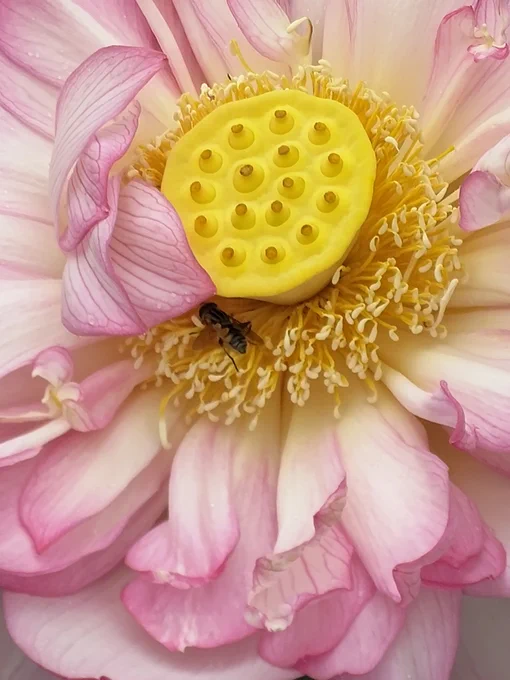
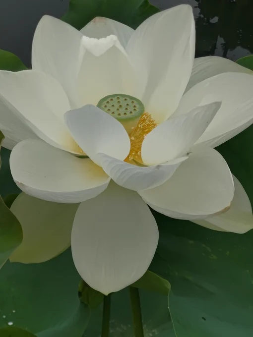
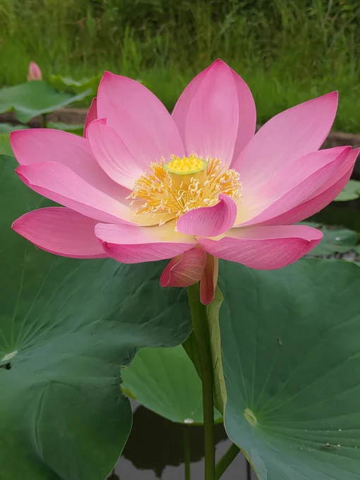
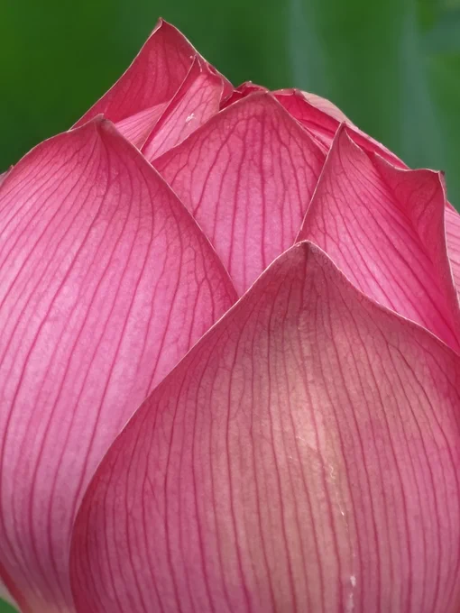

# 2023-06-27

[27 Jun, 2023 10:00 PM](https://twitter.com/hirasawa/status/1673677565511499776#m)

さっきから同じ所をグルグル回っているように感じるし、世界が黄ばんで見えるし、自分の体ではないようだ。  
  
自撮りを送るから、次はどこを曲がったらいいのか教えてくれ。  
  
無事帰れたらまたこんど！！！

---

[27 Jun, 2023 09:55 PM](https://twitter.com/hirasawa/status/1673676301146677252#m)

昨日の母親と二歳児の夫婦といい、オバチャンたちといいこの秘境5は逆子の次元かもしれない。  
  
そう思うとオバチャンたちに親近感を感じる。しかしあの国務長官には馴染めない。あれは人類への呪いだ。  
  
そう思った時から自分の体に違和感を感じる。景色も変わり映えしないし、何が起こったんだろう？

---

[27 Jun, 2023 09:50 PM](https://twitter.com/hirasawa/status/1673675043023273990#m)

「千鶴」から大勢のオバチャンが出て来た。みな髪にはしっかりとちりちりのパーマがかけられ、それにしても全員が逆回しくさい。  
  
「千鶴」の店内を改めて覗いて分かった。オバチャン達は全員逆子なのだ。

---

[27 Jun, 2023 09:45 PM](https://twitter.com/hirasawa/status/1673673784660840452#m)

帰り道、Uターンすると往路と左右が反対になってややこしいので後ろ向きで歩く。  
  
次の角を右、次を右、次を左。  
  
あれ？昨日の母親と二歳児が。。。

---

[27 Jun, 2023 09:40 PM](https://twitter.com/hirasawa/status/1673672526025879553#m)

おっと、ここまで徒歩で来たんだった。  
  
適宜振り出しに戻って文脈を把握したうえでヨタ話をするように。自分。

---

[27 Jun, 2023 09:35 PM](https://twitter.com/hirasawa/status/1673671268116168707#m)

ご近所の異郷5？にはこれから咲く蕾が沢山あり数日経たのちにまたロック解除しようと思う。  
  
今日はあまり足跡をややこしくすると帰れなくなる可能性があるので数分で引き返した。  
  
「自宅に帰ります」  
  
「はい、”ます”ですね？」  
  
「キャンセル！！自宅に帰るよ！」  
  
「はい、”よ”ですね？」

---

[27 Jun, 2023 09:30 PM](https://twitter.com/hirasawa/status/1673670012366893056#m)

戸籍も国籍も無いオバチャンはきっとまともな職に就けない代わりに暗黒への忠誠で巨万の富を得ているかも知れない。  
  
（Tシャツに描くにはイマイチ）

---

[27 Jun, 2023 09:25 PM](https://twitter.com/hirasawa/status/1673668751156477953#m)

というような戯言をプリントしたTシャツを着て「千鶴」へパーマを当てに行くオバチャンを一目見たいと思う。

---

[27 Jun, 2023 09:20 PM](https://twitter.com/hirasawa/status/1673667492877836288#m)

ところで、この世の蓮の企てだが、瞑想や完全な無思考や意識の集中に不慣れな人でも、その果てしなく柔らかい黄色の中心に視線を固定し、視野に白とピンクのグラデを捉えたまま10秒もすればあの世が見え、それもこの世だと理解する。  
  
（効目には個人差があります）

---

[27 Jun, 2023 09:15 PM](https://twitter.com/hirasawa/status/1673666234846412802#m)

「千鶴」では奥に行けば行くほど実在のオバチャンにそっくりなオバチャンが生まれるようになっている。  
  
奥の別室では某国元国務長官にソックリなオバチャンが4体も生まれている。

---

[27 Jun, 2023 09:10 PM](https://twitter.com/hirasawa/status/1673664976651952128#m)

そもそも美容院「千鶴」からして怪しいのだ。  
  
あれは美容院というより「花の分娩室」だ。  
  
ずらっと並んだ花がオバチャンを産んでいる。  
  
オバチャンは一日にして成るのだ。

---

[27 Jun, 2023 09:05 PM](https://twitter.com/hirasawa/status/1673663718884769795#m)

いったいこの世の蓮は何を企んでいるのか。  
  
薬物も使わず二足歩行の意識を変性させる。

---

[27 Jun, 2023 09:00 PM](https://twitter.com/hirasawa/status/1673662469007622144#m)

美容院「千鶴」の角で前進、後退、前進。角を右、左、左でロック解除されるご近所の異郷、その５？

---

[27 Jun, 2023 05:20 PM](https://twitter.com/Hirasawa_Info/status/1673607192157777921#m)

Retweet from [平沢進・公式サイト @Hirasawa_Info](https://twitter.com/Hirasawa_Info)

TESLAKITEレーベルの傘下KITE IN CLOUD(カイトインクラウド)から、  
オリモマサミ ソロシングル３曲のダウンロード販売が開始されました。  
詳しくはこちら <a href="https://susumuhirasawa.online/kite-in-cloud">susumuhirasawa.online/kite-i…</a> をご覧ください。

---

[27 Jun, 2023 01:00 AM](https://twitter.com/hirasawa/status/1673360472362582017#m)

着火された  
  
<a href="http://susumuhirasawa.online/170k2022">susumuhirasawa.online/170k20…</a>  
  
<a href="https://twitter.com/search?q=%23170奇炉の1分間">#170奇炉の1分間</a>

---

