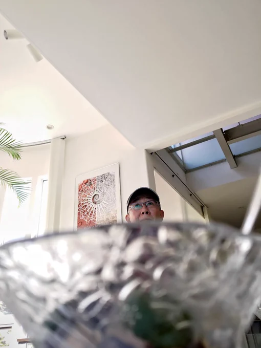
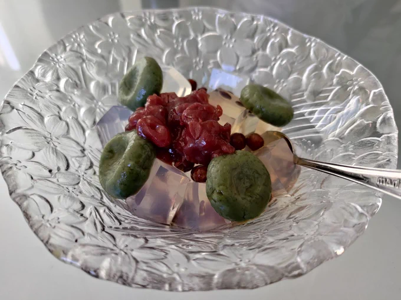
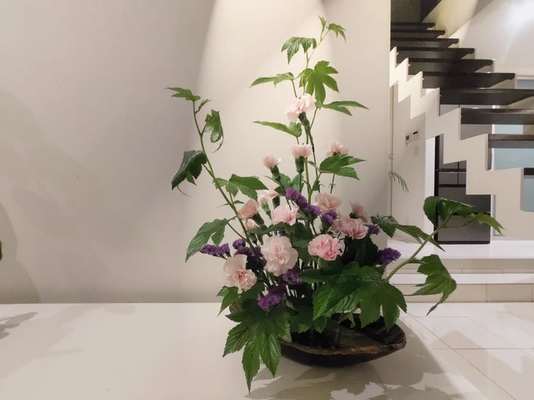

# 2023-07-02

[2 Jul, 2023 10:00 PM](https://twitter.com/hirasawa/status/1675489499672084480#m)

これで用途に応じて数種のナビも使い分けられる。後は渋滞予測のために遠方を展望できる装置が必要だって？  
  
心配ゴム用。  
  
ボンネットにキリンクビナガオトシブミが止まってる。  
  
またこんど！！

---

[2 Jul, 2023 09:55 PM](https://twitter.com/hirasawa/status/1675488240286171138#m)

それでも多くを妥協しながらカスタマイズは終わった。  
  
まあ、車内にあんなホーム画面がある車は無いと思う。  
  
見せびらかしてもいいが、多分車種が特定されてしまう。

---

[2 Jul, 2023 09:50 PM](https://twitter.com/hirasawa/status/1675486982024368128#m)

車載端末化にはいろいろ制限がある（車種によって異なる）。気に入ったアイコンパックを買おうとしても何故か車から決済できない。アイコンの大きさが変えられない等々。  
  
ご近所さんからすればアイツは車の中で汗だくで何やってんだ？のように見える。  
  
実際、何やってんだ？自分。

---

[2 Jul, 2023 09:45 PM](https://twitter.com/hirasawa/status/1675485723619622914#m)

このところ早起きして車載ディスプレイオーディオのホーム画面をカスタマイズしている。  
  
走行せず数十分経過すると電源が落ちてしまうため遅々として進まない。  
  
私は携帯端末の既成のアイコン群がかなり嫌いなので急いでいるというのに。

---

[2 Jul, 2023 09:40 PM](https://twitter.com/hirasawa/status/1675484465429114880#m)

車からバールを取り出し、巻き文をこじ開ける。  
  
「拝啓ステルス。貴殿が虫たちの弟子になりたいと歌にまで歌っていると聞きました。よろしかったら伴侶として迎えましょう。私は体長185センチのキリンクビナガオトシブミ_赤胴ツヤ有りです」

---

[2 Jul, 2023 09:35 PM](https://twitter.com/hirasawa/status/1675483207276306432#m)

それにしても「落とし文」とは情緒のある名前だ。  
  
深夜にガタンと大きな振動を受けたので車を停めた。どうやら硬く巻かれた巨大な葉の巻き文を乗り越えたようだ。

---

[2 Jul, 2023 09:30 PM](https://twitter.com/hirasawa/status/1675481948976807937#m)

そしてそのデザインはかなり好ましい。残念ながら最近の日本の工業デザインには無い世界観だ。  
  
キリンクビナガオトシブミの形をした車があれば欲しい。  
  
無いから安心だ。

---

[2 Jul, 2023 09:25 PM](https://twitter.com/hirasawa/status/1675480690446442499#m)

キリンクビナガオトシブミに至ってはより心中複雑である。  
  
もしそれがキリンより先に存在したのならその命名は失礼だ。  
  
しかしキリンクビナガオトシブミの長い首の構造はキリンのそれより合理的に出来ている。  
  
途中に一旦フシがあり、そこから先がもう一段曲がるため、途中でポキンと折れにくい。

---

[2 Jul, 2023 09:20 PM](https://twitter.com/hirasawa/status/1675479432449126400#m)

ゾウムシは虫のくせに象のように鼻が長い。  
  
こういう表現にはいつも引っかかる。いったいゾウムシと象ではどっちが先に存在したのか。  
  
場合によっては「動物のくせにゾウムシのように鼻が長い」と言うべきかもしれないというのに。

---

[2 Jul, 2023 09:15 PM](https://twitter.com/hirasawa/status/1675478174443147264#m)

その後庭師はあろるの園に出てやまぼうしの剪定にとりかかり、隣ではPEVO1号が蘇鉄の子株を分離する作業に取り組みながら次から次へと葉から落下するゾウムシによって行く手を阻まれた。  
  
ご搭乗のお客様の中にゾウムシの専門家はいらっしゃいますか？

---

[2 Jul, 2023 09:10 PM](https://twitter.com/hirasawa/status/1675476915690393602#m)

それゆえ中からPEVO1号が出て来る。

---

[2 Jul, 2023 09:05 PM](https://twitter.com/hirasawa/status/1675475657990500352#m)

そして見える「みつまめ」  
  
材料もほぼシトリンの手作り。  
  
緑のヘモグロビンを食べた日。

---

[2 Jul, 2023 09:00 PM](https://twitter.com/hirasawa/status/1675474408302067713#m)

本日のライブ生け花。  
  
カーネイションが「母」という卑近な現実や安心に関連付けられているからといって油断すれば花弁の深奥から現への間で渦巻くピンクの暴風に攫われる。あろるの館の見えないハリケーン。

---

