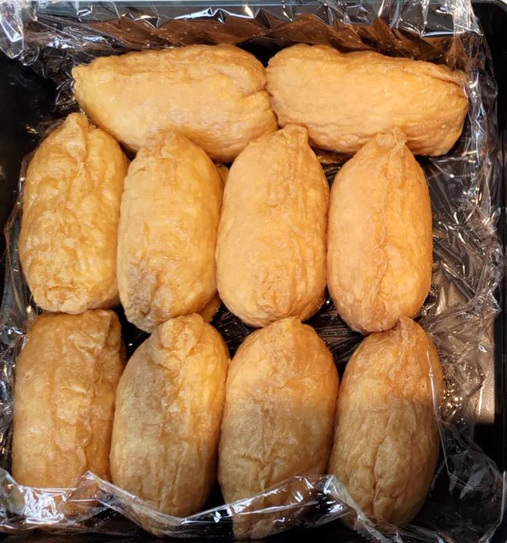
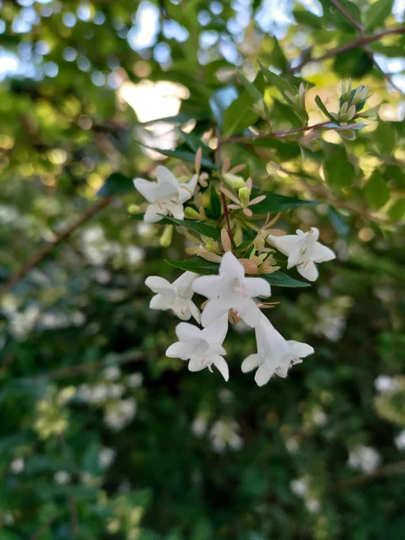

# 2023-07-11

[11 Jul, 2023 10:00 PM](https://twitter.com/hirasawa/status/1678750994325291008#m)

そのほか、経年の結果すんなり解決したことが多々ある。  
  
過去の自分を戒めるために当時のライブ会場へ行き、かたっぱしから客の耳に針をさしてやろうと思う。  
  
反省しろ、オマエタチ。  
  
またこんど！！

---

[11 Jul, 2023 09:55 PM](https://twitter.com/hirasawa/status/1678749731143442435#m)

原因だと思って設計し直したベースに差し替えた。その時右の耳たぶにチクっという痛さが走った。  
  
今振り返ればそのベースはより事態を悪化させていた。  
  
どうしてこんな簡単なことがわからないのだと、15年前の自分の耳たぶに針を刺してやった。反省しろ。

---

[11 Jul, 2023 09:50 PM](https://twitter.com/hirasawa/status/1678748472852508672#m)

今日もまた経年の恩恵に預かった。  
  
PHONON2551の時に腑に落ちなかったアレンジは何が原因かがすんなりと分かり、シャキっと解決した。

---

[11 Jul, 2023 09:45 PM](https://twitter.com/hirasawa/status/1678747214590496769#m)

しめしめ、誰も嘘だと思ってないらしい。  
  
では話を続けよう。

---

[11 Jul, 2023 09:40 PM](https://twitter.com/hirasawa/status/1678745956257513472#m)

ここまでの嘘について質問ある人。

---

[11 Jul, 2023 09:35 PM](https://twitter.com/hirasawa/status/1678744698029219840#m)

過去に苗場の斜面で目撃されている。

---

[11 Jul, 2023 09:30 PM](https://twitter.com/hirasawa/status/1678743439616143363#m)

平沢に見えるのは「お見せ科」「吟じ目」に属する希少種であり、吟じたり奏でたりできるのでますます花には見えず、ちゃっかりライブなどして民衆を騙しては夜な夜なやつくば山の東側斜面に帰って行く。  
  
斜面を好む

---

[11 Jul, 2023 09:25 PM](https://twitter.com/hirasawa/status/1678742181388099584#m)

ここだけの話、私は人間の平沢に見える「お見せ草」だ。

---

[11 Jul, 2023 09:20 PM](https://twitter.com/hirasawa/status/1678740923096653825#m)

通勤路の朝の公園には、老人にしか見えない「お見せ草」が群生する場所があり、受粉のために昆虫をおびき寄せようと蠢く様はラジオ体操に見える。

---

[11 Jul, 2023 09:15 PM](https://twitter.com/hirasawa/status/1678739665166409729#m)

これは「お見せ草」の仲間だが、どう見ても花には見えない。

---

[11 Jul, 2023 09:10 PM](https://twitter.com/hirasawa/status/1678738406522626048#m)

「香り草」や「唸り草」の仲間のように、香る花や唸る花を咲かせる植物は知られているが、「お見せ草」の目撃例が少ないのは別の姿になってお見せする花だからだ。

---

[11 Jul, 2023 09:05 PM](https://twitter.com/hirasawa/status/1678737148768337925#m)

どのアベリア区からも聞こえ、どのアベリア区にも蜂がいないのはアベリアが唸っているからだ。  
  
暑いのか、それとも犬や人を寄せ付けないために威嚇しているのか。  
  
花に威嚇される男。

---

[11 Jul, 2023 09:00 PM](https://twitter.com/hirasawa/status/1678735899121819648#m)

Uターン通勤路のアベリア地帯では、どのアベリア区からも「ブーン」という音が聞こえる。  
  
蜂の羽音のようだが蜂はいない。

---

