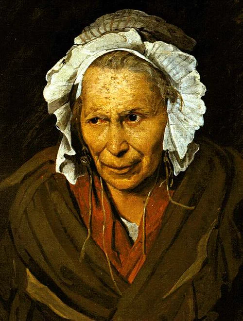

# 2023-07-15

[15 Jul, 2023 10:00 PM](https://twitter.com/hirasawa/status/1680200547108790272#m)

畢竟、バジルによる夏の嗜みは世にいうオーラ火事の原因になりかねません。  
  
夏のバジルは程ほどに。  
  
またこんど！！

---

[15 Jul, 2023 09:55 PM](https://twitter.com/hirasawa/status/1680199282585116677#m)

不運にも貴方にオーラを目視する技術が無いなら、バジルチャーハンを食む者の天井を見ると良いでしょう。そこは焼け焦げている。

---

[15 Jul, 2023 09:50 PM](https://twitter.com/hirasawa/status/1680198024218439681#m)

明日の栄誉あるホスト役をつつがなく務める男になるため、バジルソースはチャーハンにも混入された。  
  
バジルチャーハンはその香味で体表を覆うオーラ腺の煤を払う。  
  
夏は春に劣らずオーラを放つものだ。

---

[15 Jul, 2023 09:45 PM](https://twitter.com/hirasawa/status/1680196765973184512#m)

明日はまた人々がご来館だ。  
エイタブリッシュのピタゴリアンアイスクリームを何種類も並べ  
  
「お好きなのをどうぞ」  
  
とやれる誉で夏の日差しは金色みを帯びる。  
  
供給者に感謝の念を発射する。

---

[15 Jul, 2023 09:44 PM](https://twitter.com/hirasawa/status/1680196583634374656#m)

オマエタチはまったくいつもちゃんと読んでいない。  
  
上がりすぎた男女を羨望の眼で見過ぎて酸化したと書いてある。  
  
紫蘇ジュースで酸化するとは書いてない。逆だ。

---

[15 Jul, 2023 09:40 PM](https://twitter.com/hirasawa/status/1680195507648356353#m)

紫蘇ジュースによって上がりすぎた男女は衆目に羨望なる淡いくすぶりを残す。  
  
くすぶりが激しく、酸化が著しい衆目の一人。

---

[15 Jul, 2023 09:35 PM](https://twitter.com/hirasawa/status/1680194249621643265#m)

紫蘇ジュースを一口飲む度に「後味のくすぶり」はギシギシと音を立てて存在の外皮を研磨するのがわかる。  
  
紫蘇ジュースは男を上げる。  
女も上げる。

---

[15 Jul, 2023 09:30 PM](https://twitter.com/hirasawa/status/1680192993192734721#m)

植物の中で最も煙に近いのが赤紫蘇である。近いというより、それは仲間である。  
  
嗅覚の「くすぶり」を「後味のくすぶり」に変換するだけで煙は簡単に赤紫蘇になる。

---

[15 Jul, 2023 09:25 PM](https://twitter.com/hirasawa/status/1680191732774756354#m)

バジルソースの冷ややっこで背筋を伸ばした後は紫蘇ジュースで存在の外皮を研磨している。  
  
夏は、冬に劣らず外皮を輝かせるものだ。

---

[15 Jul, 2023 09:20 PM](https://twitter.com/hirasawa/status/1680190474848436225#m)

パール（ハエトリグモ）はおかずへの扉から出ておやつへの扉から入って来た。  
  
扉の向こうは明らかに夏であり、パールは日焼けして縦縞が色濃くなっている。きっと向こうではモテモテだ。

---

[15 Jul, 2023 09:15 PM](https://twitter.com/hirasawa/status/1680189216532365318#m)

硬派なそれ（基礎の章）は、おかずへの扉となり、  
  
軟派なそれ（逸脱の章）は、おやつへの扉となった。  
  
ピート（猫）はどちらから出て行ったか。

---

[15 Jul, 2023 09:10 PM](https://twitter.com/hirasawa/status/1680187958299877376#m)

「基礎の章」はバジル、オリーブオイル、ぬちまーすのみ。  
  
「逸脱の章」はこれに酢とアガべーシロップを加える。

---

[15 Jul, 2023 09:05 PM](https://twitter.com/hirasawa/status/1680186700050358274#m)

バジルソースは二種類作った。  
  
硬派なそれ（基礎の章）  
軟派なそれ（逸脱の章）

---

[15 Jul, 2023 09:00 PM](https://twitter.com/hirasawa/status/1680185445425229825#m)

バジルソースの冷ややっこで背筋に未知の金属による補強を設える。  
  
夏は背筋を伸ばすものだ。

---

