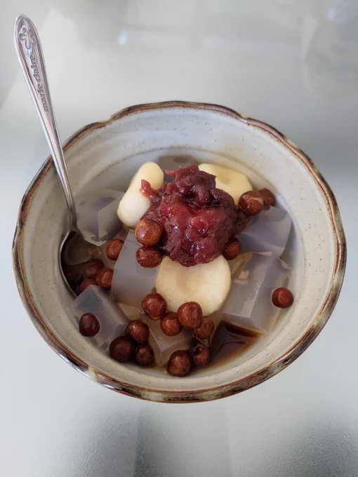
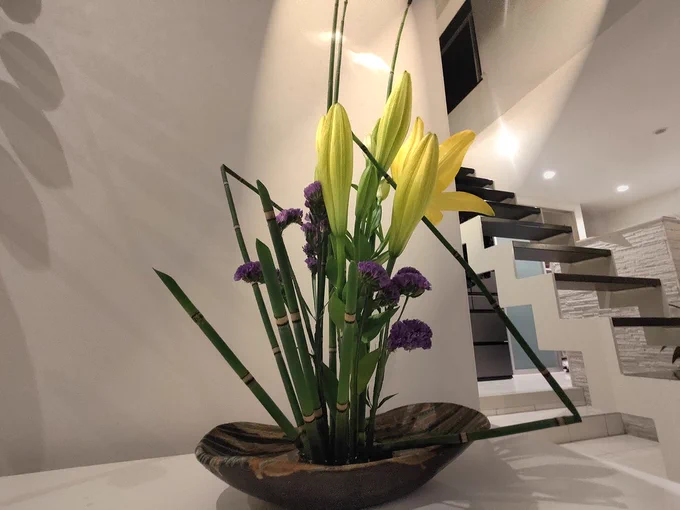

# 2023-07-16

[16 Jul, 2023 10:00 PM](https://twitter.com/hirasawa/status/1680562941454606336#m)

部屋に戻ると  
  
「ふー、助かった」と独り言を言い、窓を全開にする。猛暑の街並みを見下ろしてふと思う。  
  
何しに行ったんだっけ？  
  
トロピカル国では進めない進君。  
  
またこんど！！

---

[16 Jul, 2023 09:55 PM](https://twitter.com/hirasawa/status/1680561670249406465#m)

タンモーパン（スイカジュース）を買って外へ。  
  
入口には宿泊中のホテル名が入ったカート（オープンだから冷房はない）が止まっていた。嘘。ここまで送迎してくれるんだ。知らなんだ。  
  
運転手にキーカードを見せてホテルまで送ってもらう。

---

[16 Jul, 2023 09:50 PM](https://twitter.com/hirasawa/status/1680560412192849920#m)

もう無理と思ってから300歩のところでデパートに飛び込んだ。  
寒！刺すように寒い。切るように寒い。擦り減るように寒い。  
  
フードコートでしばしうつぶせたまま冬眠。頭痛で目が覚める。

---

[16 Jul, 2023 09:45 PM](https://twitter.com/hirasawa/status/1680559153956155395#m)

何故アンタは猛暑の中を徒歩で何処かへ行こうとするのか？と現地人が言う。現地人はちょっとの間も歩かずタクシーに乗れと言う。  
  
冷蔵庫に乗ってどこに行こう？  
選択肢が二つなら自然の刃を選ぶ。この場合は猛暑だ。

---

[16 Jul, 2023 09:40 PM](https://twitter.com/hirasawa/status/1680557895296098304#m)

あの日は本当にダメだと思った。  
  
しかし、大量のアジ△ノモ◇トと大量の砂糖から逃げるには40度の世界を匍匐前進するしかない。  
  
おばちゃん、私のタイ語がダメならそう言ってくれるかわりに関係ない店への道教えないでね。干からびるから。

---

[16 Jul, 2023 09:35 PM](https://twitter.com/hirasawa/status/1680556637633773570#m)

本日も徒歩中に「無理」と感じた暑さは独りトロピカル国でインドカレー屋さんを目指して歩いた摂氏40度の強酸性猛暑まであと10歩。

---

[16 Jul, 2023 09:30 PM](https://twitter.com/hirasawa/status/1680555382031147010#m)

スタジオの排煙窓を開けた。  
だが、出口を開けても入口がない。  
  
今アイスノンが後頭部に架空の入口を開けた。  
  
禁断の南極への入り口。  
出口はここ。

---

[16 Jul, 2023 09:25 PM](https://twitter.com/hirasawa/status/1680554120741261312#m)

ちょっと待て、暑すぎる。。。

---

[16 Jul, 2023 09:20 PM](https://twitter.com/hirasawa/status/1680552862311682048#m)

わざわざ有機の土を取り寄せ、ルッコラを植えた。  
  
庭師にその植え方でよいか質問したところ、ダメと言われた。  
  
ダメ出しされてL字形のお辞儀をする吟じる下足番。

---

[16 Jul, 2023 09:15 PM](https://twitter.com/hirasawa/status/1680551605156954113#m)

要約すると：暑い。

---

[16 Jul, 2023 09:10 PM](https://twitter.com/hirasawa/status/1680550345834139648#m)

路面から猛進してくる複写熱に首を取られ「く」の字に屈曲した己の影は、数十年前の発信から意味を削がれた反射の強弱という量的評価のみが叶う軋轢と、執拗に反復されるトリガー言語のオウム返しで人を圧迫できることを知った馬鹿たちに汚されて辟易する哀れな正気のようだ。  
  
え？

---

[16 Jul, 2023 09:05 PM](https://twitter.com/hirasawa/status/1680549087932739586#m)

そしてこの度は違うレルムに盛られたシトリンみつまめ。

---

[16 Jul, 2023 09:00 PM](https://twitter.com/hirasawa/status/1680547830430314496#m)

シトリンのライブ生け花  
  
深海の節足動物の上に生じる意匠を地の植物の中より発掘して帆に設える者は、浮揚力を持つ百合の飛包に任せて天井の湖面へと向かうゴンドラから見下ろす。  
  
寸評ではなく、観察報告。

---

