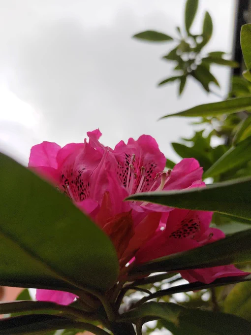
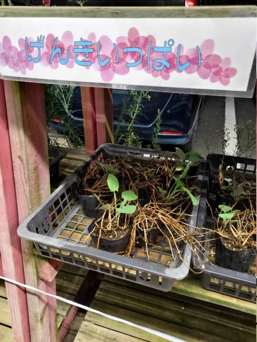

# 2023-07-20

[20 Jul, 2023 10:00 PM](https://twitter.com/hirasawa/status/1682012481299058689#m)

早起きと昼寝で整えた心身をスムース・アズ・シルクな詩的工業製品でリハーサルスタジオに運ぶ。季節の花園。  
  
ライブの準備は怪鳥。  
  
またこんど！！

---

[20 Jul, 2023 09:55 PM](https://twitter.com/hirasawa/status/1682011221954887680#m)

早朝にUターン出勤する一方で短時間の昼寝を加える。  
  
接続師の脈診でいつもと違う「良さ」が出ているそうだ。  
  
早起きと昼寝。  
  
しばしこれで行こう。

---

[20 Jul, 2023 09:50 PM](https://twitter.com/hirasawa/status/1682009963777118210#m)

---

[20 Jul, 2023 09:45 PM](https://twitter.com/hirasawa/status/1682008705355612160#m)

言われた通りに生きたらこうなった。  
  
まじめな話、人はどんどん頭がおかしくなっていると感じる。

---

[20 Jul, 2023 09:40 PM](https://twitter.com/hirasawa/status/1682007447064690689#m)

ラパンからMIRAIに乗り換えた時  
  
「なんてスムーズな乗り心地！」  
  
と感嘆した。  
  
現車からMIRAIに乗り換えると  
  
「この横揺れと弾みなんとかして」  
  
と思う。

---

[20 Jul, 2023 09:35 PM](https://twitter.com/hirasawa/status/1682006188865597440#m)

水曜日はMIRAIの日だ。  
  
バッテリーを上げないようにするため、水曜日はMIRAIで出かけることにした。  
  
かれこれ二カ月以上は水素ステーションに行ってないような気がする。胸の詰まりが消えている。

---

[20 Jul, 2023 09:30 PM](https://twitter.com/hirasawa/status/1682004930687832067#m)

鶯にまあまあの評価をもらえればこっちのものだ。  
  
バス停に群れる高校生ゾンビの中をつっきる気力がわく。

---

[20 Jul, 2023 09:25 PM](https://twitter.com/hirasawa/status/1682003672337719298#m)

そのゾーンを過ぎるともう一つの森があり、木漏れ日の浄化と英気に触れ、生まれ変わったように残りの道のりを行く。  
  
「あながちアホとばかりは言えんよ、さしずめ、まあまあのところやな」  
  
と鶯に見送られる。

---

[20 Jul, 2023 09:20 PM](https://twitter.com/hirasawa/status/1682002413983768576#m)

その駐車場にはド△ンキのそれに漂う独特の雰囲気から更に生気を抜いたような生き物の鬱憤と憤懣が満ちており、ここは日本か？と思うほどゴミが散乱している。  
  
言う通りに生きて来たらこうなった、という気の毒さはあるものの気づくチャンスもふんだんにあったはずだと、足早に通り過ぎる。

---

[20 Jul, 2023 09:15 PM](https://twitter.com/hirasawa/status/1682001155960852480#m)

この季節の往路には絶対に行倒れてはいけないゾーンがある。  
  
屋外で販売されている鉢植えには給水されず、常に、全てが、しおれ、枯れている。雑草が生えている鉢さえある。その店の前に漂う邪気に沈んではいけない。

---

[20 Jul, 2023 09:10 PM](https://twitter.com/hirasawa/status/1681999897481076737#m)

行きは良い。  
しかしＵターン後の復路では日光が真正面から当たるようになり気化熱を利用して冷却するスカーフ無しでは途中で行倒れる。  
  
行倒れた私の背中にカラスが舞い降りヒヨドリやスズメやハクセキレに向かって言う。  
  
「だからアホ言うたやろ」

---

[20 Jul, 2023 09:05 PM](https://twitter.com/hirasawa/status/1681998639378452481#m)

夏の早朝は正にゴールデンドーンで、ほぼ真横からの朝日に照らされた木々が金色に輝く。  
  
ほんの数分間で終わる金色の暗号の園で泳がされる間、カラスやヒヨドリやハクセキレやスズメが私についての評価を太陽に告げている。  
  
「コイツ、やっぱりアホやで」

---

[20 Jul, 2023 09:00 PM](https://twitter.com/hirasawa/status/1681997388779749378#m)

強い日差しを避けたUターン通勤を目指し、日に日に起床時間を早くしている。  
  
勤労なお勤め人の諸氏にはぬるいと叱られそうですが5時出発をめざしている。

---

