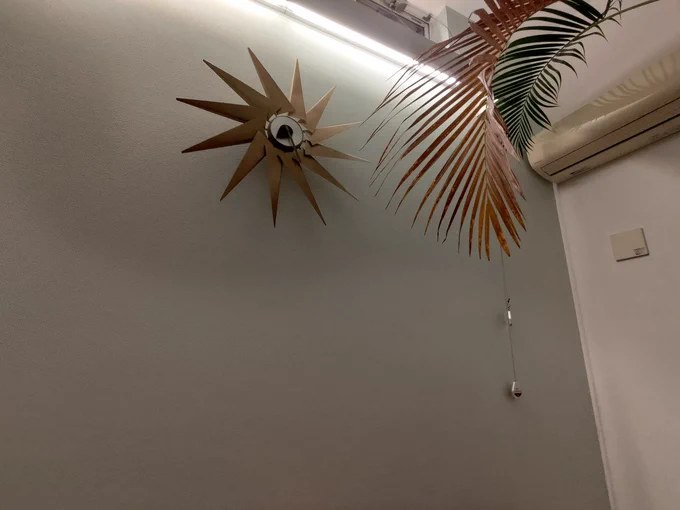
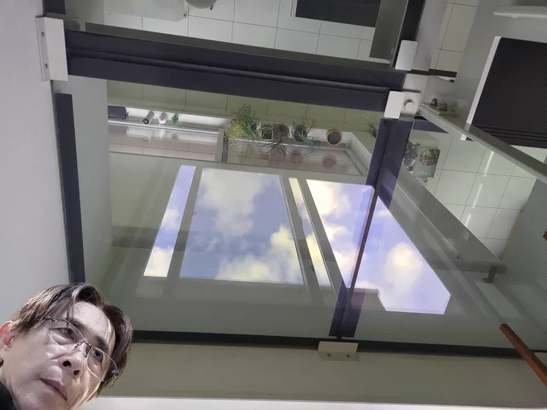

# 2023-07-22

[22 Jul, 2023 10:00 PM](https://twitter.com/hirasawa/status/1682737259966070785#m)

これは思考習慣ではなく、条件付けです。  
  
またこんど！！

---

[22 Jul, 2023 09:59 PM](https://twitter.com/hirasawa/status/1682737004201558016#m)

Q：ちょっとした出来事や情報で不幸な文脈や結末を信じてしまい、不安や恐怖、諦念で身動きが取れなくなってしまう。そういった思考回路から脱出したいです。  
  
A：結果の優劣は五分五分であるにも関わらず劣を選択する理由が無いのと同時に優を選択しない理由もありません。つづく

---

[22 Jul, 2023 09:55 PM](https://twitter.com/hirasawa/status/1682735997748903936#m)

Q：温泉シャークでサメがヒトを襲うシーンごとにステルスのデストロイギターが聴けたら私の背ビレがシビレますがそれは無いですか？🦈  
  
A：無い。

---

[22 Jul, 2023 09:50 PM](https://twitter.com/hirasawa/status/1682734739524837377#m)

Q：承認要求との良い付き合い方はありますか？  
  
A：付き合う必要は無く、決別が最も良い付き合い方です。

---

[22 Jul, 2023 09:45 PM](https://twitter.com/hirasawa/status/1682733481103618050#m)

Q：夢の中で平沢さんのライブに行くことが稀にあるのですが、いつもよく見ると別人なんです。あれは誰ですか？  
  
A：添田幸五郎です。

---

[22 Jul, 2023 09:40 PM](https://twitter.com/hirasawa/status/1682732222703345665#m)

二足歩行の食がいかに先入観と錯覚に支配されているかに気が付いたらその眼差しで世界を見てください。  
  
植物からもタンパク質（アミノ酸）は充分に摂れています。しかもアミノ酸に分解するプロセスが省けます。ゆえにアスリートやボディービルダーは採食にシフトしています。

---

[22 Jul, 2023 09:35 PM](https://twitter.com/hirasawa/status/1682730964815060992#m)

Q：最近動物性食品を摂ると体に負担を感じる様になり、要所で師匠の食事を参考にさせていただいたところ体が楽になりました。 ただ野菜中心にするとタンパク質が不足気味になってしまうのですが  
  
A：貴方は採食についてもっと勉強すべきです。つづく。

---

[22 Jul, 2023 09:30 PM](https://twitter.com/hirasawa/status/1682729706297364483#m)

Q：師匠は人生で一度も笑われたことがないとは思いますが、最近1番笑ったエピソードを教えていただきたいです。  
  
A：笑いが止まらないほどのエピソードはこれからやって来ます。

---

[22 Jul, 2023 09:25 PM](https://twitter.com/hirasawa/status/1682728447892758530#m)

タービンクロックの壁を淡いグリーンにした。  
  
空気が柔らかくなり壇中の裏側が緩んでゆく。  
体験したことのない事の古い記憶が壁から出ようとしている。  
  
治癒力のある壁。

---

[22 Jul, 2023 09:20 PM](https://twitter.com/hirasawa/status/1682727189576314881#m)

獣道を閉ざし、高く積まれたフルーツを頭上に乗せて熱気の中を歩くウブドゥのご婦人方のように、アイスノンを頭頂部に乗せて機材の熱気がこもるスタジオに入る。

---

[22 Jul, 2023 09:15 PM](https://twitter.com/hirasawa/status/1682725931583172609#m)

そんな時、夕食の支度に良い修飾ばかりが連なる緩慢な死の調理材料と共に加熱された獣の化身が猪突猛進の旋風と共に生ぬるい異臭を放って獣道を通る。  
  
残念ながら氷龍の黄金の妙風はこれまで。

---

[22 Jul, 2023 09:10 PM](https://twitter.com/hirasawa/status/1682724673384226816#m)

氷龍はおそらく20匹はおり、円形に連なって途切れなく窓を繋ぐ獣道を通る。  
  
龍の身体に触れれば命は無いが、その毛並みが掠める程度の近くに立てば清廉なる冷風の麻薬のような浄化から離れられなくなる。

---

[22 Jul, 2023 09:05 PM](https://twitter.com/hirasawa/status/1682723415197622272#m)

つる植物の窓辺から、蘇鉄脇の窓に向かって弧を描いて90度に曲がる風の獣道が出来ている。  
  
身体を掠めて通るあの毛並みと通過時間から察するに、あれはゴールデンレトリバーのような毛並みの氷龍で体長は50メートルを超える。

---

[22 Jul, 2023 09:00 PM](https://twitter.com/hirasawa/status/1682722167241465856#m)

1階の窓辺

---

