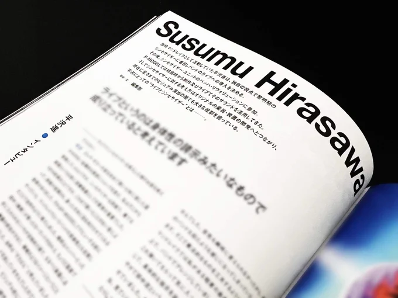

# 2023-07-26

[26 Jul, 2023 06:06 PM](https://twitter.com/Hirasawa_Info/status/1684128163029463041#m)

Retweet from [平沢進・公式サイト @Hirasawa_Info](https://twitter.com/Hirasawa_Info)

この度もFILTER様にはお世話になりました。  
読み応え充分のインタビューです。是非ご覧下さいませ。
> [26 Jul, 2023 04:19 PM](https://twitter.com/filter_synth/status/1684101146921828353#m)
> 
> [シンセサイザー専門誌『FILTER』 @filter_synth](https://twitter.com/filter_synth)
> 
> 平沢進さんには、シンセサイザーを最初に取り入れたマンドレイク時代から、P-MODELそしてソロまで、どのような視点でライブにおけるシンセサイザーを見てきたのかを語っていただきました。
> 

---

