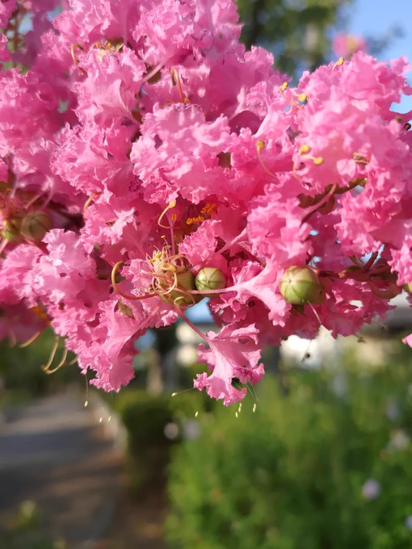

# 2023-08-06

[6 Aug, 2023 10:00 PM](https://twitter.com/hirasawa/status/1688173076062875648#m)

闇ルートとまではいかない影ルートが導く絶好調なエピソード観測は始まったばかり。  
  
明日はどんな残念に絶好調の光を見るのか。  
  
またこんど！！

---

[6 Aug, 2023 09:55 PM](https://twitter.com/hirasawa/status/1688171815519354881#m)

店内を見渡し、微生物栽培のつるむらさきとルッコラを購入。  
  
冷房の霜ガラスに奪われた緑の眺めを明日のスムージーの色で取り返す。  
  
緑の消化管ツアーへようこそ。

---

[6 Aug, 2023 09:50 PM](https://twitter.com/hirasawa/status/1688170557294985216#m)

それは皮膚のカルテノイドを計測し、どのくらいの野菜を食べているかをバラすマシンだ。  
  
マシンは私の手を計測し、こう言った。  
  
「目標値以上の野菜を食べています。すばらしい！！」  
  
時には世界とソリが合う。

---

[6 Aug, 2023 09:45 PM](https://twitter.com/hirasawa/status/1688169299721228288#m)

凍えながら熱いコーヒーを飲み店を出た。何か珍しい野菜はないかと、巨大ショッピングモールの一角に潜入する。  
  
店頭に見慣れないマシンを発見。

---

[6 Aug, 2023 09:40 PM](https://twitter.com/hirasawa/status/1688168040595333120#m)

首尾よく田園を望む大きな窓の前の席を確保したものの、店内の強冷房のためガラスは霜で覆われ外が見えない。そして凍えるような寒さ。  
  
何故このように私はこの世とソリが合わないか。  
  
つまり、今日も絶好調だ。

---

[6 Aug, 2023 09:35 PM](https://twitter.com/hirasawa/status/1688166782593286146#m)

はつらつとした稲穂の緑に染まる広大な田園沿いのカフェがある。  
  
田園はサンドペーパーでいえば50番に相当する軋轢を体現する陰陽差で生じた入道雲と新緑の接合部であり(え？)、つくばツインピークスの男体山と女体山の間にあるゲジゲジ博物館の右隣に位置する（左隣はサイゼリヤだ）。

---

[6 Aug, 2023 09:30 PM](https://twitter.com/hirasawa/status/1688165526416084992#m)

ウソである。  
  
そんなウソに彩られ、愉快と不愉快のマーブル模様に染まる盆踊りに夏の終わりの郷愁を見た。  
  
見ないけど。

---

[6 Aug, 2023 09:25 PM](https://twitter.com/hirasawa/status/1688164265964838912#m)

あのゲジゲジは、二足歩行の松果体に巣食う寄生虫で、宿主に辻褄の合わない文脈を満腹を超えて貪らせ、自滅に追い込む厄介者としてつくばツインピークスのゲジゲジ博物館に展示されている。

---

[6 Aug, 2023 09:20 PM](https://twitter.com/hirasawa/status/1688163007556091904#m)

明日の再開に備えてシートで覆われた屋台が２つ３つ。こんな狭いところに屋台が？  
  
足元を見ると何かの景品らしきものが落ちている。封も切られず打ち捨てられた緑色のゲジゲジだ。  
  
盆踊りと緑のゲジゲジ。

---

[6 Aug, 2023 09:15 PM](https://twitter.com/hirasawa/status/1688161749478887426#m)

影ルートは盆踊りの痕跡のある公園にステルスを導いた。  
  
住宅街の真っただ中にぽっかりと空いた空間の盆踊りは愉快と不愉快のマーブル模様に違いない。

---

[6 Aug, 2023 09:10 PM](https://twitter.com/hirasawa/status/1688160491213074432#m)

それは成層圏の向こうからやってくるので一昼夜放射線を発散しながら自ら解毒する。  
  
その日、桃木クラゲの並木は昼間のように明るいピンクの光で溢れる。  
  
全部ウソだけど。

---

[6 Aug, 2023 09:05 PM](https://twitter.com/hirasawa/status/1688159233047486464#m)

木西瓜は「桃木クラゲ」の木に生る小さなスイカで、満月が欠けて行くに従い生り始める。  
  
月の欠けた部分は文字通り「月の子を散らす」ように「桃木クラゲ」の木に散らされるのだ。

---

[6 Aug, 2023 09:00 PM](https://twitter.com/hirasawa/status/1688157982188621824#m)

極力日光が当たらない通勤ルートを模索中の私。  
  
闇ルートとまではいかない影ルートに咲く木西瓜の木を発見。  
  
木西瓜の木

---

