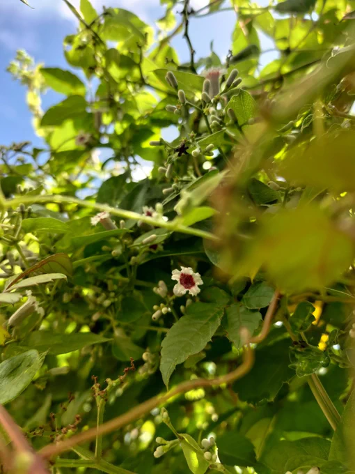
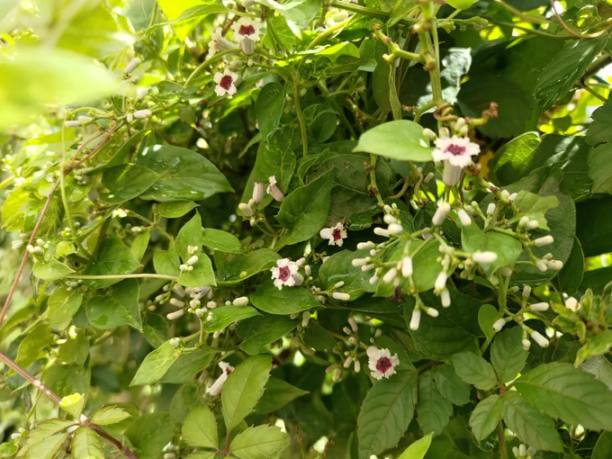

# 2023-08-15

[15 Aug, 2023 10:00 PM](https://twitter.com/hirasawa/status/1691434573031145472#m)

さて、これで今日のXは終わり。  
  
歴史の節目に二足歩行が反省すべきことの一つ。  
  
完膚なきまでに騙され、大嘘を鵜呑みにし、そのお膳立てに加担してしまったことだ。何度やられた？  
  
テーブルの下から貴方に渡す万能カードがある。それにはこう書かれている  
  
「ほとんど全てについて」  
  
またこんど！

---

[15 Aug, 2023 09:55 PM](https://twitter.com/hirasawa/status/1691433306452033537#m)

BGMの冗長な1小節というのはまるでそれが作品の一部であるかのように偽装した「合図」であり、観客も見聞きできる「梯子」のようなものだ。  
  
この梯子が外される。  
  
怖わ。

---

[15 Aug, 2023 09:50 PM](https://twitter.com/hirasawa/status/1691432048106651648#m)

「はい、サポートセンターです」と言って電話に出れば、  
  
昨日監督に出した問い合わせは全て回答され、望む通りに事は進行していることが分かった。  
  
これからBGMの冗長な1小節を消去する

---

[15 Aug, 2023 09:45 PM](https://twitter.com/hirasawa/status/1691430790020603905#m)

たった今、松村監督から「午前中に失礼しまーす」と言って電話があった。  
  
何故そんなことを言うかというと、ミュージシャンは午前中に起きていないと思っているからかもしれない。  
  
だが、私はミュージシャンである前に吟じる下足番であるので起きている。

---

[15 Aug, 2023 09:40 PM](https://twitter.com/hirasawa/status/1691429531503173632#m)

さて、現在はまだ午前であり、激しい雨に濡れた早乙女花の隙間を通る涼やかな風にあたり、蘇鉄の葉を日よけにしながら書いているが、蚊取り線香が消えたので室内に戻ることにする。

---

[15 Aug, 2023 09:35 PM](https://twitter.com/hirasawa/status/1691428273484603392#m)

まるで、ベートーベンが持つ筆記具のように、私の記憶と現実が食い違っている。

---

[15 Aug, 2023 09:30 PM](https://twitter.com/hirasawa/status/1691427016518647808#m)

奇しくも早乙女花は私の記憶にしか存在しない奇妙な出来事の主役である。  
  
あろるの館が完成したのは父の没後であるにも関わらず、あろるの窓辺に早乙女花が咲いたことを父にメールし、「それはめでたい」という返事が来たという記憶だ。

---

[15 Aug, 2023 09:25 PM](https://twitter.com/hirasawa/status/1691425756780572672#m)

貴方が履歴書に「すり潰すと悪臭がする」とは決して書かないように、すり潰されて悪臭を放つことを前提に咲く花のような名前をこの世に広く流布したことについて謝罪文を提出しなさい。

---

[15 Aug, 2023 09:20 PM](https://twitter.com/hirasawa/status/1691424498267144192#m)

私のクラスには少なくとも「ヘクソ子」という名前の女子はいませんでした。  
  
醜なる二足歩行集団への帰属訓練所で聞く点呼にさえ、個体名は美しくあれという願望の痕跡は見られた。

---

[15 Aug, 2023 09:15 PM](https://twitter.com/hirasawa/status/1691423240546033664#m)

可憐に咲く花に、すり潰すと悪臭がするからといって汚い名前を付けるなら、人間の絶世の美女だってすり潰せば悪臭がする。

---

[15 Aug, 2023 09:05 PM](https://twitter.com/hirasawa/status/1691420723800129536#m)

この花を「早乙女花」と名付けた人は豊かな人生を送りましたか？

---

[15 Aug, 2023 09:00 PM](https://twitter.com/hirasawa/status/1691419467316645888#m)

この花に悪臭を放つ物質名をご丁寧に二つも並べた名前を付けた者はもう罰を受けたましたか？

---

