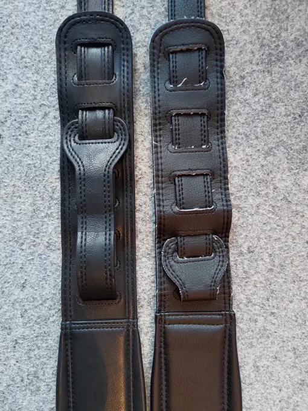
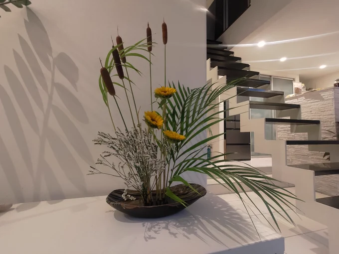
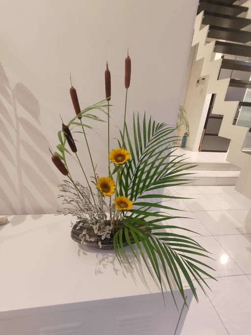

# 2023-08-20

[20 Aug, 2023 10:00 PM](https://twitter.com/hirasawa/status/1693246510987644962#m)

とはいえ、燃えさかる炎よりも殺傷能力の高い風鈴というのも魅力的だ。  
  
と、告白しておくことで踏み間違えても「あれには意味があるんだ」と思ってもらえる。  
  
意味無いけど。  
  
またこんど！！

---

[20 Aug, 2023 09:55 PM](https://twitter.com/hirasawa/status/1693245245721547147#m)

ところが、エフェクターのスイッチは足の親指と人差し指の間に入り、踏まれなかった。  
  
大きなアクションの後、火を噴くはずのサウンドは風鈴のようだった。  
  
分かる。

---

[20 Aug, 2023 09:50 PM](https://twitter.com/hirasawa/status/1693243987484893669#m)

ステージ上のエフェクターは怖いのだ。  
  
これはあるミュージシャンのエピソード。名前は言えない。  
  
その日何故か裸足でステージに立った件の人は、ここぞという瞬間にエフェクターを踏んだ。

---

[20 Aug, 2023 09:45 PM](https://twitter.com/hirasawa/status/1693242729281519716#m)

ステージからエフェクターを排除する計画実施には時間が足りず。  
  
踏み間違えのリスクを抱えて踏む。踏んで踏んで踏み切る。

---

[20 Aug, 2023 09:40 PM](https://twitter.com/hirasawa/status/1693241470872862885#m)

私の個人リハ、演出の調整等は大阪二日目に突入いたしました。

---

[20 Aug, 2023 09:35 PM](https://twitter.com/hirasawa/status/1693240212900417869#m)

民の暮らしなどどうでもよく、幸福な暮らしの上にブルドーザーを走らせ、傷を負った子供の生皮を剥ぐようなハリケーンに、相応しい者の名を付与できるほどの正気が見え始めたということか。  
  
以前なら不可能なはずだ。  
  
皆様、どうかご無事で。

---

[20 Aug, 2023 09:30 PM](https://twitter.com/hirasawa/status/1693238955830120902#m)

「ご協力ありがとうございます。フィードバックはタイムラインの精度向上に利用します」  
  
と表示された。いやいやミュートしたのは「長いキャリアを経て得たのがこの反応か」という落胆を回避するためであり、精度向上にはお役にたてません。

---

[20 Aug, 2023 09:25 PM](https://twitter.com/hirasawa/status/1693237695915397341#m)

右は使い込んだ結果ではなく、はじめからささくれており、左はそもそもピタゴリアンレザーの質が違う。  
  
私は初めからささくれていたわけではない。  
  
というようなミュージシャンの道具紹介のようなTWはそそくさと終わらせる。

---

[20 Aug, 2023 09:20 PM](https://twitter.com/hirasawa/status/1693236437917823367#m)

独国より届いたストラップの改善ぶりが良い。  
  
右が2020年版。  
左が2023年版。

---

[20 Aug, 2023 09:15 PM](https://twitter.com/hirasawa/status/1693235179274608957#m)

会人の衣装は素晴らしく、平沢喰われる。

---

[20 Aug, 2023 09:10 PM](https://twitter.com/hirasawa/status/1693233921255972947#m)

生け花が終了し、会人の衣装合わせが終わった後、皆それぞれが販売するMP3より値段が高い桃を頂いた。

---

[20 Aug, 2023 09:05 PM](https://twitter.com/hirasawa/status/1693232663094829450#m)

先生は完成した生け花を見て首をかしげながらシェーのポーズをした。  
  
あろるの室内を見渡し鉢植えのヤシから一枚葉を切り取って生け花に差し、もう一度シェーのポーズをとって納得した様子。  
  
向かって左側、右がわになびくヤシの葉がそれ。  
  
皆さんご一緒に。シェー。

---

[20 Aug, 2023 09:00 PM](https://twitter.com/hirasawa/status/1693231414492512499#m)

本日のライブ生け花。

---

