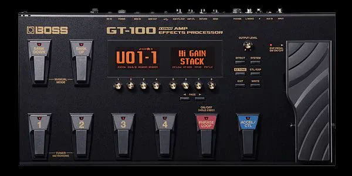

# 2023-08-28

[28 Aug, 2023 10:00 PM](https://twitter.com/hirasawa/status/1696145614633927010#m)

問題は、それが私の所有物として貴方が大事に保管しているため、私が一度も所有したことがないということです。  
  
（また始まった）  
  
パラドックスの数で決まるステルス品質。  
  
またこんど！！

---

[28 Aug, 2023 09:55 PM](https://twitter.com/hirasawa/status/1696144348717416833#m)

貴方のソレを買ったのは私です。  
  
もしソレを売った貴方がステルスファンだとしたら  
  
「ソレがヒラサワの手に渡ると予め知っているなら、ヒラサワが使用するソレを決して手放さず大事に保管しよう」  
  
というパラドックスを生きる手もあります。

---

[28 Aug, 2023 09:50 PM](https://twitter.com/hirasawa/status/1696143090552131896#m)

EVOより重いものを持ったことのない私はGT-100をローディーに預けっぱなしにし、自宅にも一台置き、設定のデータだけを移動するという方法で腕のダルさを退治しているよ。  
  
自宅設置のGT-100はメルカリで買ったもの。  
  
貴方のソレを買ったのは私です。

---

[28 Aug, 2023 09:45 PM](https://twitter.com/hirasawa/status/1696141832432881958#m)

GT-100は本体の重さが約５Kgある。  
  
ステージで蹴飛ばされて最前列の幸福な顔を陥没させるかわりに私の腕をダルくする。  
  
身を挺して客の顔を守る私。

---

[28 Aug, 2023 09:40 PM](https://twitter.com/hirasawa/status/1696140574112551396#m)

そして今に至る。  
  
気の遠くなるような数の気が滅入る無用のエフェクトがあらかじめセットされているエフェクターが足元に有る。  
  
開発エンジニア様に苦言を呈しているのではなく、デジタルの工業製品というものは「できること」と「やるべきこと」の区別が必要ない容量を持っているためにこうなる。

---

[28 Aug, 2023 09:35 PM](https://twitter.com/hirasawa/status/1696139315770691749#m)

P-MODELになったとき、ニューウエーブのつべこべ言わない潔さの採用に伴い、潔くエフェクターを全部外した。  
  
照明も色を使わず、白色光をつけっぱなしという潔さ。  
  
この「極端」に「過去の清算」を重ねて羽ばたく若沢。もうエフェクターを踏むために地上に降りなくてよい。

---

[28 Aug, 2023 09:30 PM](https://twitter.com/hirasawa/status/1696138057270075865#m)

なぜミラーボールと判定したか？  
  
MANDRAKEの自作スモークマシンは現代のようなグリセリンを加熱してスモークを発生させるのではなくドライアイスと熱湯を使う。  
  
今だ！という時に十分なスモークが出るよう、事前に加熱しておく必要がある。演奏中に足で湯加減を見るのは困難ゆえにミラーボール。

---

[28 Aug, 2023 09:25 PM](https://twitter.com/hirasawa/status/1696136798961910225#m)

ブラックドラキュラBOXというのは黒塗りでフットスイッチが複数並んでいるもの。これは照明に繋がっている。なぜドラキュラなのか知らない。  
  
アラスカマシンは、えーとどっちだったか…。スモークマシンかミラーボール。多分ミラーボールだ。

---

[28 Aug, 2023 09:20 PM](https://twitter.com/hirasawa/status/1696135540654198904#m)

MANDRAKEはライブハウスでも照明やスモークマシンを持ち込むめんどくさいバンドで、その一部の操作を若さ溢るる私が足で操作していた。

---

[28 Aug, 2023 09:15 PM](https://twitter.com/hirasawa/status/1696134282752999451#m)

ギターに関係するのはディストーション、コーラス、エコーの3つ。  
  
そのほかにブラックドラキュラBOXとアラスカマシンがある。  
  
何だって？

---

[28 Aug, 2023 09:10 PM](https://twitter.com/hirasawa/status/1696133023979421842#m)

MANDRAKE時代にはデジタルのマルチエフェクターは存在しないのでボードに複数のエフェクターを張り付けていたよ。  
  
複数のエフェクターのうちギター演奏に関係するのは３つだけ。  
  
え？

---

[28 Aug, 2023 09:05 PM](https://twitter.com/hirasawa/status/1696131766325829934#m)

ライブハウスなどでゲスト出演するときはGT-1という兄弟機を使っているよ。  
  
GT-1のサイズはGT-100に比べてずっと小さい。  
  
エフェクターのサイズを会場のサイズに合わせるのは、エフェクターに会場を投影し、踏みつぶすというおまじないだ。  
  
ウソだけど。

---

[28 Aug, 2023 05:27 PM](https://twitter.com/Hirasawa_Info/status/1696077048857731076#m)

Retweet from [平沢進・公式サイト @Hirasawa_Info](https://twitter.com/Hirasawa_Info)

ライブ「HYBRID PHONON 2566」開催に伴う  
テスラカイト・オンラインショップの発送等のお知らせを  
オフィシャルNewsに掲載致しましたので  
どうぞご確認くださいませ。

---

[28 Aug, 2023 06:50 PM](https://twitter.com/hirasawa_info_e/status/1696097997996871802#m)

Retweet from [susumu hirasawa info EN @hirasawa_info_e](https://twitter.com/hirasawa_info_e)

Susumu Hirasawa + Ejin  
HYBRID PHONON 2566  
Streaming tickets are now available!  
Includes archive for one week with the day of the performance.   
Show in Osaka: <a href="https://w.pia.jp/a/pls-hybrid-phonon-2566/">w.pia.jp/a/pls-hybrid-phonon…</a>  
Show in Tokyo: <a href="https://w.pia.jp/a/pls-hybrid-phonon-2566-tokyo/">w.pia.jp/a/pls-hybrid-phonon…</a>  
(Select your language)

---

[28 Aug, 2023 09:00 PM](https://twitter.com/hirasawa/status/1696130511155138959#m)

私はGT-100というデジタルのマルチエフェクターを使っているよ。  
  
理由は２つ  
１：配線が嫌い  
２：十分な重量があり蹴飛ばしても飛んでいかない。

---

[28 Aug, 2023 01:01 PM](https://twitter.com/Hirasawa_Live/status/1696010046772232225#m)

Retweet from [平沢進・核P-MODELライブ公式 @Hirasawa_Live](https://twitter.com/Hirasawa_Live)

平沢進＋会人  
HYBRID PHONON 2566  
 映像配信チケット販売のご案内です!  
 公演日を含めた一週間のアーカイブ付き。会場にお越しの方も、ご自宅等でご覧の方も  
 是非本公演をごゆっくりお楽しみ下さいませ。  
  
ぴあの販売ページURL  
<a href="https://w.pia.jp/t/hybrid-phonon-2566/">w.pia.jp/t/hybrid-phonon-256…</a>

---

