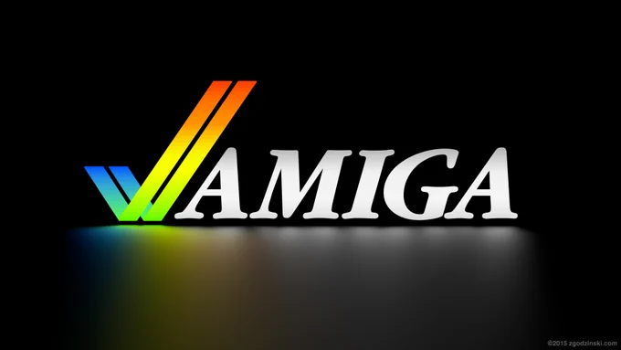

# 2023-08-31

[31 Aug, 2023 10:00 PM](https://twitter.com/hirasawa/status/1697232778679783540#m)

それは前代未聞のマスゲームだ。  
  
やっと今、オマエタチにも協調性があることを示せるチャンスだ。  
  
非協調性の権化から生まれる協調性をこの世に！（いみふ）  
  
またこんど！！

---

[31 Aug, 2023 09:55 PM](https://twitter.com/hirasawa/status/1697231512318480746#m)

しかし、この屈辱に対してオマエタチも対抗手段を持っている。  
  
曲が終わった後拍手をせず、一糸乱れぬタイミングでオマエタチ全員が渋い顔をして舌打ちする。

---

[31 Aug, 2023 09:50 PM](https://twitter.com/hirasawa/status/1697230254362988579#m)

私のライブで曲が終わり、その後の拍手がやんだころ、客を見渡してチッと舌打ちをする。  
  
どうだい？簡単だろ？

---

[31 Aug, 2023 09:45 PM](https://twitter.com/hirasawa/status/1697228995954176427#m)

ところが今、私は舌打ちで人を喜ばす方法を考え付いた。  
  
ただし条件がある。  
  
喜ばす対象が変態でなければならない。

---

[31 Aug, 2023 09:40 PM](https://twitter.com/hirasawa/status/1697227737449021698#m)

それらの音はうまく操れば人を喜ばせることができる。  
  
どう操っても人が喜ばない舌打ちとあごから出るカクッ、カクッという音。

---

[31 Aug, 2023 09:35 PM](https://twitter.com/hirasawa/status/1697226479283626071#m)

やはり靴が鳴っていた。  
  
そういえば私がまだ顎関節症だったころ、あごから「カクッ、カクッ」という音を出すことができた。  
  
身体の様々な部位から出る音が利用されている。  
  
歌とか拍手とか口笛とか。

---

[31 Aug, 2023 09:30 PM](https://twitter.com/hirasawa/status/1697225222066143676#m)

とか考えながらハタと立ち止まり、キュッと鳴っているのは靴ではなく、私の身体の何等かの部位だったら問題は別次元である、という落ち着いた態度で足元を見る。

---

[31 Aug, 2023 09:25 PM](https://twitter.com/hirasawa/status/1697223962739065316#m)

AMIGAというからには女性のはずなのに、しゃべられると男の声でしゃべる。  
  
だからといって現代の七色マツリに関連付けないでほしい。  
  
扱うテーマとは何も関係ない発脅する詐欺の横にチェックを入れてください。

---

[31 Aug, 2023 09:20 PM](https://twitter.com/hirasawa/status/1697222704582258910#m)

そういえばAMIGAのロゴマークもチェックマークだったな。  
  
しかもレインボーカラーなのでハラハラする。

---

[31 Aug, 2023 09:15 PM](https://twitter.com/hirasawa/status/1697221446165250284#m)

もしも何等かの書類にチェックマークを入れてほしければ朝私の後をついてくるとよい。  
  
もういい、というほど書類をチェックマークでいっっぱいにするのも夢ではない。

---

[31 Aug, 2023 09:10 PM](https://twitter.com/hirasawa/status/1697220188200985010#m)

そうやって朝から世間にチェックマークをまき散らしているので、世の中には✔が氾濫しているはず。  
  
職場に着いたら大事な書類の意図しない場所に✔が入っていないか確かめてほしい。  
  
例えば  
「退職希望」の横とか。

---

[31 Aug, 2023 09:05 PM](https://twitter.com/hirasawa/status/1697218929750573230#m)

その音の響きを視覚化するなら  
  
✔  
  
みたいな感じだ。

---

[31 Aug, 2023 09:00 PM](https://twitter.com/hirasawa/status/1697217683261886794#m)

ついに通勤用の靴の右からキュッという音が出るようになってしまった。

---

[31 Aug, 2023 10:01 AM](https://twitter.com/Hirasawa_Info/status/1697051863307415737#m)

Retweet from [平沢進・公式サイト @Hirasawa_Info](https://twitter.com/Hirasawa_Info)

グリーンナーブ会員様限定ムービー  
『奏でる用務員の「月締メ・フォルマント」』第51回「2023年7月の報告」の配信を開始いたしました。  
公開場所はオフィシャルサイト：GN会員限定ページ内のお知らせ欄にてご確認下さい。  
（ストリーミング配信ではございませんので、いつでも御覧頂けます）

---

