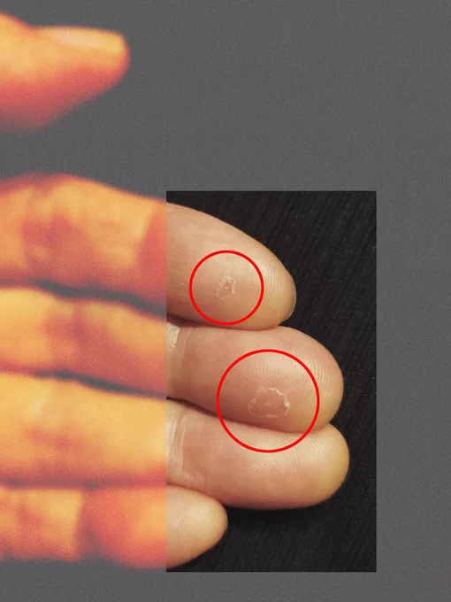

# 2023-09-14

[14 Sep, 2023 10:00 PM](https://twitter.com/hirasawa/status/1702306214632357964#m)

オマエタチはしばしば、ステージの上で突然お隣のおじさんがオマエタチの家に帰って来た様子を目撃している。  
  
明日はどこに帰ろうか？  
  
またこんど！！

---

[14 Sep, 2023 09:55 PM](https://twitter.com/hirasawa/status/1702304942374166617#m)

えーい、右だ！  
  
といって踏んだペダルが隣のペダルだった場合、それは「ただいまー！と言って帰った家が隣の家だった時のようにショックだ。

---

[14 Sep, 2023 09:50 PM](https://twitter.com/hirasawa/status/1702303684229485040#m)

乱視で悩むあまり賢くない男は暗転でエフェクターのLEDが二重に見える。  
  
左を踏めばよいのか、右を踏めば良いのかと迷う間に次ぎの曲が迫りくる。

---

[14 Sep, 2023 09:45 PM](https://twitter.com/hirasawa/status/1702302425833766962#m)

努力せず、大金も使わず「ウケる」と言わしめる遠きへと向かうチケットを得る男は主に乱視で悩んでいる。

---

[14 Sep, 2023 09:40 PM](https://twitter.com/hirasawa/status/1702301167525532061#m)

次に「ウケる」と言わしめるにはどこに立っていればいい？  
  
月面。南極。シャンバラ。アヴァロン。

---

[14 Sep, 2023 09:35 PM](https://twitter.com/hirasawa/status/1702299909414862912#m)

その男は観客を増やす努力などしたことがないし、大金を投じたマーケティングなどもしたことがない。  
  
次の30年を経て目を開けたた時、いったいどこに立っているのか。

---

[14 Sep, 2023 09:30 PM](https://twitter.com/hirasawa/status/1702298655628091748#m)

さて、私の活動をまるでパラパラマンガのように追っている存在が、30年に一度目を開けてライブの瞬間を見ていたらどう見えるか。  
  
埼玉県蕨市のライブハウスで3人の客を前に演奏していた男が次に目を開けた時には東京国際フォーラムの舞台に立っている。  
  
私ならこう言う。「ウケる」

---

[14 Sep, 2023 09:25 PM](https://twitter.com/hirasawa/status/1702297392606007701#m)

あまり賢くないとはいえ、好転反応だと聞いたその日から「反射区」を押すのを中断し、これ以上吹き出物が出ないよう一旦視力のことは忘れているとのこと。  
  
日曜前に再開しないことを祈る親心。

---

[14 Sep, 2023 09:20 PM](https://twitter.com/hirasawa/status/1702296134608474462#m)

「ピークは土日だったなあ、もうイタあて、イタあて。ばんそうこうしてたら仕事できませんやん？」  
  
そりゃ痛いでしょうねぇ。仕事道具が直接当たるからねえ。  
  
「おかげで絞り出たからもうイタないわ」

---

[14 Sep, 2023 09:15 PM](https://twitter.com/hirasawa/status/1702294876220469447#m)

指導者に尋ねたところ  
  
「あ、それ好転反応といいます。うまくできてるというサインです。一週間ほどで消えます」  
  
と言われ、あまり賢くない男は「え？」と思わず声を漏らしたらしい。  
  
一週間て…。真っ最中ですやん。

---

[14 Sep, 2023 09:10 PM](https://twitter.com/hirasawa/status/1702293617899864302#m)

あまり賢くない当人はある指導者に言われるがまま視力を改善させる「反射区」をかなり真面目に、言われた通りに、言われた回数を押し始め、その二日後に吹き出物に遭遇した。  
  
己の身体に初めて「吹き出物」を見たあまり賢くない男。

---

[14 Sep, 2023 09:05 PM](https://twitter.com/hirasawa/status/1702292360133235025#m)

あの破損は吹き出物のようなものが破裂した痕のようで、ピーク時には指に複数の突起が生じていたと当人が言っている。  
  
当人はあまり賢くないようで、思いついた事はすぐに実行してしまうタチであったことが災いしたということらしい。  
  
災いの数で何が決まるか考える時間はもう少し後です。

---

[14 Sep, 2023 09:00 PM](https://twitter.com/hirasawa/status/1702291102123123073#m)

この汚らしい指の破損は何でしょう？  
  
これはある意味最も付き合いの長い男の指で、まさかギターを弾きすぎて破損したわけではなさそうです。  
  
そもそも私と付き合いの長い男が誰でもギターを弾けるとは思わないでください。

---

