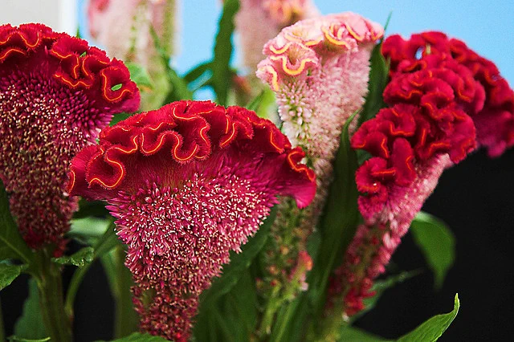
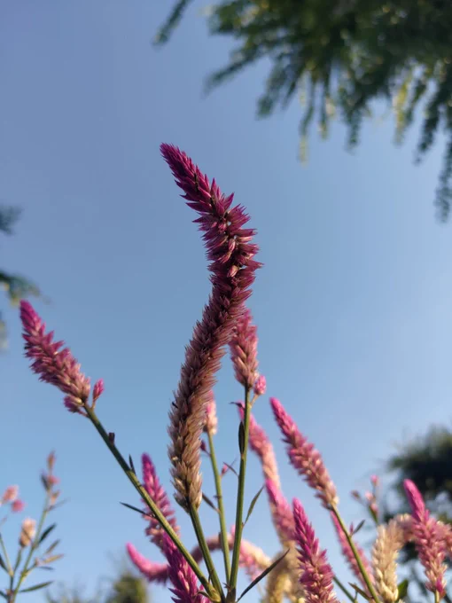

# 2023-09-15

[15 Sep, 2023 10:00 PM](https://twitter.com/hirasawa/status/1702668594465632666#m)

ところで、松村師匠は本番で私の代わりをお願いしても  
  
「私がやっても師匠のようにはいきませんから」  
  
が断る理由。  
  
それなら松村師匠のあちこちに「ここをこうすればこうなる」という付箋紙を貼っておけばよい。  
  
日曜をお楽しみに！  
  
またこんど！

---

[15 Sep, 2023 09:55 PM](https://twitter.com/hirasawa/status/1702667330281714001#m)

「ここをこうするとこうなる」  
  
と書かれた付箋紙をエフェクターのあちこちに張り付けておく。  
  
そうすれば私が居なくても大丈夫。

---

[15 Sep, 2023 09:50 PM](https://twitter.com/hirasawa/status/1702666072326070421#m)

さて、暗闇で目視が困難なペダルの使用を避けるために導入する別のエフェクターを私が居なくてもチェックできるようにしておかなくてはいけない。  
  
ちなみにギターのサウンドチェックは松村師匠が行う。  
  
本番でも弾いてくれると助かるがなかなか承諾を得られない。

---

[15 Sep, 2023 09:45 PM](https://twitter.com/hirasawa/status/1702664813728735322#m)

このように必死で話を膨らませているものの限界が近い。  
  
ミヘルちゃん、私は今日も限界の前に立っています。

---

[15 Sep, 2023 09:40 PM](https://twitter.com/hirasawa/status/1702663555290693745#m)

ミヒャエルのおかげで世界は灰色よと当時の東ドイツを風刺したニナ・ハーゲンの都都逸に出て来るミヒャエルは男性名だが、ミヘルちゃんは女性である。

---

[15 Sep, 2023 09:35 PM](https://twitter.com/hirasawa/status/1702662297146253505#m)

ケイトモコは所謂ハーフだが、ミヘルちゃんは日本人だ。響きからいえばミヘルちゃんはミヒャエルの日本語訛りのように聞こえてエキゾチックだ。

---

[15 Sep, 2023 09:30 PM](https://twitter.com/hirasawa/status/1702661040545161576#m)

そういえば60年代に「ケイトモコ」という歌手がいて、アセトアルデヒドについての歌を歌っていたために「ケイト」と聞くと置き去られた脳というイメージに繋がるヒネた幼児が居たためにミヘルちゃんを悩ませたという物語には無理がある。  
  
無理があるからここで終わる。

---

[15 Sep, 2023 09:25 PM](https://twitter.com/hirasawa/status/1702659780492562580#m)

「なるほど、鶏はこんなところに脳を置きっぱなしにしているから三歩歩いたら忘れるっていわれてるんだね」  
  
「もう脳から離れるのよ。これは花なんだから」  
  
こうして学んだケイトウがこの世では色付きの猫じゃらしのようになっている。ご丁寧にグラデで。

---

[15 Sep, 2023 09:20 PM](https://twitter.com/hirasawa/status/1702658522347954625#m)

「そうなの？このケイトウは毛糸のようにフワフワしているからケイトウという名前の脳みそなの？ミヘルちゃん？」  
  
「違うわ、鶏の頭と書いてケイトウよ。つまりトサカに似ているでしょう？」

---

[15 Sep, 2023 09:15 PM](https://twitter.com/hirasawa/status/1702657263935062064#m)

私が知っているケイトウは、幼いころ中川の土手から転げ落ちた時咄嗟に掴んだ生き物の脳だ。  
  
「わ、脳みそ掴んでしまった！」と思ったがミヘルちゃんが「それはケイトウという花なのよ」と教えてくれた。

---

[15 Sep, 2023 09:10 PM](https://twitter.com/hirasawa/status/1702656006025515022#m)

どうりで昨日から朝髪をとかそうにも手が届かないわけだ。  
  
この世界では。

---

[15 Sep, 2023 09:05 PM](https://twitter.com/hirasawa/status/1702654747751170424#m)

これをケイトウと呼ぶからには鶏の頭はこんな形をしているんだな？この世界は。  
  
大雑把に分類して動物の頭は「長い」と「丸い」があるとすれば、鶏の頭と人間の頭は同類だから人間の頭もこうなんだな？この世界は。

---

[15 Sep, 2023 09:00 PM](https://twitter.com/hirasawa/status/1702653497441972637#m)

これがケイトウ（鶏頭）と呼ばれる世界にいつ迷い込んだかは知らない。

---

[15 Sep, 2023 08:13 PM](https://twitter.com/Hirasawa_Live/status/1702641714253660597#m)

Retweet from [平沢進・核P-MODELライブ公式 @Hirasawa_Live](https://twitter.com/Hirasawa_Live)

いよいよ2566最終公演：国際フォーラムです。  
ライブ成功に向けて、出演者及びスタッフ一同尽力致します。  
ご来場の方、配信観覧の方共に　お楽しみいただければ幸いです。  
また、記念グッズに関するお知らせを  
特設サイトに掲載致しましたので  
ご確認下さい。

---

