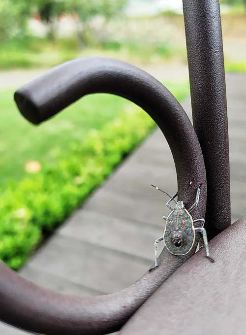

# 2023-09-21

[21 Sep, 2023 10:00 PM](https://twitter.com/hirasawa/status/1704842924381401360#m)

その前に170K最終版だ。  
  
BSPは10月までやらないのでご安心を。  
  
またこんど！！

---

[21 Sep, 2023 09:55 PM](https://twitter.com/hirasawa/status/1704841657395360053#m)

このあとどうするか。  
  
ギターアルバムのマスタリングのために音源を整理して鎮西さんに渡す。  
  
再ミックスが必要な場合、鎮西さんにやってもらう。

---

[21 Sep, 2023 09:50 PM](https://twitter.com/hirasawa/status/1704840399259594952#m)

今、危うく東京国際フォーラムでのエピソードをポストしようとした。  
  
BSPまでお預け。  
  
なにげにまたポストって言った？

---

[21 Sep, 2023 09:45 PM](https://twitter.com/hirasawa/status/1704839141169517040#m)

今日のポストは面白くない。  
  
まあ、しばらくはこんなだろう。  
  
今、ポストって言った？

---

[21 Sep, 2023 09:40 PM](https://twitter.com/hirasawa/status/1704837882706375090#m)

多くの同系列車のオーナーのように、純正ナビは使わないという結論に達し、不細工だけど信頼できるナビを立ち上げているにも関わらず信頼しないクセがついてしまったために、カメムシの幼虫のいる店には大幅に遅れて到着。  
  
幼虫が先に席についていたという物語。

---

[21 Sep, 2023 09:35 PM](https://twitter.com/hirasawa/status/1704836624641835411#m)

どうだい？わがままな女が車から降ろされ、砂漠の一本道をピンヒールを手に持って去ってゆく車に悪態つきながらとぼとぼと歩くシーンのようだろ？  
  
ぜんぜん違う

---

[21 Sep, 2023 09:30 PM](https://twitter.com/hirasawa/status/1704835366493229142#m)

信用できないナビで現在地が国道4号線上だと分かった途端フラッシュバックのように過去の東京地図と現実がリンクした。  
  
そして私はナビにこう言った。  
  
「お前、もうここで降りろ」

---

[21 Sep, 2023 09:25 PM](https://twitter.com/hirasawa/status/1704834107824382385#m)

ところがどうだい。ウルトラ渋滞で高速を降りた途端自分がどこにいるのかわからない。  
  
走っている道路の名前すらわからない。  
  
脳内で必死に過去の都内地図をスキャンするが景色が変わってしまっているのでわからない。

---

[21 Sep, 2023 09:20 PM](https://twitter.com/hirasawa/status/1704832849939960197#m)

ナビが賢くなるとドライバーがバカになる。  
  
そう唱えて生きてゆこう。  
  
しかしこれは真実だ。

---

[21 Sep, 2023 09:20 PM](https://twitter.com/hirasawa/status/1704832849466282314#m)

先日、東京国際フォーラムに向かう途中、自分がバカになっているのを再確認した。  
  
昔は頭の中に東京全域の地図があり、どこからでも地図無しで主要な場所へと最短コースを通って行けた。それがナビの無い時代のドライバーだ。

---

[21 Sep, 2023 09:15 PM](https://twitter.com/hirasawa/status/1704831591359426858#m)

ナビを信用していないため、ナビの指示を無視してイメージに従った結果恐ろしく遠回りして着いた店で撮影。  
  
もはやナビは私を信用しなくなった。

---

[21 Sep, 2023 09:10 PM](https://twitter.com/hirasawa/status/1704830332833313244#m)

足の先端がマニキュアブラシのようになっているので、ヤツはどこかにきっとマニキュアをしている。

---

[21 Sep, 2023 09:05 PM](https://twitter.com/hirasawa/status/1704829075389292649#m)

背中に子供を背負っているふりをして何かの効果を得ようとしているのでしょうが、この人全体が幼虫だそうです。  
  
「Baby in car」と同じ効果を狙っているなら、誰か事故の本質を彼（彼女）に教えてやってほしい。  
  
それより気になるのは足の先端だ。

---

[21 Sep, 2023 09:00 PM](https://twitter.com/hirasawa/status/1704827824207442355#m)

これは誰ですか？

---

