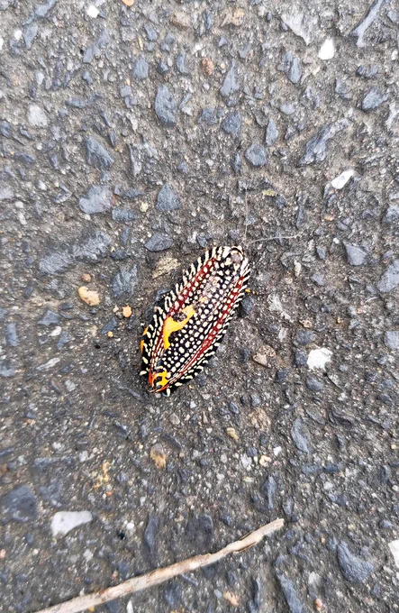
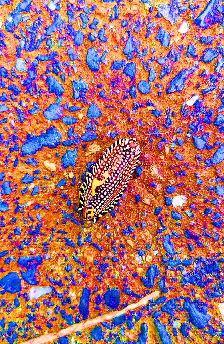

# 2023-09-28

[28 Sep, 2023 10:00 PM](https://twitter.com/hirasawa/status/1707379633442972076#m)

薬はお守りとし、実際は使わない。パニックで生じる恐怖の対象はハウリングであり実体はないという強い信念を持ち、最初の針孔に気づいたら「騙されるな」と強く自分に言い聞かせ、針孔から目をそらす。するとパニックは起こらない。これの繰り返し。気づいたら治っていた。  
  
またこんど！

---

[28 Sep, 2023 09:55 PM](https://twitter.com/hirasawa/status/1707378372433883427#m)

何等かの恐怖症に悩む人が、ヒラサワはどうやってパニック障害を克服したのか教えろ的な質問を見かけた記憶あり。  
  
参考になるかどうかは分からない。パニック障害は感情のハウリングのようなものだと気づいた。ハウリングは最初の針孔の一点に過剰に注意を向けるこで起こると気づいた。つづく。

---

[28 Sep, 2023 09:50 PM](https://twitter.com/hirasawa/status/1707377114721484862#m)

Q：ハイノン2566で演奏された1778-1985、偉大なる頭脳、MONSTER A GOGOの新規歌詞はいずれどこかでお目見えできますでしょうか  
  
A：メモリアルカードに収録される可能性は否定できません。

---

[28 Sep, 2023 09:45 PM](https://twitter.com/hirasawa/status/1707375855843078629#m)

Q：LANDINGのあそこ 師匠ったら馬骨心を分かっていらっしゃる(⁠〃ﾟ⁠3ﾟ⁠〃⁠)  寝そべり師匠、アクスタにしてくれませんかねぇ？ケイオス社さま  
  
A：イヤです。  
シーツをかけられて宙に浮いているポーズを挟むと言ったらスタッフに叱られました。

---

[28 Sep, 2023 09:40 PM](https://twitter.com/hirasawa/status/1707374597652283671#m)

Q：師匠はこれまで何度もタイムラインを移動していると思いますが、その時に元いたTLに寂しさなどは残らないのでしょうか？  
  
A：下水道の無いTLから下水道の有るTLに移動したと時と同じ心情です。移動する度に賢くなったと自覚し、周囲の人も賢くなっています。寂しさはありません。人格に下水道を。

---

[28 Sep, 2023 09:35 PM](https://twitter.com/hirasawa/status/1707373339428130876#m)

Q：たくさんの人がいる場所（ライブ会場、電車の中）だと「私」がいなくなったような感覚になります。 「私」を取り戻すには、どうしたら良いでしょうか。  
  
A：貴方がいなければ彼らはいません。あるいは、消える自分を楽しむ自分を観察してください。

---

[28 Sep, 2023 09:30 PM](https://twitter.com/hirasawa/status/1707372085121880253#m)

Q：どうして私のTLには暗くなるようなニュースしか流れてこないんですか  
  
A：トラッキングにより、貴方がそのような感情を好むとAIが判断したからかもしれません。  
  
しかし、そもそも世にいう「ニュース」とは人に暗い感情を抱かせるのが使命の一つです。

---

[28 Sep, 2023 09:25 PM](https://twitter.com/hirasawa/status/1707370822925484486#m)

Q：不可抗力で流れてくるテレビの音や店内BGMの中を、なるべく平穏に耐え抜く方法などありましたら教えてください。  
  
A：有害なものは有害。耐えてまで同居しなければならない我々はまず近づかないことが最大の防衛策。それが不可能なら異世界に紛れ込んだ孤独なAstro-Ho!に自分を投影しましょう。

---

[28 Sep, 2023 09:20 PM](https://twitter.com/hirasawa/status/1707369564445581374#m)

Q：カナブンについてはどう思われますか？  
  
A：洗練されたゴキブリ。洗練が好ましさを獲得する好例。二足歩行に応用可。

---

[28 Sep, 2023 09:15 PM](https://twitter.com/hirasawa/status/1707368306238194045#m)

現在フルーツリッチな私は以下のセットリストに準じてそれらを摂取している。  
  
1ステージめ  
リンゴ  
リンゴ  
桃太郎ぶどう  
パイナップル  
  
2ステージめ  
バナナ  
桃太郎ぶどう  
桃太郎ぶどう  
リンゴ

---

[28 Sep, 2023 09:10 PM](https://twitter.com/hirasawa/status/1707367047871545544#m)

私はリンゴハンターの腕を上げている。  
  
あっという間に完売になる生産者様のリンゴを素早く5キロ仕留めた。

---

[28 Sep, 2023 09:05 PM](https://twitter.com/hirasawa/status/1707365790062645616#m)

本日、「月締メ・フォルマント」8月の業務報告は納品された。

---

[28 Sep, 2023 09:00 PM](https://twitter.com/hirasawa/status/1707364537232486676#m)

早起きはビロードハマキの徳。  
  
誰にも似ていない生物の朝は生きる色素の隊列に咲き、  
爆発するコバルト色の意思の飛沫に眼底で始まる開闢を見る。  
  
マジか？！

---

