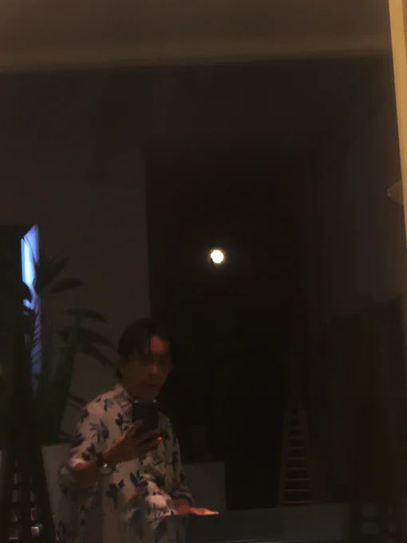

# 2023-09-30

[30 Sep, 2023 10:00 PM](https://twitter.com/hirasawa/status/1708104413544427554#m)

シャッフルしてシャッフルして鎮西さんのS字結腸に結び目を作ろう！（何で？）  
  
またこんど！！

---

[30 Sep, 2023 09:55 PM](https://twitter.com/hirasawa/status/1708103148265742755#m)

おや、今ざっと見ただけでもシャッフルダンスのモーションデータが存在する。  
  
鎮西さんを躍らせてこっそり楽しむ悪い大人もよいと思う。

---

[30 Sep, 2023 09:50 PM](https://twitter.com/hirasawa/status/1708101890070704599#m)

もう一度釘を刺しますが私はやらない。  
  
でも鎮西さんにやってほしい。  
だぼだぼのスーツ着てやったら絶対かっこいい。  
  
踊るエンジニア。ミキシング卓はシャッフルしないでね。

---

[30 Sep, 2023 09:45 PM](https://twitter.com/hirasawa/status/1708100631624655290#m)

シャッフルダンスの発明はパラパラに次ぐ快挙です。  
  
シャッフルダンスは下半身が主役。パラパラは上半身が主役。  
  
二つを同時にやると人体に結び目ができる。

---

[30 Sep, 2023 09:40 PM](https://twitter.com/hirasawa/status/1708099373975085201#m)

月面で踊るウサギを背に、路面を蹴る二足歩行のダンス。  
  
今日、私が好んでいるダンスは「シャッフルダンス」という類だということを学んだ。  
  
蹴っても蹴っても何処へも行かないダンスは、LANDINGした機内でなお見せられる映画のようだ。ウサギはとうにあそこに居る。

---

[30 Sep, 2023 09:35 PM](https://twitter.com/hirasawa/status/1708098115176366319#m)

月は我が家のインテリア。

---

[30 Sep, 2023 09:30 PM](https://twitter.com/hirasawa/status/1708096859951235116#m)

そういえばその農道に「人は死ぬとトンボになる説」を説く少年がいた。少年は真顔でそれを私に説いてくれた。  
  
なるほど、それは反証の術がない。思考の自由さと解放度において彼は大人の権威たちが知らない光から言葉を掘り出している。  
  
夏の終わりにいぶし銀をありがとう。

---

[30 Sep, 2023 09:25 PM](https://twitter.com/hirasawa/status/1708095598560452634#m)

存在してはいけないとされている日本の古代の農法を記した文献には、田んぼの周囲に生える植物によって陰イオンが生じ、それを虫たちが嫌うと記されていると聞き及ぶ。  
  
「幅奉公」は陰イオンを嫌う虫たちが、田んぼに背を向けることかもしれない。

---

[30 Sep, 2023 09:20 PM](https://twitter.com/hirasawa/status/1708094340558418178#m)

そういえば、このところめっきりUターン通勤は徒歩になり、この季節の農道に発生する虫たちの「幅奉公」を見ていない。  
  
「幅奉公」とは、農道の「長さ方向」ではなく「幅方向」に自分の前後を向けて佇んでいる現象。  
私が見る限り、農道の全ての昆虫がそうしている。  
  
彼らは揃って幅に仕えている。

---

[30 Sep, 2023 09:15 PM](https://twitter.com/hirasawa/status/1708093081948422616#m)

「憎たらしい子供よ、それは反証の術がない。お前は博識な大人たちより神に近い。アイスこぼすな」  
  
と言って立ち去る。  
  
それが秋の入り口。

---

[30 Sep, 2023 09:10 PM](https://twitter.com/hirasawa/status/1708091823502352575#m)

コンビニの駐車場にちょっと見憎たらしい子供が立っていて、アイスでベトベトになった口のまわりを袖で拭いながら夕日を指し  
  
「おじさん、今世界が転換したよ」  
  
と言われた時の準備はできている。

---

[30 Sep, 2023 09:05 PM](https://twitter.com/hirasawa/status/1708090565647270287#m)

太陽光の入射角によって世界がまったく違って見えるのと同様、時間の経過も正逆を移動する。  
  
私には四季があるのではなく、四界、四流があるように見える。  
  
まじか。まじ。

---

[30 Sep, 2023 09:00 PM](https://twitter.com/hirasawa/status/1708089313874079908#m)

この季節は目覚めると「日没」があり、ゆっくりと「日の出」に向かって逆回転している。

---

[30 Sep, 2023 09:02 AM](https://twitter.com/Hirasawa_Info/status/1707908788916003205#m)

Retweet from [平沢進・公式サイト @Hirasawa_Info](https://twitter.com/Hirasawa_Info)

グリーンナーブ会員様限定ムービー  
『奏でる用務員の「月締メ・フォルマント」』第52回「2023年8月の報告」の配信を開始いたしました。  
公開場所はオフィシャルサイト：GN会員限定ページ内のお知らせ欄にてご確認下さい。  
（ストリーミング配信ではございませんので、いつでも御覧頂けます）

---

