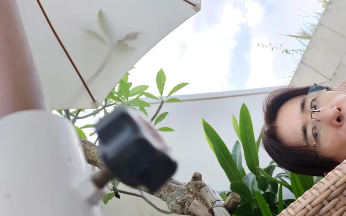
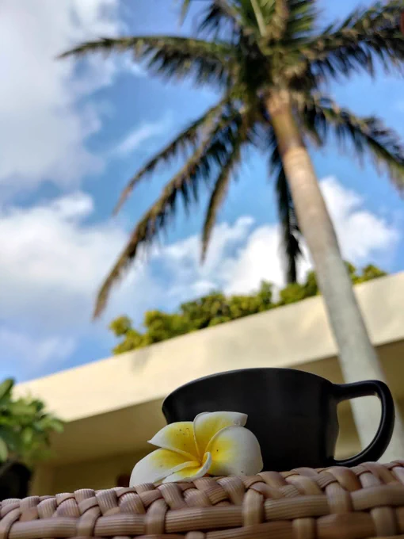

# 2023-10-02

[2 Oct, 2023 10:00 PM](https://twitter.com/hirasawa/status/1708829195378528300#m)

何千もの鳥の声にセミが参戦しはじめた。  
  
間もなくまた会人がやって来る。  
晩御飯どうしようか。  
  
またこんど！！

---

[2 Oct, 2023 09:55 PM](https://twitter.com/hirasawa/status/1708827923984142381#m)

創作は目標を糧に生まれるのではなく、抗いがたい経過から生まれる結果論なのだ。と書かれたマグカップでさんぴん茶を飲もう！

---

[2 Oct, 2023 09:50 PM](https://twitter.com/hirasawa/status/1708826665600839702#m)

そして、創作物の批評には説得力のある論をぶちまける人たちが調子に乗って自ら創作しはじめると、当人が10点すら付けないような代物になってしまう不可思議について話された。  
  
理屈で創作ができるなら天才は無価値だ。というゴム印を作りたい。  
  
さようなら東京アンダーグラウンド。

---

[2 Oct, 2023 09:45 PM](https://twitter.com/hirasawa/status/1708825407410074026#m)

帰りの車内では、いつ東京の自然発生的な文化は死滅し、作られた文化をただ消費するだけの場所になったかの回想に花が咲く。

---

[2 Oct, 2023 09:40 PM](https://twitter.com/hirasawa/status/1708824149312041112#m)

この後男は会人と共に遠出をする。  
  
28年もの間水槽の中でただ円を描くジンベイザメのペーソスはうるさすぎる外国人観光客の私語によって濁り始めた水槽の水に溶解していた。

---

[2 Oct, 2023 09:35 PM](https://twitter.com/hirasawa/status/1708822890890563983#m)

傍らの木に止まったキジバトの催眠術に抗いながら気付かれないようそっとランタナのオオスカシバを見る男の図。

---

[2 Oct, 2023 09:30 PM](https://twitter.com/hirasawa/status/1708821633530810671#m)

おせーてスカシバの人。どうやったらこの信念から脱出できるかを。  
  
ブーン。  
  
そうですか、わかりません。

---

[2 Oct, 2023 09:25 PM](https://twitter.com/hirasawa/status/1708820374153204125#m)

ここにはオオスカシバがいないと言ったのは嘘です。  
  
先ほどランタナの花に長い長いストローを差し込んで何等かの物質を吸い上げるか注入するかのどちらかをしていた。  
  
時空の堅い幻想を信念に持つ二足歩行が何時間もかけてやってきたこの土地へ、自由なオオスカシバは一瞬で来れる術を知っている。

---

[2 Oct, 2023 09:20 PM](https://twitter.com/hirasawa/status/1708819115883065404#m)

オオスカシバはいないが、何千匹もの鳥の声がある。  
  
鳥の声、葉と葉の摩擦音、風の音、繊維のように細い光の照射で出来た巨大なドームの中で浮かんでいるような錯覚。  
  
これヤバ。まじヤバ。

---

[2 Oct, 2023 09:15 PM](https://twitter.com/hirasawa/status/1708817857570635974#m)

ホバリングする2匹のオオスカシバに見送られてここに来たのだ。  
  
私は。会人と共に。

---

[2 Oct, 2023 09:10 PM](https://twitter.com/hirasawa/status/1708816599598104891#m)

オオスカシバの成虫はその容姿と色彩と母の優雅三者のモアレとしてホバリングする。  
  
クチナシは消えたがなぜか毎年オオスカシバの訪問をうけるあろるの庭園。  
  
今年もどこかでクチナシが丸坊主にされたはず。

---

[2 Oct, 2023 09:05 PM](https://twitter.com/hirasawa/status/1708815341718208868#m)

「乳飲み子に与える母」としてクチナシを植え、オオスカシバは母ごと全てたいらげた。  
  
母はオオスカシバの幼虫を体内から育てるという決死の献身としてオオスカシバのDNAを揺すり続ける。

---

[2 Oct, 2023 09:00 PM](https://twitter.com/hirasawa/status/1708814093979894240#m)

オオスカシバとクチナシはこの世の宝物だ。  
  
その人知を超えた創造物を一石二鳥で得ようとした愚か者の計画はオオスカシバのバキューム掃除機のような食欲に打ち砕かれた。  
  
一石二鳥？横着は音楽だけにしなさい。

---

