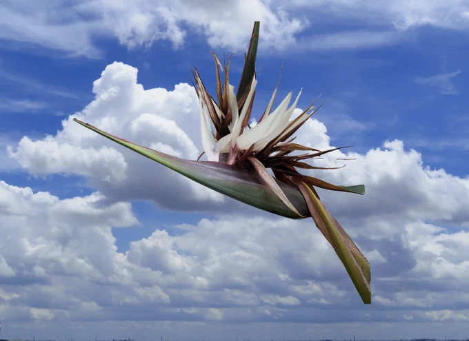

# 2023-10-06

[6 Oct, 2023 10:00 PM](https://twitter.com/hirasawa/status/1710278736183214105#m)

異郷にいてもUターン通勤は忘れない。  
  
敷地を出る時セキュリティーのおじさんに部屋番号を告げる。  
  
それは毎回おじさんがお煎餅を二つに割ろうとしている瞬間だった。  
  
「いってらっしゃいませ」パキン！と背中で割れる音。まるで江戸のおかみさんの火打石。  
  
またこんど！！

---

[6 Oct, 2023 09:55 PM](https://twitter.com/hirasawa/status/1710277475593597126#m)

何のながら投稿かって？  
  
170Kのナレーションなのだ。

---

[6 Oct, 2023 09:50 PM](https://twitter.com/hirasawa/status/1710276217205625000#m)

これは時限投稿。  
  
先ほど手が滑ってライブ投稿してしまった。  
  
Xになってから投稿が成立するまでワンクッション置いてくれる仕組みになっているにも関わらず。  
  
ながら投稿がバレる。

---

[6 Oct, 2023 09:45 PM](https://twitter.com/hirasawa/status/1710274958847287574#m)

帰宅するや否や温泉シャークに着手した。  
  
プロデューサーはOK。  
後は監督の評価を待つ日々。

---

[6 Oct, 2023 09:15 PM](https://twitter.com/hirasawa_info_e/status/1710267532236795950#m)

Retweet from [susumu hirasawa info EN @hirasawa_info_e](https://twitter.com/hirasawa_info_e)

*Introduction of The Man Who Climbs Holograms*   
  
A near futuristic texture with extensiveness and eternity.   
Phantasmagoric multiple vocal chords.   
A magic of melody and words swimming high and flying deeply.   
(cont.)

---

[6 Oct, 2023 09:15 PM](https://twitter.com/hirasawa_info_e/status/1710267647739453892#m)

Retweet from [susumu hirasawa info EN @hirasawa_info_e](https://twitter.com/hirasawa_info_e)

His daemon sword with the innovative and edged brain furbishes your rusty mind.   
It's extremely strayed away from the proper way.   
He showers love on you from th top of the wrong way.   
visit <a href="https://susumuhirasawa.bandcamp.com">susumuhirasawa.bandcamp.com</a>

---

[6 Oct, 2023 09:40 PM](https://twitter.com/hirasawa/status/1710273700556157270#m)

食い物と食い物の間に会議を進めながら帰りのオーガスタの中では予定されていたピタゴリアンラーメン店に行ってないことに気づき、皆ぴよんと跳ね上がった。  
  
それで正解。持続する満腹。

---

[6 Oct, 2023 09:35 PM](https://twitter.com/hirasawa/status/1710272442608865481#m)

このようにして山高コック帽シェフの上品なピタゴリアン食と、なれなれしいおっちゃんのジャンキーなピタゴリアン食に挟まれたトロピカル会議の日々は流れておりました。

---

[6 Oct, 2023 09:30 PM](https://twitter.com/hirasawa/status/1710271184992940538#m)

食事が終わればまたシェフがお出ましになり見送りしてくださる。  
  
目立ちすぎ！  
  
恐縮する用務員。

---

[6 Oct, 2023 09:25 PM](https://twitter.com/hirasawa/status/1710269925732864418#m)

毎朝天井スレスレのコック帽を着用したシェフがテーブルまでやって来て料理の説明をしてくれます。  
  
目立ちすぎ！  
  
そんな光景は映画でしか見たことない。申し訳ない。まるで周囲の人とは違う特別扱いされているエラそうな客のよう。  
呼んでくれれば私のほうから厨房に行くのに。  
  
優遇される下足番。

---

[6 Oct, 2023 09:20 PM](https://twitter.com/hirasawa/status/1710268667529679195#m)

宿には丁寧に対応していただき、何日も前からメニューの検討に入り、シェフが決めたメニューの報告を受けた。  
  
たった一人の我儘のために、まことに感謝です。

---

[6 Oct, 2023 09:15 PM](https://twitter.com/hirasawa/status/1710267409100120378#m)

それまではビュッフェの食材だけで立派な一食を組み立てていた。  
  
スタッフの人が心配そうにみるのでこの度はリクエストしてみた。  
  
私は満腹を超えるのが心配。  
  
心配の食い違いで作られるステルス人生。

---

[6 Oct, 2023 09:10 PM](https://twitter.com/hirasawa/status/1710266150959870410#m)

会議会場は何度も利用した宿だが、この度初めてピタゴリアンメニューをリクエストした。  
  
それまではどうしてたかって？

---

[6 Oct, 2023 09:05 PM](https://twitter.com/hirasawa/status/1710264893277155388#m)

まだ夏である現地では、歩き、水中を這い、浮遊しながら有意義な会議の時間を過ごした。

---

[6 Oct, 2023 09:00 PM](https://twitter.com/hirasawa/status/1710263647782764786#m)

会人ご一行様を乗せたオーガスタは無事あろる空港に着陸。

---

[6 Oct, 2023 04:49 PM](https://twitter.com/Hirasawa_Info/status/1710200513273475337#m)

Retweet from [平沢進・公式サイト @Hirasawa_Info](https://twitter.com/Hirasawa_Info)

平沢進13番目のアルバム「ホログラムを登る男」のデジタル配信をBandcampにて開始しました。是非ご利用ください！  
<a href="https://susumuhirasawa.bandcamp.com">susumuhirasawa.bandcamp.com</a>

---

[6 Oct, 2023 04:48 PM](https://twitter.com/hirasawa_info_e/status/1710200242971562265#m)

Retweet from [susumu hirasawa info EN @hirasawa_info_e](https://twitter.com/hirasawa_info_e)

Susumu Hirasawa's 13th album "The Man Who Climbs Holograms" is now available digitally on Bandcamp. Please take advantage of this service!  
<a href="https://susumuhirasawa.bandcamp.com">susumuhirasawa.bandcamp.com</a>

---

